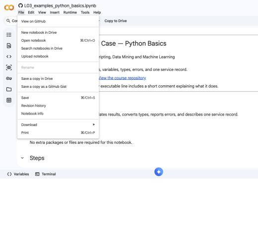
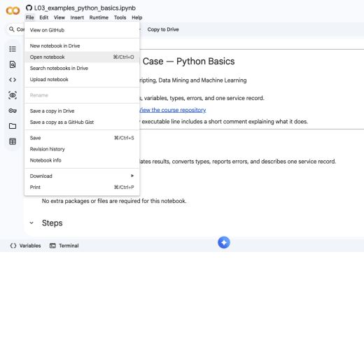
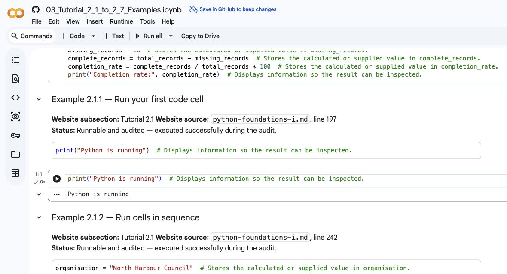
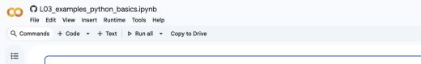
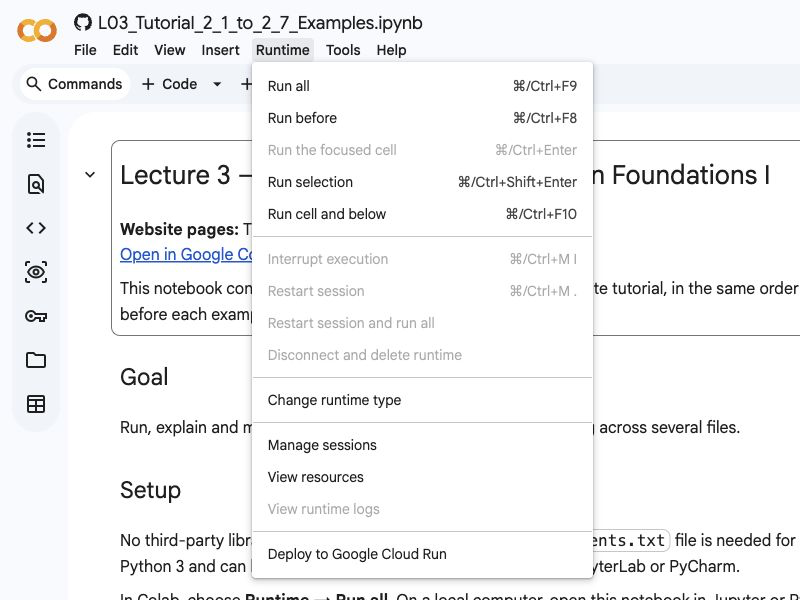
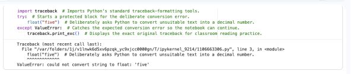

# Python Foundations I

> **Core message:** You are not expected to memorise every Python command. You are expected to read short code, predict what it will do, run it, inspect the result, change it, and use error messages to repair it.

This tutorial is the first practical Python foundation for the AAU course *Introduction to Scripting, Data Mining and Machine Learning*. It is written for complete beginners. You should be able to use it without a separate textbook.

The examples begin with very small programs. They then move towards data-quality, organisational and societal cases. We will not load a CSV file yet. Instead, we will build the knowledge needed to understand later code such as:

```python
total_records = 250
missing_records = 18
complete_records = total_records - missing_records
completion_rate = complete_records / total_records * 100
print("Completion rate:", completion_rate)
```

By the end of this tutorial, every symbol in that example should be understandable.

<!--
EDITORIAL SOURCE NOTE
The topic boundary follows the Python Foundations I scope identified by the course owner and the historical course context. The tutorial expands the slide-level topics pedagogically and is not a verbatim transcript of any historical lecture version. Historical versions should continue to be labelled separately elsewhere on the course site.
-->

## Before you start: course files and coding options

You do not need previous programming experience. You need a modern web browser, careful typing and a willingness to run, inspect and repair small examples. Lecture 3 uses standard Python 3 only: no third-party library, dataset, virtual environment or `requirements.txt` file is required.

### The three Lecture 3 notebooks

Use the tutorial number in each notebook to match it with the website:

| File | What it contains | When to use it |
|---|---|---|
| [Tutorial Examples](https://colab.research.google.com/github/asmrabbi/E26_TAN7_Scripting_CPH/blob/main/notebooks/lecture_03/L03_Tutorial_2_1_to_2_7_Examples.ipynb) | Every code example shown in Tutorials 2.1–2.7, in website order | During the lecture and when reviewing an explanation |
| [Exercises and solutions](https://colab.research.google.com/github/asmrabbi/E26_TAN7_Scripting_CPH/blob/main/notebooks/lecture_03/L03_Tutorial_2_1_to_2_7_Exercises.ipynb) | Every numbered website exercise, followed by a separate fully commented solution | Attempt the matching starter before opening its solution |
| [Practice Materials](https://colab.research.google.com/github/asmrabbi/E26_TAN7_Scripting_CPH/blob/main/notebooks/lecture_03/L03_Tutorial_2_1_to_2_7_Practice_Materials.ipynb) | Additional case questions, code-logic steps and fully commented examples | For extra classroom demonstrations or independent practice |

[Open the complete AAU course repository on GitHub](https://github.com/asmrabbi/E26_TAN7_Scripting_CPH). The repository is the organised course folder: `notebooks/lecture_03` contains these three files, `docs` contains the tutorial website and later lecture folders contain later materials.

### Use Google Colab — recommended for the course

Google Colab runs a Jupyter notebook in a browser, so nothing needs to be installed for Lecture 3.

1. Open one of the three direct Colab links above.
2. Choose **File > Save a copy in Drive** before editing the public course notebook.
3. Rename the copy so the lecture, tutorial range and your name are clear.
4. Run a code cell with its play button or **Shift+Enter**.
5. Use **Runtime > Run all** when you want to check the whole notebook from top to bottom.
6. Remember that live variables and temporarily uploaded files can disappear when a runtime restarts.












Use [Google Colab](https://colab.research.google.com/) to create a blank notebook and read the [official Colab FAQ](https://research.google.com/colaboratory/faq.html) for saving, sharing and runtime information.

### Use GitHub to find or download the material

GitHub stores the course files and their version history. Open the repository, select `notebooks`, then `lecture_03`, and choose the file whose name ends in `Examples`, `Exercises` or `Practice_Materials`. Select **Open in Colab** from this tutorial when you want to run a notebook; use GitHub when you want to inspect or download the source.

- [GitHub Hello World — official beginner guide](https://docs.github.com/en/get-started/start-your-journey/hello-world)
- [Getting started with Git — official GitHub guide](https://docs.github.com/en/get-started/learning-to-code/getting-started-with-git)
- [A brief introduction to Git for beginners — official GitHub video](https://www.youtube.com/watch?v=r8jQ9hVA2qs)

### Use Python locally in PyCharm or Jupyter

Students may use another Python environment. All Lecture 3 code uses standard Python 3, so it can be copied into a `.py` file or run from the supplied notebook without installing course libraries.

- [Python setup and usage — official documentation](https://docs.python.org/3/using/)
- [Install PyCharm — official JetBrains guide](https://www.jetbrains.com/help/pycharm/installation-guide.html)
- [Configure a Python interpreter in PyCharm — official JetBrains guide](https://www.jetbrains.com/help/pycharm/configuring-python-interpreter.html)
- [Install JupyterLab or Jupyter Notebook — official Project Jupyter guide](https://jupyter.org/install)
- [W3Schools Python tutorial](https://www.w3schools.com/python/default.asp)

For this lecture, do not create a virtual environment or install `requirements.txt` during class. Those workflows become relevant when later lectures introduce third-party libraries.

### How to work with each example

1. **Predict** the output or error.
2. **Run** the unmodified cell.
3. **Inspect** the actual result.
4. **Explain** the important line or symbol.
5. **Modify** one input or message.
6. **Break** only the instructed part.
7. **Repair** the smallest relevant part.
8. **Reflect** on what changed and what the code cannot establish.

Code appears in Python blocks, output appears in text blocks and comments begin with `#`. Each main example is self-contained unless the page explicitly says that two cells must be run in order.

---

# Part A. Start coding in Google Colab

## Tutorial 2.1 overview

Python code is a sequence of instructions that the Python interpreter reads and executes. In a Colab notebook, each code cell is a small runnable part of that sequence, and its output normally appears directly underneath it. The built-in `print()` function makes a value visible by receiving that value inside parentheses and sending a readable representation to the output area. A variable created in one cell can be used by a later cell only while the notebook runtime still remembers it, so execution order matters. Restarting the runtime clears those remembered values and is therefore a useful way to test whether a notebook can be run from the beginning. By the end of this tutorial, you should be able to predict, run, inspect, deliberately break and repair a short sequence of cells.

**Core Python vocabulary:** code cell, runtime, statement, function call, argument, string, variable, output and `print()`.

| Priority | Book and chapter | Suggested focus |
|---|---|---|
| Core companion | [Severance, *Python for Everybody*, Chapter 1: Why should you learn to write programs?](https://www.py4e.com/html3/01-intro) | Read **Words and sentences**, **Conversing with Python**, **Writing a program**, **What could possibly go wrong?** and **Debugging**. These sections support first output, execution order and a constructive response to errors. |
| Recommended companion | [Severance, *Python for Everybody*, Chapter 2: Variables, expressions, and statements](https://www.py4e.com/html3/02-variables) | Skim **Statements** to see why assignment may produce no visible output and why scripts execute in sequence. |
## Code cells, execution order and visible output

The prerequisite panel on the Python Foundations I homepage explains how to open, copy, rename and save a notebook. This tutorial now begins with the Python activity itself: run a code cell, inspect its output and understand why notebook execution order matters.

### Example 2.1.1 - Run your first code cell


**Code**

```python
print("Python is running")
```

**Expected output**

```text
Python is running
```

**Line-by-line explanation**

- `print` is the name of a Python function that displays information.
- The round brackets `(` and `)` contain the information given to the function.
- `"Python is running"` is text. Python calls a piece of text a **string**.
- The quotation marks tell Python where the string begins and ends. The quotation marks are not displayed.

**Common mistakes**

- Typing `Print` with a capital `P`. Python distinguishes uppercase and lowercase letters.
- Omitting one quotation mark or one bracket.
- Typing the code into a text cell instead of a code cell.
- Looking for output before running the cell.

**Modify it**

Change the message so the output is `Welcome to Python Foundations I`.

**Break it, observe it, repair it**

1. Deliberately remove the final quotation mark so the cell contains `print("Python is running)`.
2. Run the cell. Python should report a `SyntaxError`, often saying that a string literal was not closed.
3. Repair the code by restoring the final quotation mark.
4. Run it again and confirm that the original output returns.

**Check your understanding**

Which characters tell Python that `Python is running` should be treated as text?

### Example 2.1.2 - Run cells in sequence


**Code cell 1**

```python
organisation = "North Harbour Council"
```

**Expected output from cell 1**

```text
No visible output
```

**Code cell 2**

```python
print(organisation)
```

**Expected output from cell 2**

```text
North Harbour Council
```

**Line-by-line explanation**

- In cell 1, `organisation` is a variable name.
- `=` assigns the string `"North Harbour Council"` to that variable.
- Assignment usually creates no visible output. No output does not automatically mean that nothing happened.
- In cell 2, `print(organisation)` asks Python to display the value currently stored under the name `organisation`.
- There are no quotation marks around `organisation` in cell 2 because we want its stored value, not the word `organisation`.

**Common mistakes**

- Running cell 2 before cell 1. Python then does not know the name `organisation`.
- Writing `print("organisation")`, which displays the word `organisation` instead of the stored council name.
- Restarting the runtime and expecting old variable values to remain available.

**Modify it**

Change the organisation name in cell 1 to a fictional university unit. Rerun cell 1 and then cell 2. Confirm that the displayed value changes.

**Break it, observe it, repair it**

1. Select **Runtime > Restart session** if your Colab interface offers that wording. The exact label may vary.
2. Run only cell 2.
3. Observe the `NameError` because the restarted runtime no longer contains the variable.
4. Repair the notebook state by running cell 1 before cell 2.

**Check your understanding**

Why is notebook execution order part of debugging?

### Exercise 2.1.1 - Run, restart and repair the cell order

**Context:** A fictional Techno-Anthropology student is preparing a notebook for an Inclusive Mobility Review project. The notebook must display the student and programme labels, store the project title, and demonstrate what happens when a display cell is run after the runtime has been restarted.

**Your task**

1. Use two `print()` calls to display a fictional first name and the programme name on separate lines.
2. In a second code cell, store the fictional project title in a meaningful variable.
3. In a third code cell, display the stored project title with a clear label.
4. Restart the runtime and run only the third cell; record that the missing variable produces `NameError`.
5. Repair the notebook state by running the assignment cell before the display cell, then explain why execution order matters.

- [Open checkpoint solution](https://colab.research.google.com/github/asmrabbi/E26_TAN7_Scripting_CPH/blob/main/notebooks/lecture_03/L03_Tutorial_2_1_to_2_7_Exercises.ipynb)

---

## Display information with `print()`

`print()` lets a program communicate with a person who runs it. It can display text, numbers, variable values and the results of expressions. Later, `print()` will help you inspect data and debug scripts.

### Example 2.1.3 - Display several pieces of information


**Code**

```python
print("Dataset status")
print("Rows received:", 250)
print("Missing rows:", 18)
```

**Expected output**

```text
Dataset status
Rows received: 250
Missing rows: 18
```

**Line-by-line explanation**

- Line 1 displays a heading stored directly as a string literal.
- Line 2 gives `print()` two items: the string `"Rows received:"` and the integer `250`.
- The comma separates the two items. `print()` inserts a space between them in the output.
- Line 3 follows the same structure with the integer `18`.
- Python executes these statements from top to bottom, so the output appears in the same order.

**Common mistakes**

- Putting the number inside the text accidentally. `"250"` displays correctly, but it is text rather than a number.
- Forgetting the comma between the label and number.
- Using a semicolon when the example uses a comma.
- Assuming `print()` stores a value. It displays information, but does not create a variable by itself.

**Modify it**

Add a fourth line that displays `Duplicate rows: 6`.

**Break it, observe it, repair it**

1. Change line 2 to `print("Rows received:" 250)` by removing the comma.
2. Run the code and observe the `SyntaxError`.
3. Repair the line by restoring the comma.
4. Run the cell and confirm all three lines appear.

**Check your understanding**

What job is the comma performing inside the second `print()` call?

### Example 2.1.4 - Display a small organisational summary


**Code**

```python
organisation = "North Harbour Council"
responses_received = 480
responses_valid = 452

print("Organisation:", organisation)
print("Responses received:", responses_received)
print("Responses retained:", responses_valid)
print("Responses excluded:", responses_received - responses_valid)
```

**Expected output**

```text
Organisation: North Harbour Council
Responses received: 480
Responses retained: 452
Responses excluded: 28
```

**Line-by-line explanation**

- Line 1 stores an organisation name as text.
- Line 2 stores the number of received responses as an integer.
- Line 3 stores the number retained after validation.
- The blank line separates setup from output for human readers. Python does not require that blank line.
- Lines 5 to 7 display labels and stored values.
- The final line contains the expression `responses_received - responses_valid`.
- Python evaluates the subtraction first and gives the resulting value, `28`, to `print()`.

**Common mistakes**

- Putting quotation marks around variable names, which prints the names instead of their values.
- Misspelling the same variable differently on different lines.
- Reversing the subtraction and producing `-28`.
- Treating a displayed total as proof that the underlying records were excluded for a justified reason. Code can calculate a count, but the data decision still requires explanation.

**Modify it**

Change `responses_valid` to `440`. Before running, predict the new number of excluded responses. Then add a line that displays a short source label such as `Source: public consultation portal`.

**Break it, observe it, repair it**

1. Change the final expression to `responses_received - response_valid` by removing the `s` from one variable name.
2. Run the cell and read the last line of the traceback.
3. Identify `NameError` and the unrecognised name.
4. Repair the spelling so it matches `responses_valid` exactly.

**Check your understanding**

Does the final subtraction happen before or after `print()` displays the result?

### Example 2.1.5 - Format a readable report with newline characters


**Code**

```python
report_title = "Monthly data-quality note"
records_checked = 1250

print(report_title)
print("\nRecords checked:", records_checked)
print("Status:\nReview required")
```

**Expected output**

```text
Monthly data-quality note

Records checked: 1250
Status:
Review required
```

**Line-by-line explanation**

- Line 1 stores the report title as a string.
- Line 2 stores a whole-number count.
- Line 4 displays the title.
- In line 5, `\n` is an escape sequence meaning "start a new line". Because it appears at the beginning of the string, it creates an empty line before `Records checked:`.
- In line 6, `\n` appears inside the string, so `Review required` begins on the next output line.
- The characters `\` and `n` work together inside a string. They are not displayed literally in this example.

**Common mistakes**

- Typing `/n` with a forward slash. The newline sequence uses a backslash: `\n`.
- Placing `\n` outside quotation marks.
- Adding many newlines and making output harder to scan.
- Confusing visual formatting with data correctness.

**Modify it**

Add a blank line before the status section and change the status message to `Initial checks complete`.

**Break it, observe it, repair it**

1. Change the final line to `print("Status:\nReview required)` by deleting its closing quotation mark.
2. Run the cell and observe the `SyntaxError`.
3. Repair the missing quotation mark.
4. Rerun the cell and verify the two-line status output.

**Check your understanding**

Why does `\n` change the layout even though `print()` is called only once on the final line?

### Exercise 2.1.2 - Format and explain a short report

**Context:** A fictional community-mobility survey received 280 rows and retained 263 after an initial exclusion step. A colleague needs a four-line summary whose labels make the calculation understandable without seeing the code.

**Your task**

1. Store the dataset title, received rows and retained rows in meaningful variables.
2. Calculate excluded rows without changing either source count.
3. Print a four-line report containing the title and all three labelled counts.
4. Predict the output, then create and repair one deliberate `NameError` in your notes.
5. Explain why correct arithmetic does not establish that the exclusion rule was fair or appropriate.

- [Open checkpoint solution](https://colab.research.google.com/github/asmrabbi/E26_TAN7_Scripting_CPH/blob/main/notebooks/lecture_03/L03_Tutorial_2_1_to_2_7_Exercises.ipynb)

---

# Part B. Values, variables and names

## Tutorial 2.2 overview

Python works with values such as numbers, text, Boolean states and the special value `None`. A value written directly in code is a **literal**, while a **variable** is a meaningful name that refers to a value so it can be reused. The assignment operator `=` makes the name on its left refer to the value produced on its right; it does not mean permanent mathematical equality. Uppercase names such as `EXPECTED_COLUMNS` communicate a constant-by-convention, although Python does not prevent reassignment. Python keywords such as `if` and `class` belong to the language grammar and cannot be ordinary variable names, while names such as `input` and `float` are legal but would hide useful built-in functions. Clear snake-case names make later calculations, debugging and data work easier to explain and verify.

**Core Python vocabulary:** literal, value, variable, assignment, reassignment, constant-by-convention, keyword, built-in name and snake case.

| Priority | Book and chapter | Suggested focus |
|---|---|---|
| Core companion | [Severance, *Python for Everybody*, Chapter 2: Variables, expressions, and statements](https://www.py4e.com/html3/02-variables) | Read **Values and types**, **Variables**, **Variable names and keywords**, and **Choosing mnemonic variable names**. These sections directly support literals, assignment, reserved words and meaningful names. |
| Recommended background | [Severance, *Python for Everybody*, Chapter 1](https://www.py4e.com/html3/01-intro) | Revisit **Words and sentences** for Python's reserved vocabulary and the idea that programmers create their own meaningful variable names. |
| Optional text-focused companion | [Bird, Klein and Loper, *Natural Language Processing with Python*, Chapter 1](https://www.nltk.org/book/ch01.html) | Read **Section 2.3, Variables**, and **Section 2.4, Strings**. Stop before the language-analysis sections if lists and corpora are unfamiliar. |

## Constants and literals

A **literal** is a value written directly in code. Examples include `42`, `3.5`, `"Copenhagen"` and `True`. Python also has the special constant `None`, meaning no value is present. Section 13.1 later distinguishes `None` from zero, empty text and the string `"None"`.

A **constant** is a value that should not change while a program is running. Python does not enforce ordinary constants. Programmers usually write a constant name in uppercase letters to communicate: "Treat this as fixed." This is a convention, not a technical lock.

Compare these roles:

| Code | Role |
|---|---|
| `250` | Integer literal |
| `"Unknown"` | String literal |
| `True` | Boolean literal |
| `total_records = 250` | Assignment of a literal to a variable |
| `MISSING_LABEL = "Unknown"` | Constant-by-convention assigned a string literal |

### Example 2.2.1 - Use literals directly


**Code**

```python
print("Consultation responses")
print(320)
print(4.5)
print(True)
```

**Expected output**

```text
Consultation responses
320
4.5
True
```

**Line-by-line explanation**

- Line 1 contains a string literal between quotation marks.
- Line 2 contains the integer literal `320`, which is a whole number.
- Line 3 contains the float literal `4.5`, which includes a decimal point.
- Line 4 contains the Boolean literal `True`. Its capital `T` is required.
- Each literal is given directly to `print()` instead of being stored under a variable name first.

**Common mistakes**

- Writing `true` instead of `True`.
- Assuming `"320"` and `320` are the same type because they look similar when printed.
- Using a comma as a decimal separator, such as `4,5`. Python interprets that as two separate values, not the number four and a half.
- Filling a real data script with unexplained literal numbers, sometimes called magic numbers.

**Modify it**

Change the heading, whole number, decimal number and Boolean value. Predict which changes affect type as well as value.

**Break it, observe it, repair it**

1. Change `True` to `true`.
2. Run the cell and observe the `NameError`.
3. Repair it by restoring the capital `T`.
4. Explain why Python treated lowercase `true` as a possible name rather than a Boolean literal.

**Check your understanding**

Which of the four literals requires quotation marks?

### Example 2.2.2 - Use constants by convention


**Code**

```python
EXPECTED_COLUMNS = 12
MISSING_LABEL = "Unknown"
MAX_PREVIEW_ROWS = 10

print("Expected columns:", EXPECTED_COLUMNS)
print("Label for missing category:", MISSING_LABEL)
print("Maximum preview rows:", MAX_PREVIEW_ROWS)
```

**Expected output**

```text
Expected columns: 12
Label for missing category: Unknown
Maximum preview rows: 10
```

**Line-by-line explanation**

- Lines 1 to 3 assign literal values to names written in uppercase.
- The uppercase style tells human readers that these settings should be treated as fixed.
- `EXPECTED_COLUMNS` and `MAX_PREVIEW_ROWS` store integers.
- `MISSING_LABEL` stores a string.
- Lines 5 to 7 display each constant-by-convention beside an explanatory label.
- Python would still allow a later assignment such as `EXPECTED_COLUMNS = 15`. The convention relies on programmer discipline.

**Common mistakes**

- Believing uppercase names cannot be changed by Python.
- Using a fixed label such as `"Unknown"` without documenting what it means.
- Repeating the literal `12` throughout a script instead of defining one clearly named setting.
- Choosing a constant value because it is convenient rather than because the case justifies it.

**Modify it**

Add `REPORTING_MONTH = "October"` and display it. Then change `MAX_PREVIEW_ROWS` to `20` in its defining line only.

**Break it, observe it, repair it**

1. Change the final line to `print("Maximum preview rows:", MAX_PREVIEWS_ROWS)`.
2. Run the cell and observe the `NameError`.
3. Compare the used name with the defined name.
4. Repair the extra `S` so the names match exactly.

**Check your understanding**

Is an uppercase Python name technically protected from reassignment?

### Example 2.2.3 - Recognise the risk of unexplained literals


**Code**

```python
MINIMUM_ACCEPTABLE_COMPLETION = 80
completion_rate = 76.5
gap_to_threshold = MINIMUM_ACCEPTABLE_COMPLETION - completion_rate

print("Completion rate:", completion_rate)
print("Gap to stated threshold:", gap_to_threshold)
```

**Expected output**

```text
Completion rate: 76.5
Gap to stated threshold: 3.5
```

**Line-by-line explanation**

- Line 1 names the stated threshold instead of hiding the literal `80` inside a later calculation.
- Line 2 stores the observed completion rate as a float.
- Line 3 subtracts the observed rate from the threshold.
- Lines 5 and 6 display the observed rate and numerical gap.
- The calculation describes distance from a threshold. It does not explain who selected the threshold or whether it is appropriate.

**Common mistakes**

- Presenting a threshold as objective simply because it appears in code.
- Mixing percentages such as `80` with proportions such as `0.765`.
- Calling the result a failure without explaining the context.
- Reversing the subtraction and mislabelling the meaning of the result.

**Modify it**

Change the completion rate to `84.0`. Predict the output. Then change the label `Gap to stated threshold` so it accurately describes a negative result.

**Break it, observe it, repair it**

1. Put quotation marks around the completion rate: `completion_rate = "76.5"`.
2. Run the cell and observe the `TypeError` on the subtraction line.
3. Repair it by removing the quotation marks or converting the text to a number with `float()`.
4. Explain why numerical-looking text is still text.

**Check your understanding**

What social or organisational question should accompany any coded threshold?

### Exercise 2.2.1 - Define constants for a monthly report

**Context:** A fictional monthly service report expects 12 columns, uses “Not reported” when a category is absent, and states that at least 200 responses are desired. These project settings should be visibly different from ordinary working variables.

**Your task**

1. Store the three project settings as uppercase constants-by-convention.
2. Display every setting with a clear label.
3. Write two sentences explaining what uppercase naming communicates.
4. State why Python still allows one of these values to be reassigned.

- [Open checkpoint solution](https://colab.research.google.com/github/asmrabbi/E26_TAN7_Scripting_CPH/blob/main/notebooks/lecture_03/L03_Tutorial_2_1_to_2_7_Exercises.ipynb)

---

## Variables and assignment

A **variable** is a name that refers to a value. An **assignment statement** connects a name to a value with `=`.

```text
variable_name = value
```

Read `=` in an assignment as "is assigned" or "now refers to", not as "is mathematically equal forever".

### Example 2.2.4 - Assign and display values


**Code**

```python
city = "Copenhagen"
survey_responses = 275
average_rating = 4.2

print(city)
print(survey_responses)
print(average_rating)
```

**Expected output**

```text
Copenhagen
275
4.2
```

**Line-by-line explanation**

- Line 1 assigns the string `"Copenhagen"` to `city`.
- Line 2 assigns the integer `275` to `survey_responses`.
- Line 3 assigns the float `4.2` to `average_rating`.
- The blank line visually separates assignments from output statements.
- Lines 5 to 7 display the value associated with each variable name.
- The variable names do not appear in the output because `print()` receives their values.

**Common mistakes**

- Reversing assignment as `"Copenhagen" = city`, which is invalid.
- Writing labels with spaces, such as `survey responses`.
- Using quotation marks around a variable name when you want its value.
- Assuming the variable contains a copy of its name.

**Modify it**

Change all three values to describe a different fictional case. Add labels to the three printed lines so another person can understand the output.

**Break it, observe it, repair it**

1. Change line 2 to `275 = survey_responses`.
2. Run the cell and observe the `SyntaxError`.
3. Repair the order so the name is on the left and the assigned value is on the right.
4. Say the repaired line aloud using "is assigned".

**Check your understanding**

Which side of `=` normally contains the variable name in a basic assignment?

### Example 2.2.5 - Reassign a variable


**Code**

```python
records_reviewed = 0
print("Initially reviewed:", records_reviewed)

records_reviewed = 25
print("After first batch:", records_reviewed)

records_reviewed = records_reviewed + 10
print("After second batch:", records_reviewed)
```

**Expected output**

```text
Initially reviewed: 0
After first batch: 25
After second batch: 35
```

**Line-by-line explanation**

- Line 1 creates `records_reviewed` with the initial integer value `0`.
- Line 2 displays that initial value.
- Line 4 assigns a new value, `25`, to the same name. The previous value is replaced.
- Line 5 displays the updated value.
- Line 7 first reads the current value `25`, adds `10`, and then assigns the result `35` back to the same variable.
- Line 8 displays the final value.
- Assignment changes what the name refers to. It is not a permanent mathematical equation.

**Common mistakes**

- Reading `records_reviewed = records_reviewed + 10` as an impossible algebra equation.
- Running only the final two lines in a fresh runtime, causing a `NameError`.
- Accidentally resetting the variable to `0` after updating it.
- Losing track of a value because notebook cells were run in a different order.

**Modify it**

Change the first batch to `40` and the second batch increase to `15`. Predict all three output values before running.

**Break it, observe it, repair it**

1. In a fresh cell, run only `records_reviewed = records_reviewed + 10` after restarting the runtime.
2. Observe the `NameError` because no current value exists.
3. Repair the state by assigning an initial value before trying to update it.
4. Rerun from top to bottom.

**Check your understanding**

Why can the same variable name appear on both sides of `=` during an update?

### Example 2.2.6 - Extend an audit trail with `+=`


The augmented assignment operator `+=` updates a variable using its current value. With numbers it can increase a count. With strings it can extend text. This example uses text so that the update records a sequence of data-preparation actions.

**Code**

```python
audit_trail = "File received"
audit_trail += " -> column names standardised"
audit_trail += " -> identifiers preserved as text"

print(audit_trail)
```

**Expected output**

```text
File received -> column names standardised -> identifiers preserved as text
```

**Line-by-line explanation**

- Line 1 creates the first version of the audit-trail string.
- Line 2 reads the current string, joins another string to its end, and assigns the combined value back to `audit_trail`.
- For this string example, `audit_trail += "..."` is a shorter form of `audit_trail = audit_trail + "..."`.
- Line 3 performs a second update. The order matters because the text is being built from left to right.
- The blank line separates preparation from output.
- The final line displays the completed trail.
- This is only a teaching illustration. A real audit trail should also record dates, responsible people, versions and reproducible operations.

**Common mistakes**

- Using `=+` instead of `+=`. These are not interchangeable operators.
- Forgetting spaces around the arrow text and producing unreadable joined words.
- Running an update before the initial assignment, which raises `NameError`.
- Treating a manually written trail as proof that the described work actually happened.

**Modify it**

Add a third action stating that category labels were reviewed. Then replace the arrows with newline characters so that every action appears on its own line.

**Break it, observe it, repair it**

1. Change the second update to `audit_trail =+ " -> column names standardised"`.
2. Run the code. Python accepts the line, but it replaces the earlier text instead of extending it.
3. Repair the operator to `+=`.
4. Rerun from the first line and confirm that all stages appear in order.

**Check your understanding**

Why is this break especially important to test even though Python produces no traceback?

### Example 2.2.7 - Derive new variables without losing originals


**Code**

```python
total_records = 640
missing_records = 32
duplicate_records = 8

usable_records = total_records - missing_records - duplicate_records
usable_percentage = usable_records / total_records * 100

print("Total records:", total_records)
print("Usable records:", usable_records)
print("Usable percentage:", usable_percentage)
```

**Expected output**

```text
Total records: 640
Usable records: 600
Usable percentage: 93.75
```

**Line-by-line explanation**

- Lines 1 to 3 store the three source counts.
- Line 5 calculates a new value by subtracting missing and duplicate records from the total.
- The result is assigned to a new name, `usable_records`, so the original counts remain available.
- Line 6 divides usable records by total records and multiplies by `100` to express the proportion as a percentage.
- Lines 8 to 10 display selected inputs and derived results.
- The code assumes missing records and duplicate records are separate groups. If the same record could belong to both groups, this subtraction could double-count exclusions.

**Common mistakes**

- Overwriting `total_records` with a cleaned count and losing the original total.
- Subtracting overlapping categories as if they were independent.
- Dividing by the wrong count.
- Labelling a calculated value "usable" without defining what usable means.

**Modify it**

Change the counts to `1000`, `65` and `15`. Predict the usable count and percentage. Then rename `usable_records` to a name that fits a different documented rule.

**Break it, observe it, repair it**

1. Change `total_records` to `0` and run the cell.
2. Observe that the count calculation succeeds but the percentage calculation raises `ZeroDivisionError`.
3. Repair the example by restoring a positive total.
4. Explain why a zero total needs a case decision, not only a syntactic fix.

**Check your understanding**

Which assumption in this calculation should be checked against the real dataset?

### Exercise 2.2.2 - Preserve source counts in a municipal service summary

**Context:** A fictional housing-support service received 85 cases and has resolved 80. The team needs the unresolved count and a short audit trail, while keeping both supplied counts unchanged for later checking.

**Your task**

1. Store the service name, received count and resolved count with meaningful names.
2. Calculate the unresolved count in a new variable.
3. Create an audit-trail string and extend it once with `+=`.
4. Display the original counts, derived count and audit trail with labels.
5. Change one source count and confirm that every later use of its variable name remains consistent.

- [Open checkpoint solution](https://colab.research.google.com/github/asmrabbi/E26_TAN7_Scripting_CPH/blob/main/notebooks/lecture_03/L03_Tutorial_2_1_to_2_7_Exercises.ipynb)

---

### Exercise 2.2.3 - Calculate retained records without losing the originals

**Context:** A fictional Harbour Access Unit received 520 records, including 18 incomplete records and 7 duplicates. For this teaching calculation, assume the two exclusion categories do not overlap and make that assumption visible.

**Your task**

1. Use at least four meaningful variables and preserve all supplied source counts.
2. Use `+=` once to extend a text audit trail or update a separate count.
3. Calculate the retained count and retained percentage.
4. Display labelled inputs, results and the audit trail.
5. Document one deliberate `NameError` and its repair, plus the non-overlap assumption.

- [Open checkpoint solution](https://colab.research.google.com/github/asmrabbi/E26_TAN7_Scripting_CPH/blob/main/notebooks/lecture_03/L03_Tutorial_2_1_to_2_7_Exercises.ipynb)

---

## Reserved words and built-in names

Python reserves certain words for its own grammar. These are usually called **keywords** or **reserved words**. You cannot use a keyword as an ordinary variable name.

Common Python keywords include:

```text
False  None  True  and  as  assert  async  await  break  class
continue  def  del  elif  else  except  finally  for  from
global  if  import  in  is  lambda  nonlocal  not  or  pass
raise  return  try  while  with  yield
```

You do not need to memorise this list now. You will learn the words when they become useful.

Python also has **built-in names** such as `print`, `input`, `int`, `float`, `str` and `type`. These are not all reserved keywords, so Python may allow you to use them as variable names. Doing so is still a poor choice because your variable can hide the built-in function.

Current Python versions also have **soft keywords** such as `match`, `case`, `_` and `type`. A soft keyword has a special role only in a particular grammatical context. You do not need these contexts in Python Foundations I. The `keyword` module also provides `issoftkeyword()` for version-appropriate checks. Continue to avoid `type` as a variable name because it is an important built-in function in this tutorial.

### Example 2.2.8 - Use a reserved word inside a meaningful name


**Code**

```python
class_size = 28
return_rate = 91.5
survey_from_students = "completed"

print("Class size:", class_size)
print("Return rate:", return_rate)
print("Survey status:", survey_from_students)
```

**Expected output**

```text
Class size: 28
Return rate: 91.5
Survey status: completed
```

**Line-by-line explanation**

- `class` is a keyword, but `class_size` is a different, valid name.
- `return` is a keyword, but `return_rate` is valid.
- `from` is a keyword, but it can appear as one part of `survey_from_students`.
- The underscore joins words without creating spaces.
- Lines 5 to 7 display the values using clear labels.

**Common mistakes**

- Using `class`, `return` or `from` alone as a variable name.
- Assuming a word is forbidden anywhere inside a longer name.
- Adding punctuation such as `class-size` instead of an underscore.
- Choosing an awkward name only to avoid a keyword when a clearer alternative exists.

**Modify it**

Add a valid variable whose name contains the word `for`, such as `records_for_review`, and display it.

**Break it, observe it, repair it**

1. Change `class_size = 28` to `class = 28`.
2. Run the cell and observe the `SyntaxError`.
3. Repair the name by restoring `class_size` on both the assignment and print lines.
4. Rerun the complete cell.

**Check your understanding**

Why is `class_size` allowed even though `class` is a keyword?

### Example 2.2.9 - Check whether words are Python keywords


Python includes a small standard module named `keyword` that can check a word for you.

**Code**

```python
import keyword

print(keyword.iskeyword("class"))
print(keyword.iskeyword("records"))
print(keyword.iskeyword("True"))
print(keyword.iskeyword("print"))
```

**Expected output**

```text
True
False
True
False
```

**Line-by-line explanation**

- `import keyword` makes Python's standard `keyword` module available in this cell.
- `keyword.iskeyword("class")` asks whether the string `"class"` is a keyword. The result is `True`.
- `"records"` is not a keyword, so the result is `False`.
- `True` is a keyword and literal when written without quotation marks. Here the string `"True"` is being checked as a possible name.
- `print` is not a keyword. It is a built-in function, so `iskeyword()` returns `False` even though using `print` as a variable name is unwise.

**Common mistakes**

- Omitting `import keyword` and receiving a `NameError` for `keyword`.
- Concluding that every non-keyword is a good variable name.
- Writing `keyword.iskeyword(class)` without quotation marks, which produces invalid syntax.
- Confusing a Boolean result with the string `"True"` or `"False"`.

**Modify it**

Check `if`, `dataset`, `input` and `while`. Predict each result before running.

**Break it, observe it, repair it**

1. Comment out or delete `import keyword` and restart the runtime.
2. Run the remaining lines and observe the `NameError`.
3. Repair the example by restoring and running the import line.
4. Explain why a notebook might work before a restart but fail afterwards if an import cell was skipped.

**Check your understanding**

Why does `keyword.iskeyword("print")` return `False` even though you should avoid using `print` as a variable name?

### Example 2.2.10 - Avoid hiding a built-in function


**Code**

```python
record_type = "Consultation"
record_count = 42

print("Record type:", record_type)
print("Type of record_count:", type(record_count))
```

**Expected output**

```text
Record type: Consultation
Type of record_count: <class 'int'>
```

**Line-by-line explanation**

- `record_type` is a descriptive variable name.
- `record_count` stores an integer.
- Line 4 displays the case label.
- Line 5 calls the built-in `type()` function to inspect `record_count`.
- Because the variable is named `record_type`, the useful built-in name `type` remains available.

**Common mistakes**

- Creating a variable called `type`, `str`, `int`, `input` or `print`.
- Assuming Python will warn you immediately when a built-in has been hidden.
- Restarting only one cell mentally. Runtime state persists until it is restarted or overwritten.
- Repairing the assignment but forgetting to rerun it.

**Modify it**

Add a float variable called `completion_percentage` and use `type()` to inspect it.

**Break it, observe it, repair it**

1. Add `type = "Consultation"` before the final print line.
2. Run the cell. The later call `type(record_count)` should raise `TypeError: 'str' object is not callable`.
3. Repair the code by renaming the variable to `record_type`.
4. If the error remains, restart the runtime or run `del type`, then rerun the repaired cell. The old assignment may still exist in notebook state.

**Check your understanding**

Why can a legal variable name still be a bad variable name?

### Exercise 2.2.4 - Classify proposed Python names

**Context:** A project team proposes several variable names before writing its script: `if`, `data`, `input`, `missing_record_count`, `class`, `class_label`, `x`, `float` and `survey_year`. Some are invalid, some hide built-ins, and others differ in clarity.

**Your task**

1. Classify every proposed name as an invalid keyword, an unwise built-in name, a meaningful valid name or an unclear valid name.
2. Explain why a name can be technically valid but still unsuitable.
3. Import the standard-library `keyword` module.
4. Run `keyword.iskeyword()` for at least four proposed names and compare the result with your classification.

- [Open checkpoint solution](https://colab.research.google.com/github/asmrabbi/E26_TAN7_Scripting_CPH/blob/main/notebooks/lecture_03/L03_Tutorial_2_1_to_2_7_Exercises.ipynb)

---

## Variable naming rules and meaningful names

Python variable names must follow technical rules. Good names must also help humans understand the code.

### Technical naming rules

A basic Python variable name:

- may contain letters, digits and underscores;
- must not begin with a digit;
- must not contain spaces;
- must not contain a hyphen or most other punctuation;
- must not be a Python keyword;
- is case-sensitive, so `records`, `Records` and `RECORDS` are three different names.

### Style for this course

Use **snake case** for ordinary variables: lowercase words joined by underscores.

Good examples:

```text
total_records
missing_response_count
reporting_month
average_waiting_time
```

Use uppercase snake case for constants-by-convention:

```text
EXPECTED_COLUMNS
MISSING_LABEL
```

Avoid names such as `x`, `thing`, `data1`, `temp` and `final_final` unless the context genuinely makes them clear.

### Example 2.2.11 - Use valid snake-case names


**Code**

```python
survey_year = 2026
responses_received = 315
missing_response_count = 12

print("Survey year:", survey_year)
print("Responses received:", responses_received)
print("Missing responses:", missing_response_count)
```

**Expected output**

```text
Survey year: 2026
Responses received: 315
Missing responses: 12
```

**Line-by-line explanation**

- `survey_year` uses two lowercase words joined by an underscore.
- `responses_received` describes both what is counted and the stage of the process.
- `missing_response_count` is longer, but it communicates that the value is a count rather than the missing records themselves.
- Each print label uses normal spaces because output is written for people.
- Variable names use underscores because spaces are not permitted inside them.

**Common mistakes**

- Writing `survey year = 2026` with a space.
- Writing `2026_survey = 2026`, which begins with a digit.
- Writing `responses-received`, which Python reads as subtraction between two names.
- Making names so long that the code becomes difficult to scan.

**Modify it**

Add valid variables for the survey title and the number of duplicate responses. Display both.

**Break it, observe it, repair it**

1. Change `survey_year` to `survey-year` on the assignment line.
2. Run the cell and inspect the syntax-related error.
3. Repair the hyphen by replacing it with an underscore.
4. Check that every later use of the variable matches the repaired name.

**Check your understanding**

Why can output labels contain spaces while variable names cannot?

### Example 2.2.12 - Replace vague names with meaningful ones


**Code**

```python
total_responses = 500
invalid_responses = 35
valid_responses = total_responses - invalid_responses

print("Valid responses:", valid_responses)
```

**Expected output**

```text
Valid responses: 465
```

**Line-by-line explanation**

- `total_responses` communicates the starting count.
- `invalid_responses` communicates what will be subtracted, although a real project should define the validation rule.
- `valid_responses` describes the result of the calculation.
- The calculation can be read almost as an English sentence.
- The output label matches the meaning of the result.

**Common mistakes**

- Using `a`, `b` and `c`, which forces readers to remember meanings.
- Calling all tables or values `data` without distinguishing their roles.
- Using `valid_responses` before documenting what "valid" means.
- Renaming a variable on its assignment line but not where it is later used.

**Modify it**

Rename `invalid_responses` to a more precise name for one actual rule, such as `responses_missing_consent`. Update every line that depends on it.

**Break it, observe it, repair it**

1. Rename the assignment to `responses_missing_consent = 35` but leave `invalid_responses` in the calculation.
2. Run the cell and observe the `NameError`.
3. Repair the calculation so it uses the new name consistently.
4. Use Colab's search feature to check that the old name no longer appears.

**Check your understanding**

How can a precise variable name expose an assumption in a data-cleaning decision?

### Example 2.2.13 - Notice case sensitivity


**Code**

```python
records = 120
Records = 15
RECORDS = 5

print(records)
print(Records)
print(RECORDS)
```

**Expected output**

```text
120
15
5
```

**Line-by-line explanation**

- Python treats `records`, `Records` and `RECORDS` as three different names.
- Each assignment therefore stores a different integer.
- The print lines retrieve three different values.
- Although the code runs, this naming choice is difficult to read and easy to misuse.
- A better script would use distinct semantic names such as `total_records`, `flagged_records` and `MAX_RECORDS`.

**Common mistakes**

- Changing capitalisation accidentally and creating a new variable.
- Assuming uppercase always means Python has created a constant.
- Using names that differ only by case.
- Treating code that runs as automatically well designed.

**Modify it**

Replace the three confusing names with `total_records`, `flagged_records` and `MAX_PREVIEW_RECORDS`. Update the output labels to match.

**Break it, observe it, repair it**

1. Change the first print line to `print(REcords)`.
2. Run the cell and observe the `NameError`.
3. Repair the capitalisation or, preferably, complete the meaningful renaming task.
4. Explain why autocomplete cannot decide which meaning you intended.

**Check your understanding**

Are two names that differ only in capitalisation the same variable in Python?

### Exercise 2.2.5 - Rewrite unclear or invalid names

**Context:** A draft data-cleaning script contains the names `1stMonth`, `Missing Values`, `case-type`, `x`, `DATA` and `final final count`. Rewrite them so another researcher can infer what each stored value means.

**Your task**

1. Rewrite every proposed name as valid snake case.
2. Do not rely only on shortening or lowercasing; make the underlying concept explicit.
3. Add a one-sentence definition for every rewritten name.
4. Use at least three rewritten names in assignments and print their values.

- [Open checkpoint solution](https://colab.research.google.com/github/asmrabbi/E26_TAN7_Scripting_CPH/blob/main/notebooks/lecture_03/L03_Tutorial_2_1_to_2_7_Exercises.ipynb)

---

# Part C. Expressions and calculations

## Tutorial 2.3 overview

An **expression** is Python code that produces a value, while a **statement** is an instruction Python carries out. Arithmetic expressions use operators such as `+`, `-`, `*`, `/`, `//`, `%` and `**` to combine numerical values. Ordinary division `/` produces a floating-point result, floor division `//` gives the number of complete whole groups, and modulo `%` gives the remainder. Python follows an order of operations, so exponentiation and multiplication are evaluated before addition unless parentheses specify another order. Parentheses are therefore not only mathematical punctuation; they also make the intended calculation easier for another reader to audit. Every rate or percentage must be connected to a defensible numerator, denominator, unit and case assumption.

**Core Python vocabulary:** expression, statement, operator, operand, arithmetic, floor division, modulo, exponentiation, precedence and parentheses.

| Priority | Book and chapter | Suggested focus |
|---|---|---|
| Core companion | [Severance, *Python for Everybody*, Chapter 2: Variables, expressions, and statements](https://www.py4e.com/html3/02-variables) | Read **Statements**, **Operators and operands**, **Expressions**, **Order of operations**, **Modulus operator** and **String operations**. These sections match the Part C sequence closely. |
| Optional practice | [Bird, Klein and Loper, *Natural Language Processing with Python*, Chapter 1](https://www.nltk.org/book/ch01.html) | Use **Section 1.1** and Exercises 1 to 3 for extra practice with arithmetic expressions, parentheses and operator behaviour. The later corpus exercises are outside Day 1. |

## Expressions and statements

An **expression** is code that Python can evaluate to produce a value. Examples include:

- a literal, such as `10`;
- a variable reference, such as `total_records`;
- a calculation, such as `total_records - missing_records`;
- a function call that returns a value, such as `type(total_records)`.

A **statement** is an instruction that Python executes. An assignment such as `total_records = 250` is a statement. A call such as `print(total_records)` can be used as a statement.

At beginner level, use this practical distinction:

> An expression answers "what value does this produce?" A statement answers "what instruction is Python carrying out?"

### Example 2.3.1 - Put an expression inside a statement


**Code**

```python
received = 90
excluded = 7
print(received - excluded)
```

**Expected output**

```text
83
```

**Line-by-line explanation**

- Line 1 is an assignment statement. The literal expression `90` produces the assigned value.
- Line 2 is another assignment statement.
- In line 3, `received - excluded` is an arithmetic expression.
- Python evaluates the expression to `83`.
- `print(...)` then displays that result.

**Common mistakes**

- Believing Python displays the result of every assignment automatically.
- Putting the expression in quotation marks, which displays text instead of calculating.
- Calling the expression a variable even though it has no stored name.
- Reversing the operands and changing the meaning.

**Modify it**

Change both assigned values and predict the expression result. Then assign the result to `retained` before printing it.

**Break it, observe it, repair it**

1. Change the final line to `print("received - excluded")`.
2. Run the cell. It will run without an error but display the expression as text.
3. Repair this logical mistake by removing the quotation marks.
4. Explain why the absence of an error does not guarantee the intended result.

**Check your understanding**

Which part of the final line produces the numerical value?

### Example 2.3.2 - Store the result of an expression


**Code**

```python
total_records = 300
missing_records = 21
complete_records = total_records - missing_records
completion_rate = complete_records / total_records * 100

print("Complete records:", complete_records)
print("Completion rate:", completion_rate)
```

**Expected output**

```text
Complete records: 279
Completion rate: 93.0
```

**Line-by-line explanation**

- The first two statements establish source values.
- In line 3, the expression on the right produces `279`.
- The assignment stores that result under `complete_records`.
- Line 4 contains a longer expression. Python divides `279` by `300`, then multiplies by `100`.
- The result `93.0` is stored as a float.
- The two print statements display stored results with labels.

**Common mistakes**

- Dividing `total_records` by `complete_records` and calculating the opposite ratio.
- Forgetting `* 100` when the label says rate as a percentage.
- Multiplying one source value by `100` before dividing and losing clarity.
- Confusing a percentage with a percentage point difference.

**Modify it**

Add `duplicate_records = 9` and modify the complete-record calculation to subtract both missing and duplicate records. State the assumption you are making.

**Break it, observe it, repair it**

1. Put quotation marks around `total_records` in line 1.
2. Run the cell and observe the `TypeError` on the subtraction line.
3. Repair the value by storing it as the integer `300`.
4. Use `type(total_records)` in a separate cell to confirm the repaired type.

**Check your understanding**

Why is `completion_rate` assigned a float even though the source counts are integers?

### Example 2.3.3 - Turn a messy field label into a consistent name


**Code**

```python
raw_field_label = "  Preferred TRANSPORT mode  "
trimmed_label = raw_field_label.strip()
lowercase_label = trimmed_label.lower()
field_name = lowercase_label.replace(" ", "_")

print("Raw label:", raw_field_label)
print("Trimmed label:", trimmed_label)
print("Proposed field name:", field_name)
```

**Expected output**

```text
Raw label:   Preferred TRANSPORT mode  
Trimmed label: Preferred TRANSPORT mode
Proposed field name: preferred_transport_mode
```

**Line-by-line explanation**

- Line 1 preserves the original label, including its uneven capitalisation and extra spaces.
- `raw_field_label.strip()` is a method-call expression. It produces a new string without spaces at the beginning or end.
- `trimmed_label.lower()` produces another string in lowercase.
- `lowercase_label.replace(" ", "_")` replaces each ordinary space with an underscore.
- Each expression result is assigned to a new variable, so the transformation can be inspected stage by stage.
- The final three statements display evidence of the original value, the intermediate value and the proposed Python-friendly name.
- `strip()`, `lower()` and `replace()` are ready-made string methods. You are calling existing tools, not writing your own function yet.
- This mechanical transformation is only a proposal. A human still needs to check spelling, meaning, abbreviations and whether two distinct source labels would be collapsed into one category.

**Common mistakes**

- Overwriting the raw value and losing evidence of what was received.
- Forgetting the parentheses after a method name, such as writing `.strip` instead of `.strip()`.
- Assuming one space replacement handles tabs, punctuation or repeated internal spaces perfectly.
- Treating standardisation as a neutral operation when it may merge meaningful distinctions.

**Modify it**

Change the raw label to `"  SERVICE   Access? "`. Predict the proposed name. Identify what remains imperfect, then add one more documented `replace()` call to remove the question mark.

**Break it, observe it, repair it**

1. Change `trimmed_label = raw_field_label.strip()` to `trimmed_label = raw_field_label.strip` by removing the parentheses.
2. Run the cell and observe that `trimmed_label` now refers to a method rather than the cleaned string. A later line raises an error because a method object has no `.lower()` string operation.
3. Repair the call by restoring `strip()`.
4. Use `type(trimmed_label)` before and after the repair to compare the values.

**Check your understanding**

Why is preserving `raw_field_label` useful when reviewing a data-cleaning decision?

### Exercise 2.3.1 - Distinguish expressions from statements

**Context:** A research assistant is learning how Python turns supplied counts into a derived value. Classify the roles of `42`, `total = 42`, `total - missing`, `complete = total - missing` and `print(total - missing)`, then apply the pattern to 90 received and 7 excluded records.

**Your task**

1. Classify each supplied line by its main role: expression, assignment statement or print statement containing an expression.
2. Store the received and excluded counts in two source variables.
3. Derive the retained count in a third variable without changing the sources.
4. Display the retained count with a clear label and explain which expression produced it.

- [Open checkpoint solution](https://colab.research.google.com/github/asmrabbi/E26_TAN7_Scripting_CPH/blob/main/notebooks/lecture_03/L03_Tutorial_2_1_to_2_7_Exercises.ipynb)

---

## Arithmetic operators

Python uses arithmetic operators to build numerical expressions.

| Operator | Meaning | Example | Result |
|---|---|---|---:|
| `+` | Addition | `7 + 3` | `10` |
| `-` | Subtraction | `7 - 3` | `4` |
| `*` | Multiplication | `7 * 3` | `21` |
| `/` | Division | `7 / 2` | `3.5` |
| `//` | Floor division | `7 // 2` | `3` |
| `%` | Remainder, modulo | `7 % 2` | `1` |
| `**` | Exponentiation | `2 ** 3` | `8` |

Important points:

- `/` produces a float in ordinary Python 3 division.
- `//` discards the fractional part by rounding down to the next whole-number boundary.
- `%` means remainder. It does not mean percentage.
- `**` means "raised to the power of". Python does not use `^` for exponentiation.

### Example 2.3.4 - Calculate basic data-quality counts


**Code**

```python
received = 240
missing = 18
duplicates = 6

flagged = missing + duplicates
retained = received - flagged

print("Flagged records:", flagged)
print("Retained records:", retained)
```

**Expected output**

```text
Flagged records: 24
Retained records: 216
```

**Line-by-line explanation**

- The first three lines store source counts.
- `missing + duplicates` uses addition to calculate a combined flagged count.
- `received - flagged` uses subtraction to calculate the remaining count.
- The output statements label both derived values.
- The arithmetic assumes that no record appears in both the missing and duplicate counts.

**Common mistakes**

- Adding counts that overlap and double-counting records.
- Subtracting the total from the flagged count.
- Using `+` where the case requires subtraction.
- Accepting a plausible output without checking the category definitions.

**Modify it**

Change the source values to `500`, `35` and `10`. Predict both derived counts. Then rename `retained` if the records have not yet passed every quality check.

**Break it, observe it, repair it**

1. Change `flagged = missing + duplicates` to `flagged = missing - duplicates`.
2. Run the code. It will produce output without an error, but the flagged total will be logically wrong.
3. Repair the operator to `+`.
4. Explain why testing must include expected values, not only checking for error messages.

**Check your understanding**

Which assumption determines whether the addition is valid?

### Example 2.3.5 - Compare division, floor division and remainder


**Code**

```python
records_to_review = 125
batch_size = 20

exact_batches = records_to_review / batch_size
full_batches = records_to_review // batch_size
remaining_records = records_to_review % batch_size

print("Exact division result:", exact_batches)
print("Complete batches:", full_batches)
print("Records left over:", remaining_records)
```

**Expected output**

```text
Exact division result: 6.25
Complete batches: 6
Records left over: 5
```

**Line-by-line explanation**

- The source values say that 125 records must be placed into batches of 20.
- `/` calculates the exact numerical division, `6.25`.
- `//` calculates how many complete batches fit, `6`.
- `%` calculates the remainder after those complete batches, `5`.
- The three operations answer different questions about the same values.

**Common mistakes**

- Calling `6.25` a possible number of complete batches.
- Assuming `%` converts a number to a percentage.
- Using floor division when an accurate average is required.
- Forgetting that `//` with negative numbers has additional behaviour not needed in this example.

**Modify it**

Change the batch size to `12`. Predict the exact result, complete batches and remainder before running.

**Break it, observe it, repair it**

1. Change `batch_size` to `0`.
2. Run the cell and observe `ZeroDivisionError` on the first division.
3. Repair it with a positive batch size.
4. Explain why a zero batch size is a problem in the case, not merely in Python.

**Check your understanding**

Which operator tells you how many records remain after creating complete batches?

### Example 2.3.6 - Calculate a rate and a projected count


**Code**

```python
eligible_residents = 800
responses_received = 520
next_round_multiplier = 1.10

response_rate = responses_received / eligible_residents * 100
projected_responses = responses_received * next_round_multiplier

print("Response rate:", response_rate)
print("Projected responses:", projected_responses)
```

**Expected output**

```text
Response rate: 65.0
Projected responses: 572.0
```

**Line-by-line explanation**

- `eligible_residents` is the stated denominator for the response rate.
- `responses_received / eligible_residents` calculates a proportion.
- Multiplying by `100` expresses the proportion as a percentage.
- `1.10` represents 110 per cent of the current response count, which is a 10 per cent increase.
- The projected count is a float because multiplication involves a float.
- A projection is an assumption-based scenario, not a prediction guaranteed by the data.

**Common mistakes**

- Using `10` instead of `1.10` and multiplying the count tenfold.
- Using the wrong denominator for the response rate.
- Reporting `572.0` as if people or responses can be fractional without deciding how to round.
- Describing a simple scenario calculation as evidence that growth will occur.

**Modify it**

Change the multiplier to represent a 5 per cent decrease. Hint: the multiplier will be below `1`. Predict the projected count.

**Break it, observe it, repair it**

1. Change `eligible_residents` to `"800"`.
2. Run the cell and observe the `TypeError` during division.
3. Repair the value as an integer or use `int("800")`.
4. Explain why data imported from a file may contain numerical-looking text that needs conversion.

**Check your understanding**

What assumption is encoded in `next_round_multiplier`?

### Example 2.3.7 - Use exponentiation in a simple growth scenario


**Code**

```python
initial_count = 100
growth_factor = 1.05
number_of_periods = 2

projected_count = initial_count * growth_factor ** number_of_periods
print("Projected count after two periods:", projected_count)
```

**Expected output**

```text
Projected count after two periods: 110.25
```

**Line-by-line explanation**

- `initial_count` stores the starting value.
- `growth_factor = 1.05` represents a 5 per cent increase per period.
- `number_of_periods = 2` states that the factor is applied twice.
- `growth_factor ** number_of_periods` calculates `1.05` raised to the power of `2`.
- Multiplying by `initial_count` produces the scenario value `110.25`.
- This mathematical scenario does not establish that real social behaviour follows a constant growth rate.

**Common mistakes**

- Using `^` instead of `**`. In Python, `^` has a different meaning.
- Multiplying by `1.05 * 2`, which is not the same as compounding twice.
- Forgetting that a count may need a documented rounding decision.
- treating a scenario as a forecast without evidence.

**Modify it**

Change the number of periods to `3` and predict whether the result will be below or above `115`.

**Break it, observe it, repair it**

1. Replace `**` with `^`.
2. Run the cell and observe a `TypeError` because bitwise exclusive OR is not defined between these float and integer values.
3. Repair the operator to `**`.
4. Add a comment stating the assumption of a constant 5 per cent increase.

**Check your understanding**

Why is a compounded scenario analytically different from simply adding 5 twice?

### Exercise 2.3.2 - Calculate complete review batches and a remainder

**Context:** An organisation has 387 records and reviews them in batches of 25. It needs the exact division result, the number of complete batches, the remaining records and the remainder as a percentage of all records.

**Your task**

1. Predict all four numerical results before running Python.
2. Use `/`, `//` and `%` for their distinct purposes.
3. Calculate the remainder percentage using 387 as the denominator.
4. Display every result with a label and unit where relevant.
5. Replace one numerical value with text, record the resulting error type, and repair it.

- [Open checkpoint solution](https://colab.research.google.com/github/asmrabbi/E26_TAN7_Scripting_CPH/blob/main/notebooks/lecture_03/L03_Tutorial_2_1_to_2_7_Exercises.ipynb)

---

## Operator precedence and parentheses

When an expression contains several operators, Python needs rules for deciding which operation happens first. These rules are called **operator precedence**.

For the arithmetic in this tutorial, use this simplified order:

1. Parentheses: `(...)`
2. Exponentiation: `**`
3. Multiplication, division, floor division and remainder: `*`, `/`, `//`, `%`
4. Addition and subtraction: `+`, `-`

Operators at the same level are usually evaluated from left to right. Exponentiation has special right-associative behaviour, which is outside the core requirement. Parentheses remain the clearest way to communicate intended grouping.

### Example 2.3.8 - See how multiplication happens before addition


**Code**

```python
without_parentheses = 1200 + 350 * 4
with_parentheses = (1200 + 350) * 4

print("Without parentheses:", without_parentheses)
print("With parentheses:", with_parentheses)
```

**Expected output**

```text
Without parentheses: 2600
With parentheses: 6200
```

**Line-by-line explanation**

- In line 1, multiplication has higher precedence than addition.
- Python calculates `350 * 4` as `1400`, then adds `1200`, producing `2600`.
- In line 2, parentheses take priority.
- Python calculates `1200 + 350` as `1550`, then multiplies by `4`, producing `6200`.
- The output demonstrates that the same numbers and operators can represent different calculations when grouping changes.

**Common mistakes**

- Assuming Python always works strictly from left to right.
- Adding parentheses without checking whether they match the real formula.
- Treating parentheses as decoration rather than part of the expression's meaning.
- Using a plausible result without comparing it with a hand-calculated expectation.

**Modify it**

Change `4` to `6`. Predict both results. Then write one sentence describing a situation in which each formula could be appropriate.

**Break it, observe it, repair it**

1. Remove the closing parenthesis from line 2.
2. Run the cell and observe the `SyntaxError`.
3. Repair the unmatched parenthesis.
4. Count opening and closing parentheses before running again.

**Check your understanding**

Which operation is performed first in `1200 + 350 * 4`?

### Example 2.3.9 - Make a percentage formula explicit


**Code**

```python
missing_records = 18
duplicate_records = 6
total_records = 240

problem_rate = (missing_records + duplicate_records) / total_records * 100

print("Problem rate:", problem_rate)
```

**Expected output**

```text
Problem rate: 10.0
```

**Line-by-line explanation**

- Lines 1 to 3 store the counts.
- In line 5, parentheses make Python add the two problem counts first: `18 + 6 = 24`.
- Python then divides `24` by `240`, producing `0.1`.
- Multiplication by `100` expresses the result as `10.0` per cent.
- The parentheses also help a human reader see the intended numerator.

**Common mistakes**

- Writing `missing_records + duplicate_records / total_records * 100`, which applies the percentage calculation only to duplicates before adding missing records.
- Omitting `* 100` while retaining a percentage label.
- Including overlapping problem categories in the numerator.
- Thinking parentheses make an unjustified metric valid.

**Modify it**

Add `invalid_date_records = 12` to the numerator. Predict the new rate and state whether the categories are assumed to be mutually exclusive.

**Break it, observe it, repair it**

1. Remove the parentheses around the addition, but leave the rest unchanged.
2. Run the cell. It will produce `20.5`, not an error.
3. Repair the grouping and rerun.
4. Explain why this is a logical error rather than a syntax error.

**Check your understanding**

What value is the complete numerator in the repaired expression?

### Example 2.3.10 - Use nested parentheses for a weighted scenario


**Code**

```python
missing_records = 18
duplicate_records = 6
total_records = 240

weighted_problem_rate = ((missing_records * 2) + duplicate_records) / total_records * 100

print("Weighted problem rate:", weighted_problem_rate)
```

**Expected output**

```text
Weighted problem rate: 17.5
```

**Line-by-line explanation**

- Missing records receive a weight of `2` in this illustrative formula.
- The inner parentheses calculate `missing_records * 2`, producing `36`.
- The outer parentheses add the duplicate count, producing a weighted numerator of `42`.
- Division by `240` and multiplication by `100` produce `17.5`.
- The weight is an analytical decision. It does not come from Python and must be justified.

**Common mistakes**

- Describing the weighted result as the percentage of records with problems. It is a score, not a direct count percentage.
- Hiding the weight inside a long expression without naming or documenting it.
- Misplacing one parenthesis and changing the numerator.
- Comparing a weighted score directly with an unweighted rate as if they were the same metric.

**Modify it**

Create `MISSING_WEIGHT = 2` and replace the literal weight in the formula with that constant-by-convention. Then test a weight of `1.5`.

**Break it, observe it, repair it**

1. Move the closing parenthesis so the formula becomes `(missing_records * (2 + duplicate_records)) / total_records * 100`.
2. Run it and observe the very different value, `60.0`.
3. Repair the grouping to match the stated metric.
4. Explain the difference between weighting the missing count and adding the duplicate count to the weight.

**Check your understanding**

Who is responsible for justifying the value of a weight used in a metric?

### Example 2.3.11 - Understand a subtle negative-number case


**Code**

```python
result_without_grouping = -3 ** 2
result_with_grouping = (-3) ** 2

print("Without grouping:", result_without_grouping)
print("With grouping:", result_with_grouping)
```

**Expected output**

```text
Without grouping: -9
With grouping: 9
```

**Line-by-line explanation**

- In the first expression, exponentiation happens before the leading negative sign is applied. Python reads it like `-(3 ** 2)`.
- `3 ** 2` is `9`, and the leading negative sign produces `-9`.
- In the second expression, parentheses make `-3` the complete base.
- Squaring `-3` produces `9`.
- Explicit parentheses are especially helpful when negative values and powers appear together.

**Common mistakes**

- Assuming the two expressions mean the same thing.
- Memorising the result without understanding the grouping.
- Using negative values in a case where negative counts are impossible.
- Adding parentheses mechanically instead of checking the intended formula.

**Modify it**

Change the exponent from `2` to `3`. Predict both results before running.

**Break it, observe it, repair it**

1. Remove only the closing parenthesis from `(-3) ** 2`.
2. Observe the `SyntaxError`.
3. Repair the pair of parentheses.
4. Add an output label that describes the mathematical grouping rather than only saying "with" or "without".

**Check your understanding**

What is the base of the exponent in `(-3) ** 2`?

### Exercise 2.3.3 - Predict and verify operator precedence

**Context:** A colleague has written seven unlabelled arithmetic expressions and needs to know how Python groups them. Predict each result before execution, then connect one expression to a realistic calculation and state its assumption.

**Your task**

1. Predict the results of `10 + 5 * 2`, `(10 + 5) * 2`, `100 / 5 + 5`, `100 / (5 + 5)`, `2 ** 3 * 4`, `(-2) ** 4` and `-2 ** 4`.
2. Run every expression inside a labelled `print()` statement.
3. Explain two differences caused by parentheses or exponentiation precedence.
4. Give one expression a realistic case interpretation and identify one assumption.

- [Open checkpoint solution](https://colab.research.google.com/github/asmrabbi/E26_TAN7_Scripting_CPH/blob/main/notebooks/lecture_03/L03_Tutorial_2_1_to_2_7_Exercises.ipynb)

---

# Part D. Foundational Python data types

## Tutorial 2.4 overview

A Python value has a **type**, and that type determines which operations are meaningful. Strings (`str`) represent text, integers (`int`) represent whole numbers, floats (`float`) represent decimal or continuous numerical values, and Booleans (`bool`) represent `True` or `False`. Quotation marks matter because `"25"` is text while `25` is a number, even though both may look similar when displayed. The built-in `type()` function reports how Python currently treats a value and is especially helpful when a calculation fails. Python may combine compatible numerical types automatically, but identifiers with leading zeros often need to remain strings so their meaning is preserved. `None`, zero, empty text and the string `"None"` are different states and must not be treated as interchangeable missing values.

**Core Python vocabulary:** data type, string, integer, float, Boolean, comparison, `type()`, implicit conversion and `None`.

| Priority | Book and chapter | Suggested focus |
|---|---|---|
| Core companion | [Severance, *Python for Everybody*, Chapter 2: Variables, expressions, and statements](https://www.py4e.com/html3/02-variables) | Read **Values and types** and **String operations**. Pay particular attention to the difference between numerical values and digits inside quotation marks. |
| Recommended review | [Severance, *Python for Everybody*, Chapter 2](https://www.py4e.com/html3/02-variables) | Revisit ordinary division and use `type()` to check the values produced by expressions. The tutorial adds Booleans, `None`, floating-point representation and formatting in more detail. |
| Optional text-focused companion | [Bird, Klein and Loper, *Natural Language Processing with Python*, Chapter 1](https://www.nltk.org/book/ch01.html) | Read **Section 2.4, Strings**, for string assignment, joining and repetition. List indexing and corpus exploration are not required for Python Foundations I. |

## Strings: working with text

A **string** is a sequence of characters used to represent text. A string literal is normally enclosed in single or double quotation marks.

```python
"Copenhagen"
'Public consultation'
```

The quotation marks define the value but are not part of the displayed output. Digits inside quotation marks are also text: `"250"` is a string, not an integer.

### Example 2.4.1 - Choose quotation marks that fit the text


**Code**

```python
case_title = "Residents' transport survey"
department = 'Urban Mobility Office'

print("Case:", case_title)
print("Department:", department)
```

**Expected output**

```text
Case: Residents' transport survey
Department: Urban Mobility Office
```

**Line-by-line explanation**

- Line 1 uses double quotation marks around a string that contains an apostrophe.
- The apostrophe in `Residents'` does not end a double-quoted string.
- Line 2 demonstrates that single quotation marks can also define a string.
- Lines 4 and 5 display labels followed by the stored strings.
- This course usually uses double quotation marks for consistency, but either style is valid when used correctly.

**Common mistakes**

- Opening with one quotation style and closing with another.
- Using single quotation marks around text that contains an unescaped apostrophe.
- Typing typographic quotation marks copied from a word processor instead of straight code quotation marks.
- Believing quotation marks will appear in ordinary printed output.

**Modify it**

Change the case title to a phrase containing an apostrophe. Try both quotation styles and keep the clearer working version.

**Break it, observe it, repair it**

1. Change line 1 to `case_title = 'Residents' transport survey'`.
2. Run the cell and observe the `SyntaxError`.
3. Repair it with double quotation marks around the complete string.
4. Explain which apostrophe Python incorrectly interpreted as the end of the broken string.

**Check your understanding**

Why are double quotation marks convenient for the first string?

### Example 2.4.2 - Join and repeat strings


**Code**

```python
source = "Consultation portal"
period = "October 2026"
report_label = source + " | " + period
separator = "-" * 25

print(report_label)
print(separator)
```

**Expected output**

```text
Consultation portal | October 2026
-------------------------
```

**Line-by-line explanation**

- Lines 1 and 2 store two strings.
- Line 3 uses `+` to concatenate, or join, strings.
- The literal `" | "` includes a vertical bar and spaces for readability.
- Line 4 uses `*` to repeat the one-character string `"-"` twenty-five times.
- The output statements display the composed label and separator.

**Common mistakes**

- Omitting spaces inside separator strings and producing cramped output.
- Trying to multiply two strings.
- Trying to join a string and integer directly with `+`.
- Spending more effort decorating console output than checking the underlying result.

**Modify it**

Add a third string for the department and join all three with ` | `. Change the separator to `=` repeated 35 times.

**Break it, observe it, repair it**

1. Change `separator = "-" * 25` to `separator = "-" * "25"`.
2. Run the cell and observe the `TypeError`.
3. Repair the repetition count by storing it as the integer `25`.
4. Use `type(25)` and `type("25")` to compare the two values.

**Check your understanding**

What does `+` do when both operands are strings?

### Example 2.4.3 - Build clear messages with f-strings


An **f-string** lets you place expressions inside a string by writing `f` before the opening quotation mark and placing expressions inside braces `{}`.

**Code**

```python
organisation = "North Harbour Council"
records_checked = 640
completion_rate = 93.75

summary = f"{organisation} checked {records_checked} records. Completion: {completion_rate:.1f}%"
print(summary)
```

**Expected output**

```text
North Harbour Council checked 640 records. Completion: 93.8%
```

**Line-by-line explanation**

- Lines 1 to 3 store a string, an integer and a float.
- The `f` before the opening quotation mark activates f-string formatting.
- `{organisation}` inserts the organisation string.
- `{records_checked}` inserts the integer after converting it for display.
- `{completion_rate:.1f}` displays the float with one digit after the decimal point.
- The formatting rounds `93.75` for display to `93.8`. It does not change the stored value of `completion_rate`.

**Common mistakes**

- Forgetting the `f` and seeing braces printed literally.
- Using parentheses instead of braces around inserted expressions.
- Assuming display rounding changes the underlying value.
- Formatting an uncertain metric to look more precise or authoritative than the data allows.

**Modify it**

Display the completion rate with two decimal places. Add the reporting month as another variable and insert it into the message.

**Break it, observe it, repair it**

1. Remove the `f` before the string.
2. Run the cell. It will not raise an error, but the output will contain the literal braces and variable names.
3. Repair the logical formatting error by restoring `f`.
4. Confirm that the output uses values rather than placeholder text.

**Check your understanding**

Does `:.1f` change the stored value or only its displayed format?

### Exercise 2.4.1 - Build a readable report heading

**Context:** Copenhagen Community Lab is preparing an October 2026 summary of its Mobility Feedback dataset containing 275 records. Build the same readable heading once with string concatenation and once with an f-string.

**Your task**

1. Store the organisation, dataset, reporting month and record count in separate variables.
2. Create one heading with concatenation, converting the count only where necessary.
3. Create an equivalent heading with an f-string.
4. Add an apostrophe to one text value and choose quotation marks that keep the code readable.
5. Display both headings and confirm that they communicate the same information.

- [Open checkpoint solution](https://colab.research.google.com/github/asmrabbi/E26_TAN7_Scripting_CPH/blob/main/notebooks/lecture_03/L03_Tutorial_2_1_to_2_7_Exercises.ipynb)

---

## Integers and floats: working with numbers

An **integer**, written `int` in Python, is a whole number such as `0`, `42` or `-7`.

A **floating-point number**, written `float`, contains a decimal point or is produced by an operation such as ordinary division. Examples include `3.5`, `65.0` and `-0.25`.

Use integers for counts when partial units are impossible. Use floats for measurements, averages, rates and other quantities that can include fractional values. Context matters. A year such as `2026` may be stored as an integer, but it is an identifier rather than an amount to average.

### Example 2.4.4 - Use counts and measurements appropriately


**Code**

```python
response_count = 275
average_waiting_minutes = 6.5

print("Response count:", response_count)
print("Average waiting time:", average_waiting_minutes)
print("Count type:", type(response_count))
print("Average type:", type(average_waiting_minutes))
```

**Expected output**

```text
Response count: 275
Average waiting time: 6.5
Count type: <class 'int'>
Average type: <class 'float'>
```

**Line-by-line explanation**

- `275` has no decimal point, so Python stores it as an integer.
- `6.5` has a decimal point, so Python stores it as a float.
- The first two output statements display the values.
- `type(response_count)` returns `<class 'int'>`.
- `type(average_waiting_minutes)` returns `<class 'float'>`.
- The types fit the case meanings: a count of responses and a measured average.

**Common mistakes**

- Adding `.0` to every count without a reason.
- Assuming any whole-looking float is automatically an integer.
- Averaging identifiers such as record IDs or years because they are numerical.
- Confusing measurement precision with data accuracy.

**Modify it**

Add an integer for the number of service locations and a float for average satisfaction. Inspect both types.

**Break it, observe it, repair it**

1. Put quotation marks around `6.5`.
2. Run the cell. Notice that printing still looks similar, but `type()` now reports `<class 'str'>`.
3. Repair it by removing the quotation marks or applying `float()`.
4. Explain why visible output alone can hide a type problem.

**Check your understanding**

Why should a count normally be stored as an integer?

### Example 2.4.5 - Notice that division produces a float


**Code**

```python
total_waiting_minutes = 45
people_observed = 6
average_waiting_minutes = total_waiting_minutes / people_observed

print("Average waiting time:", average_waiting_minutes)
print("Result type:", type(average_waiting_minutes))
```

**Expected output**

```text
Average waiting time: 7.5
Result type: <class 'float'>
```

**Line-by-line explanation**

- Both source values are integers.
- `/` performs ordinary division.
- The result is `7.5`, which requires a fractional representation.
- Python 3 ordinary division produces a float.
- The type check confirms the result type.

**Common mistakes**

- Using `//` and silently discarding the fractional part.
- Dividing people by minutes instead of minutes by people.
- Reporting an average without the number of observations.
- Treating an average as if every observed person waited exactly that long.

**Modify it**

Change the total to `48`. Predict the displayed value and result type.

**Break it, observe it, repair it**

1. Replace `/` with `//` while keeping the original values.
2. Observe that the result becomes `7`, losing `0.5` minute.
3. Repair the operator to `/`.
4. Explain why this is a silent analytical error rather than a Python error.

**Check your understanding**

Can dividing two integers produce a float?

### Example 2.4.6 - Understand floating-point representation


Computers store many decimal fractions as binary approximations. This can produce a small representation surprise.

**Code**

```python
first_share = 0.1
second_share = 0.2
combined_share = first_share + second_share

print("Raw result:", combined_share)
print(f"Formatted result: {combined_share:.2f}")
```

**Expected output**

```text
Raw result: 0.30000000000000004
Formatted result: 0.30
```

**Line-by-line explanation**

- Lines 1 and 2 store two floats.
- Their binary representations are close approximations to the decimal values.
- Adding them exposes a tiny representation difference in the raw output.
- The f-string format `.2f` displays two digits after the decimal point.
- Formatting is appropriate for presentation here, but it does not remove the underlying representation issue or validate the input data.

**Common mistakes**

- Assuming Python has made a large calculation error.
- Comparing floats for exact equality in situations where tiny representation differences matter.
- Using display formatting to hide a genuinely important discrepancy.
- Reporting more decimal places than the measurements support.

**Modify it**

Try `0.1 + 0.1 + 0.1`. Display the raw result and a version formatted to one decimal place.

**Break it, observe it, repair it**

1. Change the format from `.2f` to `.2` inside the f-string.
2. Run it and observe that the result may use general significant-digit formatting rather than the intended fixed two decimal places.
3. Repair the format to `.2f`.
4. Explain the difference between controlling decimal places for display and changing the stored number.

**Check your understanding**

Why might a simple decimal calculation display more digits than expected?

### Example 2.4.7 - Recognise implicit conversion from integer to float


Python can combine an integer and a float in one arithmetic expression. It automatically represents the numerical result as a float so that a fractional part is not lost. This is called **implicit conversion** or **type promotion**.

**Code**

```python
whole_hours = 12
additional_hours = 0.5
total_hours = whole_hours + additional_hours

print("Total observed hours:", total_hours)
print("Whole-hours type:", type(whole_hours))
print("Total-hours type:", type(total_hours))
```

**Expected output**

```text
Total observed hours: 12.5
Whole-hours type: <class 'int'>
Total-hours type: <class 'float'>
```

**Line-by-line explanation**

- `whole_hours` stores the whole-number value `12` as an integer.
- `additional_hours` stores `0.5` as a float.
- The addition combines the two numeric types.
- Python produces the float `12.5` automatically because that type can represent the fractional result.
- The original `whole_hours` value remains an integer. Python converts for the expression; it does not rewrite the source variable.
- The two `type()` calls make the before-and-after types visible.

**Common mistakes**

- Assuming the integer variable itself has permanently changed type.
- Calling this automatic behaviour the same as explicit conversion with `float()`.
- Mixing numerical values with numerical-looking strings, which Python does not convert automatically for arithmetic.
- Ignoring whether two values use the same unit before adding them.

**Modify it**

Change `additional_hours` to `2.0`. Predict both the displayed value and its type even though the result looks whole.

**Break it, observe it, repair it**

1. Change `additional_hours = 0.5` to `additional_hours = "0.5"`.
2. Run the code and observe `TypeError` on the addition line.
3. Repair it by storing `0.5` as a float or by explicitly converting suitable text with `float()`.
4. Explain why Python promotes compatible numeric types but does not guess the intended meaning of text.

**Check your understanding**

After the calculation, what is the type of `whole_hours`, and what is the type of `total_hours`?

### Example 2.4.8 - Separate rounding a value from formatting its display


Rounding and display formatting answer different questions. `round()` creates a rounded numerical value. An f-string can control how a number looks without changing the stored source value.

**Code**

```python
raw_completion_rate = 93.756
rounded_rate = round(raw_completion_rate, 1)
display_line = f"Completion rate: {raw_completion_rate:.1f}%"

print("Raw value:", raw_completion_rate)
print("Rounded numerical value:", rounded_rate)
print(display_line)
print("Raw value is still:", raw_completion_rate)
```

**Expected output**

```text
Raw value: 93.756
Rounded numerical value: 93.8
Completion rate: 93.8%
Raw value is still: 93.756
```

**Line-by-line explanation**

- Line 1 stores the source float with three decimal places.
- `round(raw_completion_rate, 1)` produces the numerical value `93.8` and assigns it to a new variable.
- The f-string formats the original value to one decimal place inside a display string.
- The first output preserves the unrounded evidence.
- The second output shows a rounded number that could be used in later numerical work if that rule is justified.
- The third output is presentation text.
- The final output proves that f-string formatting did not change `raw_completion_rate`.
- Neither approach creates more accurate evidence. The chosen precision should match the data and the reporting purpose.

**Common mistakes**

- Believing `:.1f` permanently changes the variable.
- Overwriting the raw measurement before checking whether the rounding rule is appropriate.
- Reporting many decimal places merely because Python can display them.
- Assuming `round()` is a data-quality correction rather than a representation decision.

**Modify it**

Create a second display line with two decimal places. Then round the numerical value to two decimal places and inspect both results with `type()`.

**Break it, observe it, repair it**

1. Change the f-string format from `.1f` to `.1`.
2. Run the code and observe that general significant-digit formatting may produce a different representation from one fixed decimal place.
3. Repair the format to `.1f`.
4. State whether your goal is a rounded number for later calculation or a readable string for communication.

**Check your understanding**

Which line creates a new rounded number, and which line only controls presentation?

### Exercise 2.4.2 - Choose types that preserve meaning

**Context:** A fictional interview record contains 24 interviews, an average duration of 47.5 minutes, postcode `0700`, a 4.5 satisfaction score, reporting year 2026, participant ID `0042` and a 91.5 per cent completion rate. Choose types that preserve each value’s intended role.

**Your task**

1. Classify each value as best represented by `int`, `float` or `str` and explain why.
2. Keep identifiers with leading zeros as strings.
3. Create at least one value of each of the three types.
4. Use `type()` to inspect the created values and compare the output with your predictions.

- [Open checkpoint solution](https://colab.research.google.com/github/asmrabbi/E26_TAN7_Scripting_CPH/blob/main/notebooks/lecture_03/L03_Tutorial_2_1_to_2_7_Exercises.ipynb)

---

## Boolean values and comparisons

A **Boolean** value is either `True` or `False`. The capital letters are required. Boolean values can store flags directly or result from comparisons.

Common comparison operators are:

| Operator | Meaning | Example |
|---|---|---|
| `==` | Equal to | `status == "complete"` |
| `!=` | Not equal to | `missing != 0` |
| `>` | Greater than | `responses > 100` |
| `<` | Less than | `error_rate < 5` |
| `>=` | Greater than or equal to | `score >= 80` |
| `<=` | Less than or equal to | `file_size <= 10` |

Do not confuse assignment `=` with equality comparison `==`.

### Example 2.4.9 - Store Boolean flags directly


**Code**

```python
consent_recorded = True
contains_personal_data = False

print("Consent recorded:", consent_recorded)
print("Contains personal data:", contains_personal_data)
print("Consent flag type:", type(consent_recorded))
```

**Expected output**

```text
Consent recorded: True
Contains personal data: False
Consent flag type: <class 'bool'>
```

**Line-by-line explanation**

- Line 1 stores the Boolean literal `True`.
- Line 2 stores the Boolean literal `False`.
- The output labels describe what each flag means.
- `type(consent_recorded)` confirms the Boolean type.
- A Boolean flag simplifies a complex situation, so its definition still needs documentation.

**Common mistakes**

- Writing `true` or `false` in lowercase.
- Writing `"True"`, which creates a string rather than a Boolean.
- Assuming a Boolean field captures uncertainty or partial consent.
- Using a negatively worded flag that is difficult to interpret.

**Modify it**

Add a Boolean variable called `requires_manual_review` and display it. Write one sentence defining when it should be `True`.

**Break it, observe it, repair it**

1. Change `True` to `"True"`.
2. Run the cell. No error occurs, but `type()` reports `<class 'str'>`.
3. Repair it by removing the quotation marks.
4. Explain why a silent type change can be dangerous in later decision logic.

**Check your understanding**

What are the only two Boolean literal values in Python?

### Example 2.4.10 - Produce Booleans with comparisons


**Code**

```python
total_records = 300
missing_records = 0
minimum_required = 250

has_no_missing_records = missing_records == 0
meets_minimum_size = total_records >= minimum_required
is_exactly_minimum = total_records == minimum_required

print("No missing records:", has_no_missing_records)
print("Meets minimum size:", meets_minimum_size)
print("Exactly minimum size:", is_exactly_minimum)
```

**Expected output**

```text
No missing records: True
Meets minimum size: True
Exactly minimum size: False
```

**Line-by-line explanation**

- The first three lines store numerical values.
- `missing_records == 0` asks a question and produces `True`.
- `total_records >= minimum_required` is `True` because `300` is at least `250`.
- `total_records == minimum_required` is `False` because `300` is not exactly `250`.
- The three Boolean results are stored under question-like, readable names.

**Common mistakes**

- Using `=` instead of `==` for comparison.
- Confusing `>` with `>=` at the boundary value.
- Treating a minimum sample size as proof of representative data.
- Choosing a threshold without documenting who decided it and why.

**Modify it**

Set `total_records` to exactly `250`. Predict which Boolean results change.

**Break it, observe it, repair it**

1. Change `has_no_missing_records = missing_records == 0` to `has_no_missing_records = missing_records = 0`.
2. Run the cell and observe the `SyntaxError`.
3. Repair the comparison operator to `==`.
4. Point to the separate assignment operator earlier in the script and explain the difference.

**Check your understanding**

Why are `>= 250` and `== 250` different questions?

### Example 2.4.11 - Combine Boolean conditions


**Code**

```python
has_required_columns = True
missing_record_count = 0
duplicate_record_count = 0

ready_for_initial_analysis = (
    has_required_columns
    and missing_record_count == 0
    and duplicate_record_count == 0
)

print("Ready for initial analysis:", ready_for_initial_analysis)
```

**Expected output**

```text
Ready for initial analysis: True
```

**Line-by-line explanation**

- The first three lines store two counts and one Boolean flag.
- Parentheses allow the longer expression to span several readable lines.
- `and` requires every connected Boolean expression to be `True`.
- `has_required_columns` is already Boolean, so it does not need comparison with `True`.
- Both count comparisons are `True` because the counts equal zero.
- The final variable stores the combined Boolean result.
- "Ready" here means only that these three checks passed. Other quality and ethical checks may still be needed.

**Common mistakes**

- Believing `and` checks concepts that were not coded.
- Using vague readiness labels without defining their scope.
- Comparing a Boolean as `has_required_columns == "True"`, which compares it with a string.
- Omitting parentheses and indenting a continued expression incorrectly.

**Modify it**

Change `duplicate_record_count` to `2`. Predict the combined result. Then rename the variable to clarify that it represents only initial technical readiness.

**Break it, observe it, repair it**

1. Delete the final closing parenthesis after the Boolean expression.
2. Run the cell and observe the `SyntaxError`.
3. Repair the parenthesis.
4. Count and align the opening and closing parentheses visually.

**Check your understanding**

Does a `True` result prove that the dataset is reliable, representative or ethically appropriate?

### Exercise 2.4.3 - Create and test Boolean data-quality checks

**Context:** A fictional dataset contains 540 records, zero known duplicates, an 80.0 per cent completion rate and recorded consent. Create transparent Boolean checks and then test the exact record-count and completion-rate boundaries.

**Your task**

1. Create Booleans for more than 500 records, exactly zero duplicates, at least 80 per cent completion and recorded consent.
2. Create one combined Boolean showing whether all four conditions hold.
3. Display every Boolean with a clear label.
4. Test exactly 500 records and exactly 80.0 per cent, then explain the `>` and `>=` boundary difference.
5. State why `True` does not prove general data quality.

- [Open checkpoint solution](https://colab.research.google.com/github/asmrabbi/E26_TAN7_Scripting_CPH/blob/main/notebooks/lecture_03/L03_Tutorial_2_1_to_2_7_Exercises.ipynb)

---

## Inspect values with `type()`

The built-in `type()` function tells you the type of a value. It is especially useful when code looks correct but Python reports that two values cannot be combined.

Common results in this tutorial are:

```text
<class 'str'>
<class 'int'>
<class 'float'>
<class 'bool'>
```

### Example 2.4.12 - Inspect the four foundation types


**Code**

```python
case_name = "Green Mobility Debate"
record_count = 420
average_engagement = 37.5
review_complete = False

print(type(case_name))
print(type(record_count))
print(type(average_engagement))
print(type(review_complete))
```

**Expected output**

```text
<class 'str'>
<class 'int'>
<class 'float'>
<class 'bool'>
```

**Line-by-line explanation**

- The first four lines assign one value of each foundational type.
- Each `type(...)` call receives a variable's value.
- The four print statements display the returned type objects.
- `str` means string, `int` means integer, `float` means floating-point number and `bool` means Boolean.
- Type describes how Python treats a value, not whether the underlying data is valid or truthful.

**Common mistakes**

- Writing `print("type(record_count)")`, which displays text.
- Writing `Type()` with a capital letter.
- Expecting `type()` to convert a value.
- Treating a correct Python type as proof of good measurement.

**Modify it**

Change one value so its type changes without changing its visible characters when printed. Example: compare `420` with `"420"`.

**Break it, observe it, repair it**

1. Change the final call to `print(typo(review_complete))`.
2. Observe the `NameError` for `typo`.
3. Repair the function name to `type`.
4. Confirm that the result is `<class 'bool'>`.

**Check your understanding**

Does `type()` report the role of a value in your research design or only its Python type?

### Example 2.4.13 - Use `type()` to investigate a failed calculation


**Code**

```python
records_received = "250"
records_missing = 18

print("records_received type:", type(records_received))
print("records_missing type:", type(records_missing))
```

**Expected output**

```text
records_received type: <class 'str'>
records_missing type: <class 'int'>
```

**Line-by-line explanation**

- `records_received` looks numerical when printed, but quotation marks make it a string.
- `records_missing` is an integer.
- The labelled `type()` calls expose the mismatch before subtraction is attempted.
- This is a useful debugging pattern when values may come from keyboard input or a data file.

**Common mistakes**

- Checking only the type of the final result rather than the input values.
- Assuming a column or input is numerical because its characters are digits.
- Converting values automatically without checking whether conversion is appropriate.
- Forgetting that empty text and labels such as `"Unknown"` cannot be converted directly to numbers.

**Modify it**

Add `records_received_number = int(records_received)` and inspect its type. Then calculate the retained count.

**Break it, observe it, repair it**

1. Add `print(records_received - records_missing)` before conversion.
2. Observe the `TypeError` explaining that subtraction is not supported between `str` and `int`.
3. Repair the calculation by using the converted integer.
4. Keep the original string variable so you can explain the transformation.

**Check your understanding**

What evidence in the code tells you that `"250"` is not an integer?

### Example 2.4.14 - Inspect expressions, not only variables


**Code**

```python
print(type(10 + 5))
print(type(10 / 5))
print(type("10" + "5"))
print(type(10 > 5))
```

**Expected output**

```text
<class 'int'>
<class 'float'>
<class 'str'>
<class 'bool'>
```

**Line-by-line explanation**

- `10 + 5` produces the integer `15`.
- `10 / 5` produces the float `2.0`, even though the mathematical result is whole.
- `"10" + "5"` concatenates two strings and produces `"105"`.
- `10 > 5` is a comparison and produces the Boolean `True`.
- `type()` can inspect the value produced by a complete expression.

**Common mistakes**

- Predicting that `"10" + "5"` produces `15`.
- Predicting that ordinary division produces an integer when the result is whole.
- Confusing a comparison result with the text `"True"`.
- Checking type after converting or overwriting the value and losing evidence of the original problem.

**Modify it**

Predict and inspect the types of `10 // 5`, `10 == 5`, `"10" * 2` and `10 * 2.0`.

**Break it, observe it, repair it**

1. Change the first line to `print(type(10 + "5"))`.
2. Observe the `TypeError` caused by adding an integer and string.
3. Repair it according to intended meaning: use `10 + int("5")` for arithmetic or `str(10) + "5"` for text joining.
4. State which meaning you selected and why.

**Check your understanding**

Why is intended meaning necessary when repairing a type mismatch?

### `None`, zero and empty text mean different things

Python uses the special value `None` to represent the absence of a value. It is not the integer `0`, the empty string `""`, the Boolean `False`, or the text `"None"`. This distinction is important in later data work because "not recorded" is different from a recorded value of zero.

### Example 2.4.15 - Preserve three different states


**Code**

```python
waiting_time_minutes = None
complaint_count = 0
optional_comment = ""

print("Waiting time:", waiting_time_minutes)
print("Complaint count:", complaint_count)
print("Optional comment:", optional_comment)
print("Waiting-time type:", type(waiting_time_minutes))
print("Complaint-count type:", type(complaint_count))
print("Comment type:", type(optional_comment))
```

**Expected output**

```text
Waiting time: None
Complaint count: 0
Optional comment: 
Waiting-time type: <class 'NoneType'>
Complaint-count type: <class 'int'>
Comment type: <class 'str'>
```

**Line-by-line explanation**

- `waiting_time_minutes = None` records that no waiting-time value is available in this teaching case.
- `complaint_count = 0` records an observed or reported count of zero complaints.
- `optional_comment = ""` stores a string containing no characters. It may mean that the optional field was left blank, but the code alone cannot prove why.
- The first three output statements look different because the stored values differ.
- `type(None)` is `NoneType`, the zero is an integer, and the empty value remains a string.
- Keeping these states distinct prevents a missing measurement from being silently interpreted as a genuine zero.
- A real dataset may use other missing-value markers. Those conventions must be documented and handled consistently later.

**Common mistakes**

- Writing `"None"`, which stores four characters as text rather than the special value.
- Replacing all missing measurements with zero and changing the meaning of the data.
- Assuming an empty comment means the participant had no opinion.
- Writing `none` in lowercase, which Python treats as an ordinary undefined name.

**Modify it**

Add `review_note = "Not yet checked"`. Compare its meaning and type with `None` and `""`. Explain which state best represents a value that has not yet been entered.

**Break it, observe it, repair it**

1. Change `waiting_time_minutes = None` to `waiting_time_minutes = none`.
2. Run the code and observe `NameError` because `none` is not the special Python literal.
3. Repair the capitalisation to `None`.
4. Confirm the repaired type with `type()`.

**Check your understanding**

Why would replacing a missing waiting time with `0` change the meaning of the record?

### Exercise 2.4.4 - Predict the types produced by expressions

**Context:** A learner sees values that look similar on screen but behave differently in Python. Predict the type of each supplied literal or expression, verify it with `type()`, and explain every incorrect prediction.

**Your task**

1. Predict the type of `25`, `25.0`, `"25"`, `None`, `""`, `25 / 5`, `25 // 5`, `10 + 0.5`, `round(93.756, 1)`, `f"{93.756:.1f}"`, `"A" + "B"` and `25 >= 20`.
2. Verify every prediction with `type()`.
3. Record the actual value as well as the type.
4. For each mismatch, write one sentence explaining the misunderstood rule.

- [Open checkpoint solution](https://colab.research.google.com/github/asmrabbi/E26_TAN7_Scripting_CPH/blob/main/notebooks/lecture_03/L03_Tutorial_2_1_to_2_7_Exercises.ipynb)

---

# Part E. Type conversion and user input

## Tutorial 2.5 overview

Type conversion creates a new value of another type when the conversion is possible and appropriate. The functions `int()`, `float()` and `str()` convert suitable values to an integer, float or string, but a successful conversion does not prove that the result is plausible or ethically appropriate. The built-in `input()` function displays a prompt, pauses the script and returns everything the user types as a string. Numerical keyboard input must therefore be converted before arithmetic, while identifiers and categories may need to remain text. Clear prompts should state what information and unit the script expects, and raw input should be preserved when traceability matters. The interactive examples in this tutorial print a manual-run instruction first, then wait for the learner to enter the requested values.

**Core Python vocabulary:** type conversion, `int()`, `float()`, `str()`, `input()`, prompt, raw input, validation and `ValueError`.

| Priority | Book and chapter | Suggested focus |
|---|---|---|
| Core companion | [Severance, *Python for Everybody*, Chapter 2: Variables, expressions, and statements](https://www.py4e.com/html3/02-variables) | Read **Asking the user for input** and the surrounding type-conversion discussion. This directly supports `input()`, `int()` and the `ValueError` produced by unsuitable text. |
| Recommended transfer practice | [Severance, *Python for Everybody*, Chapter 2 exercises](https://www.py4e.com/html3/02-variables) | Complete Exercises 2, 3 and 5 after the tutorial examples. Exercises 3 and 5 are the sources for the explicitly adapted gross-pay and temperature activities in this part. |
| NLTK Book | No Day 1 reading required | The NLTK Book is not the best companion for keyboard input and type conversion. Return to it during the later text-processing lecture. |

## Convert values with `int()`, `float()` and `str()`

Type conversion creates a value of a different type when the conversion is possible and meaningful.

| Function | Intended result | Example | Result |
|---|---|---|---|
| `int()` | Integer | `int("42")` | `42` |
| `float()` | Float | `float("42.5")` | `42.5` |
| `str()` | String | `str(42)` | `"42"` |

Conversion is not the same as data validation. Successfully converting `"999"` to `999` does not prove that 999 is a plausible age, count or score.

### Example 2.5.1 - Convert whole-number text to an integer


**Code**

```python
records_text = "250"
records_number = int(records_text)
remaining_records = records_number - 18

print("Original type:", type(records_text))
print("Converted type:", type(records_number))
print("Remaining records:", remaining_records)
```

**Expected output**

```text
Original type: <class 'str'>
Converted type: <class 'int'>
Remaining records: 232
```

**Line-by-line explanation**

- Line 1 stores the characters `250` as a string because they are inside quotation marks.
- `int(records_text)` reads suitable whole-number text and produces the integer `250`.
- The converted value is stored under a new name, preserving the original text for comparison.
- The integer can be used in subtraction.
- The two `type()` calls verify the transformation.

**Common mistakes**

- Writing `int = records_text`, which hides the function instead of calling it.
- Forgetting the parentheses in `int(records_text)`.
- Converting every identifier made of digits, including values where leading zeros matter.
- Assuming conversion proves that the number is plausible.

**Modify it**

Change the text to `"1000"` and the subtraction to `65`. Predict the new result. Then display the original and converted values beside their types.

**Break it, observe it, repair it**

1. Change `"250"` to `"250 records"`.
2. Run the cell and observe `ValueError` because the complete string is not a valid integer representation.
3. Repair the source text to `"250"` for now.
4. Explain why silently deleting words from real data would require a documented cleaning rule.

**Check your understanding**

Which variable retains the original string after conversion?

### Example 2.5.2 - Convert decimal text to a float


**Code**

```python
completion_text = "93.5"
completion_number = float(completion_text)
gap_to_full_completion = 100 - completion_number

print("Completion:", completion_number)
print("Gap to 100:", gap_to_full_completion)
print("Converted type:", type(completion_number))
```

**Expected output**

```text
Completion: 93.5
Gap to 100: 6.5
Converted type: <class 'float'>
```

**Line-by-line explanation**

- `completion_text` contains decimal characters as a string.
- `float(completion_text)` converts suitable decimal text to a floating-point number.
- The converted number can be subtracted from integer `100`; Python produces a float result.
- The output displays the value, derived gap and type.

**Common mistakes**

- Using `int("93.5")`, which raises `ValueError` because the string is not a whole-number representation.
- Writing a comma decimal such as `"93,5"` without an explicit cleaning rule.
- Calling `float()` but continuing to calculate with the original string.
- Interpreting a completion percentage without knowing its denominator.

**Modify it**

Change the text to `"87.25"`. Display the gap with two decimal places using an f-string.

**Break it, observe it, repair it**

1. Change the conversion to `completion_number = int(completion_text)`.
2. Observe the `ValueError`.
3. Repair the conversion by using `float()`.
4. Explain why converting the text first to float and then to int would discard information.

**Check your understanding**

Why is `float()` the appropriate converter for `"93.5"`?

### Example 2.5.3 - Convert numbers to text for concatenation


**Code**

```python
report_year = 2026
record_count = 420

file_label = "report_" + str(report_year) + "_records_" + str(record_count)
print(file_label)
```

**Expected output**

```text
report_2026_records_420
```

**Line-by-line explanation**

- The year and record count begin as integers.
- String concatenation with `+` requires string operands.
- `str(report_year)` produces the string `"2026"`.
- `str(record_count)` produces the string `"420"`.
- The joined result is stored as a label and displayed.
- The source variables remain integers. `str()` creates converted values for this expression.

**Common mistakes**

- Joining integers directly with strings by `+`.
- Overwriting a numerical source variable with its string version before calculations are finished.
- Using a human-readable label as a file name without checking allowed characters.
- Treating a year as an amount just because it is stored as an integer.

**Modify it**

Add a string variable for the reporting month and include it in the label. Use lowercase text without spaces for the file-friendly month value.

**Break it, observe it, repair it**

1. Remove `str()` from `record_count` in the concatenation.
2. Run the cell and observe `TypeError`.
3. Repair it by restoring `str(record_count)` or rewriting the label as an f-string.
4. Explain why `print("Records:", record_count)` does not need this explicit conversion.

**Check your understanding**

Does calling `str(report_year)` change the type stored under `report_year`?

### Example 2.5.4 - Understand that `int()` truncates floats


**Code**

```python
projected_responses = 572.9
whole_responses = int(projected_responses)

print("Original projection:", projected_responses)
print("Converted integer:", whole_responses)
```

**Expected output**

```text
Original projection: 572.9
Converted integer: 572
```

**Line-by-line explanation**

- The original projection is a float.
- `int(projected_responses)` removes the fractional part by truncating towards zero.
- It does not perform ordinary rounding to the nearest integer.
- The original and converted values are displayed separately.
- A real project needs an explicit decision about rounding, ceiling, flooring or reporting the decimal scenario.

**Common mistakes**

- Assuming `int(572.9)` produces `573`.
- Converting a measurement to an integer and losing meaningful precision.
- Applying a rounding rule without documenting it.
- Treating a projected fractional count as an observed count.

**Modify it**

Test `572.1`, `572.5` and `572.9`. Record the integer produced in each case. Then describe why truncation may systematically reduce positive projected counts.

**Break it, observe it, repair it**

1. Change the source value to `"572.9"` and keep `int(projected_responses)`.
2. Observe `ValueError` because the string contains a decimal point.
3. Repair it with `int(float(projected_responses))` only if truncation is genuinely intended.
4. Prefer keeping the float when the fractional value is analytically meaningful.

**Check your understanding**

What important decision is hidden if you convert every projected count with `int()`?

### Conversion decision guide

Before converting, ask:

1. What type is the value now?
2. What type does the next operation require?
3. Does the text represent a number, an identifier or a category?
4. Could leading zeros or decimal places carry meaning?
5. What should happen to missing, empty or invalid text?
6. Does conversion change the interpretation of the data?

### Exercise 2.5.1 - Predict safe and unsafe conversions

**Context:** A form exports the strings `42`, `42.0`, `42.5`, ` 42 `, `forty-two`, an empty string, `0042` and `93,5`. Decide which converter can be used directly and which values should remain text because their role or formatting matters.

**Your task**

1. Predict whether `int()`, `float()` or neither works directly for every source string.
2. Run successful conversions separately so one failure cannot stop later checks.
3. Record `ValueError` for the failed direct conversions without hiding the source string.
4. Explain why `0042` may need to remain a string when it is an identifier.
5. Explain why decimal-comma text requires an explicit data-format decision.

- [Open checkpoint solution](https://colab.research.google.com/github/asmrabbi/E26_TAN7_Scripting_CPH/blob/main/notebooks/lecture_03/L03_Tutorial_2_1_to_2_7_Exercises.ipynb)

---

## Collect user input with `input()`

The built-in `input()` function pauses the program, displays a prompt and waits for the user to type something. When the user presses Enter, `input()` returns the typed content as a **string**.

```text
variable_name = input("Prompt shown to the user: ")
```

Even when the user types digits, the returned value is a string. Numerical input must normally be converted before arithmetic.

### Example 2.5.5 - Collect and display text input


**Code**

```python
print("Run this cell manually. Enter the requested value when Python prompts you, then inspect the output.")
organisation = input("Enter the organisation name: ")
print("Organisation recorded:", organisation)
print("Input type:", type(organisation))
```

**Expected output for this sample interaction**

```text
Run this cell manually. Enter the requested value when Python prompts you, then inspect the output.
Enter the organisation name: North Harbour Council
Organisation recorded: North Harbour Council
Input type: <class 'str'>
```

**Line-by-line explanation**

- `input(...)` displays the prompt inside its parentheses.
- Python waits until the user types a response and presses Enter.
- The response is assigned to `organisation` as a string.
- The second line displays the stored response.
- The final line confirms that keyboard input is text.

**Common mistakes**

- Clicking the next cell while the current cell is still waiting for input.
- Expecting quotation marks to be needed around a typed response.
- Assuming input has been checked merely because it was collected.
- Using a vague prompt such as `Enter value:` without context or units.

**Modify it**

Change the prompt to request a dataset title. Add a second input for the reporting month and display both in one sentence.

**Break it, observe it, repair it**

1. Change the first line to `organisation = Input("Enter the organisation name: ")`.
2. Run the cell and observe the `NameError` because Python is case-sensitive.
3. Repair `Input` to lowercase `input`.
4. Rerun and complete the prompt.

**Check your understanding**

What type does `input()` return?

### Example 2.5.6 - Convert numerical input before calculating


**Code**

```python
print("Run this cell manually. Enter the requested value when Python prompts you, then inspect the output.")
records_text = input("Enter the number of records received: ")
records_received = int(records_text)
records_missing = 8
records_complete = records_received - records_missing

print("Complete records:", records_complete)
```

**Expected output for this sample interaction**

```text
Run this cell manually. Enter the requested value when Python prompts you, then inspect the output.
Enter the number of records received: 120
Complete records: 112
```

**Line-by-line explanation**

- Line 1 collects the typed characters and stores them as `records_text`.
- Line 2 converts suitable whole-number text to an integer.
- Line 3 stores another integer.
- Line 4 performs subtraction using two integers.
- The final line displays the derived count.
- Separate names make the conversion visible for beginners.

**Common mistakes**

- Subtracting from `records_text` before conversion.
- Typing decimal text when `int()` expects a whole-number representation.
- Entering a unit such as `120 records`.
- Accepting a negative or implausible value without later validation.

**Modify it**

Collect the missing-record count from the user as well. Convert both inputs and calculate the complete count.

**Break it, observe it, repair it**

1. Comment out the conversion line and change the calculation to use `records_text`.
2. Enter `120` and observe `TypeError` when Python tries to subtract an integer from a string.
3. Repair the conversion and calculate with `records_received`.
4. Use `type()` to confirm both numerical inputs before subtraction.

**Check your understanding**

Why does typing `120` not automatically create an integer?

### Example 2.5.7 - Turn messy text input into a traceable file label


**Code**

```python
print("Run this cell manually. Enter each requested value when Python prompts you, then inspect the output.")
organisation_raw = input("Organisation: ")
dataset_raw = input("Dataset title: ")
period_raw = input("Reporting period: ")

organisation = organisation_raw.strip().title()
organisation_label = organisation.lower().replace(" ", "_")
dataset_label = dataset_raw.strip().lower().replace(" ", "_")
period_label = period_raw.strip().lower().replace(" ", "_")
file_name = f"{organisation_label}_{dataset_label}_{period_label}.csv"

print(f"\nOrganisation: {organisation}")
print("Dataset label:", dataset_label)
print("Reporting-period label:", period_label)
print("Draft file name:", file_name)
```

**Expected output for this sample interaction**

```text
Run this cell manually. Enter each requested value when Python prompts you, then inspect the output.
Organisation:   north harbour council  
Dataset title:   Mobility Feedback  
Reporting period: OCTOBER 2026

Organisation: North Harbour Council
Dataset label: mobility_feedback
Reporting-period label: october_2026
Draft file name: north_harbour_council_mobility_feedback_october_2026.csv
```

**Line-by-line explanation**

- The first three lines preserve exactly what the user typed, including extra spaces and inconsistent capitalisation.
- `strip()` removes spaces from the beginning and end of a new string.
- `title()` prepares a human-readable organisation name for this fictional example.
- `lower()` and `replace(" ", "_")` prepare simple lowercase labels with underscores instead of spaces.
- The transformations are chained from left to right. Each method returns a new string for the next method.
- The raw variables are not overwritten, so a reviewer can compare input and transformation.
- The f-string combines three prepared components with underscores and adds a `.csv` suffix.
- The output separates a human-readable label from file-oriented labels.
- This is not complete file-name validation. Punctuation, repeated spaces, non-English characters, duplicated names and the organisation's own naming policy still require decisions.

**Common mistakes**

- Overwriting raw input and losing evidence of the original characters.
- Assuming `.title()` produces correct capitalisation for every personal, organisational or place name.
- Treating text standardisation as neutral when labels may carry social or organisational meaning.
- Assuming a plausible file name is automatically unique, permitted or safe on every system.

**Modify it**

Add a fourth input for a version label such as `v01`. Include it before `.csv`. Then create a separate human-readable report title without underscores.

**Break it, observe it, repair it**

1. Change `.replace(" ", "_")` in `dataset_label` to `.replace(" ", "")`.
2. Run the program. Python reports no error, but `Mobility Feedback` becomes the harder-to-read `mobilityfeedback`.
3. Repair the replacement string to `"_"`.
4. Explain why naming conventions require expected-output tests even when the code runs successfully.

**Check your understanding**

Why does this script keep both `dataset_raw` and `dataset_label`?

### Example 2.5.8 - Compare text joining before and after conversion


**Code**

```python
print("Run this cell manually. Enter each requested value when Python prompts you, then inspect the output.")
first_text = input("First count: ")
second_text = input("Second count: ")

joined_text = first_text + second_text
numerical_total = int(first_text) + int(second_text)

print("Text joined:", joined_text)
print("Numbers added:", numerical_total)
```

**Expected output for this sample interaction**

```text
Run this cell manually. Enter each requested value when Python prompts you, then inspect the output.
First count: 12
Second count: 8
Text joined: 128
Numbers added: 20
```

**Line-by-line explanation**

- Both input values begin as strings.
- Adding two strings concatenates their characters, so `"12" + "8"` becomes `"128"`.
- Converting each string with `int()` changes the operation to numerical addition.
- The output makes the two meanings visible.
- Python follows types and operators. It cannot infer that a user intended arithmetic merely because the strings contain digits.

**Common mistakes**

- Seeing `128` and assuming the input values were added.
- Converting after joining, which would produce the integer `128`, not `20`.
- Using unclear variable names that hide whether values are text or numbers.
- Forgetting to test with values of different lengths.

**Modify it**

Try inputs `5` and `10`. Predict both lines of output. Rename the source variables to make their string type even more obvious.

**Break it, observe it, repair it**

1. Change only the second conversion to `float(second_text)`.
2. Run with `12` and `8`. The total becomes `20.0`, which is valid but changes the result type.
3. Repair both conversions to `int()` when the case represents whole-number counts.
4. Explain when a float result would instead be appropriate.

**Check your understanding**

Why is converting the joined text not equivalent to adding converted inputs?

### Example 2.5.9 - Estimate gross pay from typed values

This example adapts the input-and-conversion pattern from [*Python for Everybody*, Chapter 2, Exercise 3](https://www.py4e.com/html3/02-variables). The organisation, labels, prompts and output have been rewritten for this course.

**Code**

```python
print("Run this cell manually. Enter each requested value when Python prompts you, then inspect the output.")
role_label = input("Role label: ")
hours_worked = float(input("Hours worked: "))
hourly_rate_dkk = float(input("Hourly rate in DKK: "))

gross_pay_dkk = hours_worked * hourly_rate_dkk
pay_note = f"{role_label}: estimated gross pay is {gross_pay_dkk:.2f} DKK"

print(pay_note)
```

**Expected output for this sample interaction**

```text
Run this cell manually. Enter each requested value when Python prompts you, then inspect the output.
Role label: Student assistant
Hours worked: 12.5
Hourly rate in DKK: 145
Student assistant: estimated gross pay is 1812.50 DKK
```

**How it works**

- The first input remains text because it is a descriptive label.
- The two numerical prompts are passed directly to `float()` so decimal values such as `12.5` are permitted.
- Multiplication creates the estimated gross-pay value from hours and rate.
- The f-string inserts both the role label and the calculated amount into one sentence.
- The format instruction `.2f` displays two decimal places without changing the stored float.
- The calculation is a teaching estimate; taxes, supplements, overtime rules and employment conditions are outside this script.

**Common mistakes**

- Calculating with unconverted input strings.
- Typing units such as `12.5 hours` or `145 DKK` inside a numerical response.
- Confusing formatted display with a complete payroll calculation.
- Failing to state whether the hourly rate and result are before or after deductions.

**Modify it**

Run the script with a different role, hours and hourly rate. Display the original numerical inputs as well as the estimate, then inspect their types.

**Break it, observe it, repair it**

1. Remove `float()` from `hours_worked` and run the example.
2. Observe that multiplying text by a float raises `TypeError`.
3. Restore the conversion and enter a valid decimal value.
4. Explain why successful conversion still does not verify a real employment claim.

**Check your understanding**

Why does this example use `float()` rather than `int()` for hours and rate?

### Example 2.5.10 - Convert a typed temperature

This example adapts the conversion formula practice from [*Python for Everybody*, Chapter 2, Exercise 5](https://www.py4e.com/html3/02-variables). It adds a sensor identifier, preserves the original text and produces a traceable report line.

**Code**

```python
print("Run this cell manually. Enter each requested value when Python prompts you, then inspect the output.")
sensor_id = input("Sensor identifier: ")
celsius_text = input("Temperature in degrees Celsius: ")
celsius = float(celsius_text)

fahrenheit = celsius * 9 / 5 + 32
report_line = f"Sensor {sensor_id}: {celsius:.1f} °C equals {fahrenheit:.1f} °F"

print(report_line)
print("Original temperature text:", celsius_text)
```

**Expected output for this sample interaction**

```text
Run this cell manually. Enter each requested value when Python prompts you, then inspect the output.
Sensor identifier: CPH-07
Temperature in degrees Celsius: 21.5
Sensor CPH-07: 21.5 °C equals 70.7 °F
Original temperature text: 21.5
```

**How it works**

- `sensor_id` remains text because identifiers can contain letters, punctuation or leading zeros.
- `celsius_text` preserves exactly what the user typed.
- `float(celsius_text)` creates a numerical value for the conversion formula.
- Multiplication and division are evaluated before the final addition of 32.
- The f-string labels both units and displays one decimal place.
- The last line preserves traceability by showing the original source text separately from the converted value.

**Common mistakes**

- Converting the sensor identifier because it contains digits.
- Reversing the order of the conversion formula.
- Typing the degree symbol or unit inside the numerical input.
- Treating a calculated conversion as evidence that a sensor measurement is accurate.

**Modify it**

Try `0`, `-10` and `37.5` degrees Celsius. Predict the Fahrenheit value before each run and compare the observed result.

**Break it, observe it, repair it**

1. Enter `twenty` for the temperature.
2. Observe the `ValueError` raised by `float()`.
3. Rerun the complete cell and enter numerical text.
4. Explain why later tutorials will need input validation rather than assuming every response is suitable.

**Check your understanding**

Why does the script preserve both `celsius_text` and `celsius`?

### Exercise 2.5.2 - Build and test an interactive project summary

**Context:** A fictional Neighbourhood Workshop invites 120 participants, receives 96 completed responses and reports an average completion time of 7.5 minutes. Build an input-based summary, then test text, zero and impossible-count cases separately.

**Your task**

1. Ask for the project title, invited count, completed count and average minutes with clear prompts.
2. Convert the two counts with `int()` and the duration with `float()`.
3. Calculate and display the completion percentage for the normal data.
4. Test a word where an integer is expected and record the `ValueError`.
5. Test zero invited participants and completed responses above invited participants; explain why these require validation decisions.

- [Open checkpoint solution](https://colab.research.google.com/github/asmrabbi/E26_TAN7_Scripting_CPH/blob/main/notebooks/lecture_03/L03_Tutorial_2_1_to_2_7_Exercises.ipynb)

---

# Part F. Comments and beginner debugging

## Tutorial 2.6 overview

Comments are notes for human readers that begin with `#`; Python ignores the rest of that line during execution. A useful comment explains purpose, units, assumptions, data decisions or an unusual repair instead of simply repeating the code. Debugging is the normal process of comparing what should happen with what actually happens and then locating the smallest relevant cause. When Python cannot continue, its traceback identifies the error type and points toward the line that needs investigation. `SyntaxError`, `NameError`, `TypeError`, `ValueError`, `ZeroDivisionError` and `IndentationError` describe different kinds of problem and therefore suggest different checks. Some logical errors produce no traceback at all, so known-answer tests, boundary tests and careful interpretation remain necessary even when a script runs.

**Core Python vocabulary:** comment, debugging, traceback, error type, syntax error, name error, type error, value error, logical error and test case.

| Priority | Book and chapter | Suggested focus |
|---|---|---|
| Core debugging companion | [Severance, *Python for Everybody*, Chapter 1](https://www.py4e.com/html3/01-intro) | Read **What could possibly go wrong?** and **Debugging**. The chapter distinguishes syntax, logic and semantic problems and presents debugging as a normal activity. |
| Core comments companion | [Severance, *Python for Everybody*, Chapter 2](https://www.py4e.com/html3/02-variables) | Read **Comments** and compare comments that repeat syntax with comments that explain purpose, units or assumptions. |
| Optional text-focused example | [Bird, Klein and Loper, *Natural Language Processing with Python*, Chapter 1](https://www.nltk.org/book/ch01.html) | Revisit the `SyntaxError` example in **Section 1.1**. Use the current tutorial for modern traceback wording and the complete repair routine. |

## Write useful comments

A comment begins with `#`. Python ignores the remainder of that line. Comments are written for humans.

Useful comments can explain:

- the purpose of a section;
- the source or meaning of a fixed value;
- an assumption in a calculation;
- a data-quality decision;
- why an apparently unusual step is necessary;
- a task that must be completed later.

Avoid comments that merely repeat obvious syntax.

### Example 2.6.1 - Explain purpose and assumptions


**Code**

```python
# Summarise the first technical check of a monthly file.
total_records = 240
missing_records = 18

# Assumption: missing_records is a non-overlapping count.
complete_records = total_records - missing_records

print("Complete records:", complete_records)
```

**Expected output**

```text
Complete records: 222
```

**Line-by-line explanation**

- Line 1 is a comment describing the purpose of the small code section.
- Lines 2 and 3 assign source counts.
- The second comment records an assumption relevant to interpreting the subtraction.
- Line 6 performs the calculation.
- The final line displays the result.
- Neither comment appears in the output because Python ignores comment text.

**Common mistakes**

- Writing `# subtract missing records` when the code already makes that obvious.
- Allowing a comment to become outdated after the code changes.
- Using comments to justify a questionable decision without evidence.
- Writing essential student instructions only inside code comments where they may be missed.

**Modify it**

Add `duplicate_records = 4`, update the calculation, and revise the assumption comment to describe whether the categories overlap.

**Break it, observe it, repair it**

1. Place `#` at the beginning of the assignment `total_records = 240`.
2. Restart the runtime and run the cell.
3. Observe `NameError` because the assignment has become a comment.
4. Repair it by removing the unintended `#` and rerunning the cell.

**Check your understanding**

Why is the assumption comment more useful than a comment saying `# subtract`?

### Example 2.6.2 - Use end-of-line comments carefully


**Code**

```python
MINIMUM_REQUIRED = 80  # Stated project threshold, pending review.
completion_rate = 76.5  # Percentage, not a proportion.

gap = MINIMUM_REQUIRED - completion_rate
print("Gap to stated threshold:", gap)
```

**Expected output**

```text
Gap to stated threshold: 3.5
```

**Line-by-line explanation**

- The first end-of-line comment records that the threshold is stated but still subject to review.
- The second comment clarifies the unit of `76.5`.
- The blank line separates inputs from calculation.
- The gap calculation uses values expressed on the same percentage scale.
- The output label retains the careful wording "stated threshold".

**Common mistakes**

- Adding long end-of-line comments that make code hard to scan.
- Treating `80` as natural or neutral because it is uppercase.
- Mixing a proportion such as `0.765` with a percentage such as `80`.
- Updating the threshold without updating its comment or documentation.

**Modify it**

Move one long end-of-line comment to its own line above the related code. Change the observed rate and update any wording that no longer fits.

**Break it, observe it, repair it**

1. Insert `#` immediately before `- completion_rate` in the calculation line.
2. Run the code. The calculation becomes only `gap = MINIMUM_REQUIRED`, producing a plausible but wrong result.
3. Repair the misplaced comment marker.
4. Explain why comments can create logical errors without producing a traceback.

**Check your understanding**

What unit must both operands use for the gap calculation to be meaningful?

### Example 2.6.3 - Do not confuse strings with comments


**Code**

```python
note = "Missing categories are labelled Unknown in this teaching example."
# The string above is stored data. This line is a comment.

print(note)
print(type(note))
```

**Expected output**

```text
Missing categories are labelled Unknown in this teaching example.
<class 'str'>
```

**Line-by-line explanation**

- Line 1 assigns a string to `note`. Python stores the text as data.
- Line 2 is a comment. Python does not store it as the value of a variable.
- The print statement displays the stored string.
- `type(note)` confirms that the stored note is a string.
- Triple-quoted text is also a string literal, not a special general-purpose comment syntax. It may be used as a documentation string in specific contexts introduced later.

**Common mistakes**

- Calling every block of triple-quoted text a comment.
- Expecting a comment to be available as program data.
- Printing internal notes that should not appear in user-facing output.
- Storing sensitive information in comments or notebook output.

**Modify it**

Change the stored note to a statement that should appear in a report. Add a separate comment explaining why the note is included.

**Break it, observe it, repair it**

1. Put `#` before `note = ...` and restart the runtime.
2. Run the cell and observe `NameError` at `print(note)`.
3. Repair the assignment by removing `#`.
4. Explain the difference between documentation for a programmer and text intended as program output.

**Check your understanding**

Which line creates data that can later be printed?

### Comment quality checklist

Before keeping a comment, ask:

- Does it explain purpose, context, unit, source, assumption or reasoning?
- Would a clearer variable name make the comment unnecessary?
- Is the comment still accurate after the latest code change?
- Does it reveal confidential or personal information?
- Does it distinguish a confirmed fact from an assumption or pending decision?

### Exercise 2.6.1 - Write comments that explain purpose and assumptions

**Context:** A fictional monthly report contains 200 total records and 176 complete records. Add comments that help another student understand the purpose, percentage unit, denominator assumption and one item still requiring review.

**Your task**

1. Write one purpose comment before the calculation.
2. Write one unit comment and one assumption comment beside relevant values.
3. Write one pending-review comment that identifies an unresolved decision.
4. Delete comments that only repeat obvious assignments.
5. Ask another student whether the remaining comments help them explain the script.

- [Open checkpoint solution](https://colab.research.google.com/github/asmrabbi/E26_TAN7_Scripting_CPH/blob/main/notebooks/lecture_03/L03_Tutorial_2_1_to_2_7_Exercises.ipynb)

---

## Read and repair beginner error messages

An error message is information. It normally tells you:

- where Python noticed a problem;
- what category of problem occurred;
- what Python could not do.

When Python reports an error during execution, Colab often displays a **traceback**. Read it from the bottom upwards at first.

### A beginner traceback-reading routine

1. Read the final line.
2. Identify the error type, such as `NameError` or `TypeError`.
3. Read the short explanation after the error type.
4. Locate the highlighted line or line number.
5. Compare names, quotation marks, brackets, operators and types.
6. Fix the smallest likely cause.
7. Rerun the corrected cell.
8. If the cell depends on earlier variables, rerun the relevant earlier cells from top to bottom.
9. Compare the output with an expected result. A missing traceback does not prove that the logic is correct.



### Example 2.6.4 - Error clinic: `SyntaxError`

`SyntaxError` means Python cannot understand the code as valid Python grammar. Common causes include missing quotation marks, missing brackets, invalid variable names and incomplete expressions.

**Deliberately broken code**

```python
case_title = "Mobility survey
print(case_title)
```

**Typical error output**

```text
SyntaxError: unterminated string literal
```

The exact wording may include a line number or say `detected at line 1`.

**Repaired code**

```python
case_title = "Mobility survey"
print(case_title)
```

**Expected repaired output**

```text
Mobility survey
```

**Line-by-line explanation**

- The broken first line opens a string with `"` but never closes it.
- Python reaches the end of the line while still expecting the string to continue.
- The repaired first line adds the matching closing quotation mark.
- The second line can then display the assigned string.

**Common mistakes**

- Fixing the line highlighted by Python without checking the line immediately above it.
- Adding another quotation mark in the wrong place.
- Replacing straight quotation marks with typographic quotation marks.
- Assuming a syntax repair also guarantees correct case logic.

**Modify it**

Change the title to a phrase containing an apostrophe and choose quotation marks that keep the string valid.

**Break it again, then repair it**

1. Change the second line to `print(case_title` by removing the closing parenthesis.
2. Observe the new `SyntaxError`.
3. Restore the parenthesis.
4. Compare this bracket error with the original quotation-mark error.

**Check your understanding**

What unfinished structure caused the first syntax error?

### Example 2.6.5 - Error clinic: `NameError`

`NameError` means Python does not currently know a name that the code tried to use. The name may be misspelt, never defined, deleted, or lost after a runtime restart.

**Deliberately broken code**

```python
total_records = 250
missing_records = 18
complete_records = total_records - missing_record
print(complete_records)
```

**Typical error output**

```text
NameError: name 'missing_record' is not defined
```

**Repaired code**

```python
total_records = 250
missing_records = 18
complete_records = total_records - missing_records
print(complete_records)
```

**Expected repaired output**

```text
232
```

**Line-by-line explanation**

- The source variable is defined as plural `missing_records`.
- The broken calculation uses singular `missing_record`.
- Python treats these as different names.
- The repaired calculation uses the exact defined spelling.
- The final print statement then receives the derived integer `232`.

**Common mistakes**

- Checking only spelling while overlooking capitalisation.
- Correcting one occurrence but leaving other mismatches.
- Running a dependent cell before its setup cell.
- Creating several similar names that differ by one character.

**Modify it**

Rename `missing_records` to `records_with_missing_values` everywhere. Use search to verify that the old name is gone.

**Break it again, then repair it**

1. Restart the runtime and run only the final `print(complete_records)` line.
2. Observe another `NameError`, this time caused by missing notebook state rather than spelling.
3. Rerun the repaired code from top to bottom.
4. Record the two different causes of the same error type.

**Check your understanding**

Why can correctly spelt code still raise `NameError` in a notebook?

### Example 2.6.6 - Error clinic: `TypeError`

`TypeError` means an operation received a type of value it cannot use in that way.

**Deliberately broken code**

```python
total_records = "250"
missing_records = 18
complete_records = total_records - missing_records
print(complete_records)
```

**Typical error output**

```text
TypeError: unsupported operand type(s) for -: 'str' and 'int'
```

**Repaired code**

```python
total_records = int("250")
missing_records = 18
complete_records = total_records - missing_records
print(complete_records)
```

**Expected repaired output**

```text
232
```

**Line-by-line explanation**

- In the broken code, `total_records` is a string.
- `missing_records` is an integer.
- Subtraction is not defined between a string and integer.
- The repaired first line converts suitable whole-number text to an integer.
- The subtraction then operates on two integers.

**Common mistakes**

- Converting the wrong variable.
- Using `str(missing_records)` and turning both values into text even though subtraction is intended.
- Removing quotation marks without considering where the value came from.
- Assuming all values in a CSV column share the same clean type.

**Modify it**

Print the type of each source value before and after the repair. Explain why the converter matches the intended arithmetic.

**Break it again, then repair it**

1. Change the calculation to `complete_records = total_records + "18"`.
2. Observe a `TypeError` because the repaired `total_records` is an integer and `"18"` is a string.
3. Repair the second value as the integer `18`.
4. Verify the expected result rather than accepting any error-free `+` operation.

**Check your understanding**

How does the final error line identify the two incompatible types?

### Example 2.6.7 - Error clinic: `ValueError`

`ValueError` means a function received the right broad type but an unsuitable value. A common beginner case is asking `int()` to convert text that is not a valid whole-number representation.

**Deliberately broken code**

```python
completion_text = "93.5"
completion_number = int(completion_text)
print(completion_number)
```

**Typical error output**

```text
ValueError: invalid literal for int() with base 10: '93.5'
```

**Repaired code**

```python
completion_text = "93.5"
completion_number = float(completion_text)
print(completion_number)
```

**Expected repaired output**

```text
93.5
```

**Line-by-line explanation**

- The source is correctly a string for a conversion function to inspect.
- Its content includes a decimal point.
- `int()` cannot directly interpret that string as a whole-number representation.
- `float()` matches the decimal content and produces `93.5`.
- The repair preserves the decimal information.

**Common mistakes**

- Using `int(float(completion_text))` and unintentionally truncating the result.
- Deleting non-numerical content without documenting the cleaning decision.
- Assuming every `ValueError` has the same cause.
- Writing a bare decimal comma and expecting Python's default converters to interpret local formatting.

**Modify it**

Test `"93"`, `"93.0"`, `"93,5"` and `"ninety-three"` separately with `int()` and `float()`. Record which conversions succeed.

**Break it again, then repair it**

1. Change the source string to an empty string `""`.
2. Observe `ValueError` from `float()`.
3. Repair the teaching example with a valid value.
4. Explain why a real empty value should be handled as missing data rather than invented as zero.

**Check your understanding**

Why is `float()` a better repair than converting first to float and then to integer here?

### Example 2.6.8 - Error clinic: `ZeroDivisionError`

`ZeroDivisionError` occurs when a numerical expression tries to divide by zero.

**Deliberately broken code**

```python
completed_responses = 0
invited_participants = 0
completion_rate = completed_responses / invited_participants * 100
print(completion_rate)
```

**Typical error output**

```text
ZeroDivisionError: division by zero
```

**Repaired teaching example**

```python
completed_responses = 72
invited_participants = 90
completion_rate = completed_responses / invited_participants * 100
print(completion_rate)
```

**Expected repaired output**

```text
80.0
```

**Line-by-line explanation**

- The broken example uses zero as the denominator.
- A rate relative to zero invited participants is not defined by this formula.
- The repaired teaching values use a positive denominator.
- `72 / 90 * 100` produces `80.0`.
- In real work, replacing a zero with an invented positive number is not an acceptable repair. The case requires a rule for missing or not-applicable rates.

**Common mistakes**

- Adding a tiny number only to avoid the error without analytical justification.
- replacing zero with one and producing a misleading rate.
- Confusing a zero numerator, which is valid with a positive denominator, with a zero denominator.
- Hiding the affected record instead of documenting the decision.

**Modify it**

Use `0` completed responses and `90` invited participants. Predict the valid result and explain why no error occurs.

**Break it again, then repair it**

1. Set only `invited_participants` back to `0`.
2. Observe the same error.
3. Restore a justified positive teaching value.
4. Write a note describing how later conditional logic could mark the rate as not applicable when the denominator is zero.

**Check your understanding**

Which part of a division expression must not be zero?

### Example 2.6.9 - Error clinic: `IndentationError`

Python uses indentation to group lines in structures such as conditions, loops and functions. Those structures are taught later, but accidental leading spaces can already cause an error.

**Deliberately broken code**

```python
    print("Dataset loaded")
print("Initial check started")
```

**Typical error output**

```text
IndentationError: unexpected indent
```

**Repaired code**

```python
print("Dataset loaded")
print("Initial check started")
```

**Expected repaired output**

```text
Dataset loaded
Initial check started
```

**Line-by-line explanation**

- The broken first line begins with spaces even though no surrounding structure requires indentation.
- Python reports the indentation as unexpected.
- The repaired lines begin at the same left margin.
- Python executes them in sequence.

**Common mistakes**

- Mixing tabs and spaces after copying code.
- Removing all indentation from code that actually belongs inside a later condition or loop.
- Looking only at visible text and overlooking leading whitespace.
- Pasting code from a formatted document that changes spacing.

**Modify it**

Add a third unindented print line describing a completed check. Confirm that all three align.

**Break it again, then repair it**

1. Add spaces before only the second line.
2. Observe `IndentationError` again.
3. Repair the alignment.
4. Use Colab's code formatting or visible indentation guides if available.

**Check your understanding**

Why is indentation part of Python syntax rather than only visual style?

### Example 2.6.10 - Error clinic: A logical error with no traceback

Some of the most important errors do not produce an error message. Python can execute the wrong formula perfectly.

**Logically broken code**

```python
complete_records = 180
total_records = 200
completion_rate = total_records / complete_records * 100

print("Completion rate:", completion_rate)
```

**Wrong but valid output**

```text
Completion rate: 111.11111111111111
```

**Repaired code**

```python
complete_records = 180
total_records = 200
completion_rate = complete_records / total_records * 100

print("Completion rate:", completion_rate)
```

**Expected repaired output**

```text
Completion rate: 90.0
```

**Line-by-line explanation**

- The broken formula divides the total by the complete count.
- Python is allowed to perform that division, so no traceback appears.
- The value above 100 per cent is a clue that the formula may be reversed.
- The repaired formula places the part in the numerator and the whole in the denominator.
- The expected result is confirmed by a simple hand calculation: 180 is 90 per cent of 200.

**Common mistakes**

- Treating "the code ran" as proof that the calculation is correct.
- Ignoring impossible or implausible values.
- Changing the label instead of fixing the calculation.
- Assuming every rate must be below 100 without checking whether the metric can genuinely exceed it.

**Modify it**

Test `complete_records = 0`, `100` and `200` with a total of `200`. Predict the three rates and use them as boundary tests.

**Break it again, then repair it**

1. Change `* 100` to `/ 100`.
2. Observe the error-free but incorrect result `0.009`.
3. Repair the operator.
4. Write an expected-output test in a comment before running.

**Check your understanding**

What evidence helped you recognise the wrong formula without a traceback?

### Common beginner-error reference

| Error type | Plain-language meaning | First things to check |
|---|---|---|
| `SyntaxError` | Python cannot parse the code | Quotes, brackets, colons, incomplete lines, invalid names |
| `NameError` | Python does not know a name | Spelling, capitalisation, execution order, runtime restart |
| `TypeError` | An operation received incompatible types | `type()`, quotation marks, conversion, intended operation |
| `ValueError` | The type is acceptable but the value is unsuitable | Actual text content, decimal format, empty value, converter choice |
| `ZeroDivisionError` | The denominator is zero | Source data, formula, not-applicable rule |
| `IndentationError` | Leading spaces do not fit Python's structure | Tabs, spaces, copied code, block alignment |
| No traceback | Python ran, but the logic may be wrong | Expected output, units, formula direction, boundaries, assumptions |

### Exercise 2.6.2 - Complete a safe seven-problem error laboratory

**Context:** A class error laboratory covers `SyntaxError`, `NameError`, `TypeError`, `ValueError`, `ZeroDivisionError`, `IndentationError` and a logical error with no traceback. Diagnose each problem separately so one broken cell cannot prevent the other investigations.

**Your task**

1. For every problem, predict the error or wrong output before running the broken version.
2. Record the exact error type or logical mismatch and its likely cause.
3. Make the smallest repair and record the repaired output.
4. Add one normal or boundary test supporting each repair.
5. Keep broken code in separate cells or notes and never include personal data in screenshots.

- [Open checkpoint solution](https://colab.research.google.com/github/asmrabbi/E26_TAN7_Scripting_CPH/blob/main/notebooks/lecture_03/L03_Tutorial_2_1_to_2_7_Exercises.ipynb)

---

# Part G. Integrate and apply the foundations

## Tutorial 2.7 overview

An integrated script connects source values, meaningful names, conversions, expressions, comparisons, comments and labelled output into one traceable pathway. The first step is to identify what information is supplied, which values are raw observations, and which values the script will derive. Each calculation should preserve the original values and make its denominator, unit and assumptions visible. Boolean checks can state whether a technical rule is met, but Python does not decide whether the rule itself is fair, complete or socially meaningful. Input-based scripts should use non-sensitive teaching data and clearly tell the learner when the cell will pause for input. The examples and exercises in this tutorial ask you to explain both what the code establishes and what remains a matter for human judgement or further evidence.

**Core Python vocabulary:** source value, derived value, audit trail, conversion, evidence statement, Boolean check, boundary test, limitation and reproducibility.

| Priority | Book and chapter | Suggested focus |
|---|---|---|
| Core consolidation | [Severance, *Python for Everybody*, Chapter 1](https://www.py4e.com/html3/01-intro) and [Chapter 2](https://www.py4e.com/html3/02-variables) | Review only the sections connected to a self-test error or uncertainty. Then use the Chapter 2 exercises as additional transfer practice rather than rereading both chapters from beginning to end. |
| Optional language-data transfer | [Bird, Klein and Loper, *Natural Language Processing with Python*, Chapter 1](https://www.nltk.org/book/ch01.html) | Revisit **Sections 2.3 and 2.4** and explain which variables, assignments, expressions and string operations you now recognise. Lists, corpora and frequency analysis belong to later tutorials. |
| Looking ahead, not Day 1 | [NLTK Book, Chapter 3: Processing Raw Text](https://www.nltk.org/book/ch03.html) | Bookmark this chapter for the later text-processing lecture. Do not treat it as required Python Foundations I reading. |

## Read complete foundation scripts

The next examples combine the ideas from the whole tutorial. Do not rush to run them. First annotate every literal, variable, assignment, expression, operator, type conversion, comparison, comment and output statement that you recognise.

### Example 2.7.1 - Produce a monthly data-quality summary


**Code**

```python
# Report settings
REPORT_TITLE = "Monthly consultation data check"
total_records = 750
missing_records = 27
duplicate_records = 9

# Initial technical summary. Problem counts are assumed not to overlap.
problem_records = missing_records + duplicate_records
usable_records = total_records - problem_records
usable_rate = usable_records / total_records * 100
has_identified_problems = problem_records > 0

print(REPORT_TITLE)
print("Total records:", total_records)
print("Problem records:", problem_records)
print("Usable records:", usable_records)
print(f"Usable rate: {usable_rate:.1f}%")
print("Identified problems present:", has_identified_problems)
```

**Expected output**

```text
Monthly consultation data check
Total records: 750
Problem records: 36
Usable records: 714
Usable rate: 95.2%
Identified problems present: True
```

**Line-by-line explanation**

- The first comment labels a settings section.
- `REPORT_TITLE` is uppercase because it is treated as a constant setting.
- The next three assignments store integer source counts.
- The second comment documents that the two problem categories are assumed not to overlap.
- `problem_records` adds the two problem counts.
- `usable_records` subtracts the combined problem count from the total.
- `usable_rate` divides part by whole and multiplies by `100`.
- `problem_records > 0` produces a Boolean value.
- The first four output statements display a heading and counts.
- The f-string displays the rate to one decimal place.
- The final output statement displays the Boolean flag.
- The script provides an initial technical summary. It does not establish data representativeness, reliability or fairness.

**Common mistakes**

- Double-counting records that are both missing and duplicated.
- Naming records "usable" before defining every relevant quality rule.
- Believing one decimal place makes the rate more accurate.
- Treating the Boolean flag as a complete data-quality judgement.

**Modify it**

Add `invalid_date_records = 14`. Update the formula, comment and output. Then replace one literal count with keyboard input and apply the correct conversion.

**Break it, observe it, repair it**

1. Reverse the rate formula to `total_records / usable_records * 100`.
2. Run the cell. It will produce an error-free value above 100 per cent.
3. Repair the part-over-whole order.
4. Use the expected range and a hand calculation as tests.

**Check your understanding**

Which line creates the Boolean, and which line merely displays it?

### Example 2.7.2 - Compare expected and received file structure


**Code**

```python
# Expected structure agreed for this fictional teaching case.
EXPECTED_COLUMNS = 12

dataset_name = "October service log"
received_columns_text = "10"
received_columns = int(received_columns_text)

missing_column_count = EXPECTED_COLUMNS - received_columns
structure_matches_expectation = received_columns == EXPECTED_COLUMNS

summary = (
    f"{dataset_name}: received {received_columns} of "
    f"{EXPECTED_COLUMNS} expected columns."
)

print(summary)
print("Missing column count:", missing_column_count)
print("Structure matches expectation:", structure_matches_expectation)
print("Original input type:", type(received_columns_text))
print("Converted input type:", type(received_columns))
```

**Expected output**

```text
October service log: received 10 of 12 expected columns.
Missing column count: 2
Structure matches expectation: False
Original input type: <class 'str'>
Converted input type: <class 'int'>
```

**Line-by-line explanation**

- The first comment explains the origin of the expectation within the fictional case.
- `EXPECTED_COLUMNS` stores the fixed structural expectation.
- `dataset_name` is a string label.
- `received_columns_text` simulates numerical-looking text from an input or file.
- `int()` converts the suitable text to an integer.
- Subtraction calculates a difference of `2`.
- Equality comparison produces `False` because 10 does not equal 12.
- Parentheses allow the long `summary` assignment to span two source lines.
- Adjacent f-strings inside the parentheses form one string.
- The output displays the summary, count difference, Boolean result and evidence of conversion.
- A matching number of columns would still not prove that the names, types or values are correct.

**Common mistakes**

- Treating a matching column count as complete schema validation.
- Converting an invalid or empty value without a plan.
- Receiving more columns than expected and labelling a negative difference as "missing".
- Hiding the original text before investigating conversion problems.

**Modify it**

Test received counts of `12` and `14`. For `14`, rename or redesign the difference variable so the output remains truthful. Do not use `if` yet.

**Break it, observe it, repair it**

1. Remove `int()` and assign `received_columns = received_columns_text`.
2. Run the cell and observe `TypeError` during subtraction.
3. Restore the conversion.
4. Confirm the types with the existing diagnostic output.

**Check your understanding**

Why is a correct column count only one part of a structural check?

### Example 2.7.3 - Create an interactive organisational intake note


**Code**

```python
# Collect a small, non-sensitive teaching example.
print("Run this cell manually. Enter each requested value when Python prompts you, then inspect the output.")
organisation = input("Organisation: ")
reporting_period = input("Reporting period: ")
records_received = int(input("Records received: "))
records_excluded = int(input("Records excluded: "))

records_retained = records_received - records_excluded
retention_rate = records_retained / records_received * 100
has_exclusions = records_excluded > 0

print(f"\n{organisation} | {reporting_period}")
print("Records retained:", records_retained)
print(f"Retention rate: {retention_rate:.1f}%")
print("Has exclusions:", has_exclusions)
```

**Expected output for this sample interaction**

```text
Run this cell manually. Enter each requested value when Python prompts you, then inspect the output.
Organisation: Community Services Unit
Reporting period: October 2026
Records received: 320
Records excluded: 16

Community Services Unit | October 2026
Records retained: 304
Retention rate: 95.0%
Has exclusions: True
```

**Line-by-line explanation**

- The comment limits the example to non-sensitive teaching information.
- The first two inputs remain strings.
- The next two inputs are converted immediately to integers.
- Subtraction derives the retained count.
- The rate expression uses retained records as the part and received records as the whole.
- The comparison produces a Boolean indicating whether any exclusions exist.
- `\n` separates input interaction from the displayed note.
- The final statements display a heading, count, formatted rate and flag.
- The reason, legitimacy and possible overlap of exclusions still require documentation.

**Common mistakes**

- Entering zero received records and causing division by zero.
- Entering exclusions greater than received records and accepting a negative result.
- Entering identifying or sensitive information into a teaching notebook.
- Treating a high retention rate as proof of high-quality or representative data.

**Modify it**

Add a string input describing the exclusion rule. Display it in the final note. Then test a case with zero exclusions and predict the Boolean result.

**Break it, observe it, repair it**

1. Enter `sixteen` instead of `16` for excluded records.
2. Observe `ValueError` from `int()`.
3. Rerun and enter a valid whole number.
4. Record how later exception handling and validation could improve the interaction.

**Check your understanding**

Which types are returned by the four `input()` calls before conversion is applied?

### Example 2.7.4 - Preserve raw metadata and publish a standardisation note


This example combines assignment, strings, method-call expressions, `None`, Booleans, `type()` and an f-string. It does not use conditions, loops or custom functions.

**Code**

```python
# Raw metadata copied from a fictional intake form.
raw_project_title = "  neighbourhood ACCESS study  "
raw_field_label = "Service Access?"
raw_missing_marker = " n/a "
reviewer_note = None

project_title = raw_project_title.strip().title()
field_name = raw_field_label.strip().lower().replace(" ", "_").replace("?", "")
missing_marker = raw_missing_marker.strip().upper()
review_complete = False

standardisation_note = (
    f"Project: {project_title}\n"
    f"Proposed field name: {field_name}\n"
    f"Preserved missing marker: {missing_marker}\n"
    f"Review complete: {review_complete}\n"
    f"Reviewer note: {reviewer_note}"
)

print(standardisation_note)
print("Raw project title retained:", raw_project_title)
print("Reviewer-note type:", type(reviewer_note))
```

**Expected output**

```text
Project: Neighbourhood Access Study
Proposed field name: service_access
Preserved missing marker: N/A
Review complete: False
Reviewer note: None
Raw project title retained:   neighbourhood ACCESS study  
Reviewer-note type: <class 'NoneType'>
```

**Line-by-line explanation**

- The comment identifies the provenance of the first group of values.
- The four `raw_...` variables preserve received metadata rather than overwriting it.
- `reviewer_note = None` states that no review note is available yet. It does not claim that a reviewer wrote an empty note.
- `strip()` removes outer spaces and `title()` creates a presentation version of the project title.
- The field-name expression standardises case, replaces spaces with underscores and removes the question mark.
- The missing marker is preserved as text and displayed in uppercase. It is not automatically converted to `None`, because that would be a separate data-cleaning decision.
- `review_complete = False` stores the current workflow state explicitly.
- Parentheses let one f-string expression span several source lines. Each `\n` creates a line break in the stored note.
- The final outputs show the prepared note, the untouched raw title and the special type of `None`.
- The code prepares metadata for review. It does not decide whether `N/A` means missing, not applicable, refused or something else.

**Common mistakes**

- Replacing every source marker immediately and losing information about how missingness was encoded.
- Assuming `.title()` handles every organisation, place or personal name correctly.
- Changing `review_complete` to `True` merely because the script ran.
- Confusing the string `"None"` with the special value `None`.

**Modify it**

Add `raw_source_label = "  MOBILE portal "`. Produce a cleaned presentation label and include both the raw and cleaned versions in the standardisation note.

**Break it, observe it, repair it**

1. Remove `.replace("?", "")` from the field-name expression.
2. Run the code. Python produces no traceback, but the proposed field name ends with punctuation.
3. Restore the documented replacement.
4. Compare both outputs and explain why a naming policy is a human requirement, not a Python syntax rule.

**Check your understanding**

Which variables preserve evidence, which variables contain proposed standardisations, and which variable records workflow state?

### Exercise 2.7.1 - Integrate the foundation in a community-programme report

**Context:** A fictional Neighbourhood Workshops programme expected 320 monthly records and has 24 missing records. Create a traceable report that preserves the source values, calculates completeness and states what the percentage cannot establish.

**Your task**

1. Store the programme label, total count and missing count with meaningful names.
2. Calculate complete records and the completion rate without changing the source counts.
3. Format the rate to one decimal place in a readable evidence statement.
4. Add purpose and non-overlap assumption comments.
5. Explain the literals, variables, assignments, expressions and output, then state one conclusion the script cannot support.

- [Open checkpoint solution](https://colab.research.google.com/github/asmrabbi/E26_TAN7_Scripting_CPH/blob/main/notebooks/lecture_03/L03_Tutorial_2_1_to_2_7_Exercises.ipynb)

---

## Applied problem-solving exercises

These exercises bring several Python Foundations I ideas together. Read the situation, follow the numbered requirements and try your own solution before opening the fully commented answer in the Lecture 3 Exercises notebook.

### Exercise 2.7.2 - Prepare a municipal consultation intake report

**Context:** A fictional municipality received 640 mobility-plan consultation responses. Eighteen lack consent information, seven are duplicates, and the file has 10 of the 11 expected columns; assume the two exclusion categories do not overlap.

**Your task**

1. Store the expected column count as a constant-by-convention and preserve all supplied counts.
2. Calculate retained responses, the retention rate and the column difference.
3. Create Booleans for whether exclusions exist and whether the structure matches expectation.
4. Display a labelled report and inspect at least two values with `type()`.
5. Document the non-overlap assumption and explain why a column-count match is not full validation.

- [Open checkpoint solution](https://colab.research.google.com/github/asmrabbi/E26_TAN7_Scripting_CPH/blob/main/notebooks/lecture_03/L03_Tutorial_2_1_to_2_7_Exercises.ipynb)

---

### Exercise 2.7.3 - Prepare a university feedback summary

**Context:** A fictional TAN7 Copenhagen feedback round invited 100 students, received 72 responses and recorded an average completion time of 8.5 minutes. Use only non-sensitive aggregate information and preserve the original text inputs before conversion.

**Your task**

1. Store the course label, reporting period, invited count, completed count and average minutes as source values.
2. Convert whole-number counts and the decimal duration appropriately.
3. Calculate the response rate and a Boolean for whether everyone responded.
4. Display a labelled summary with units and inspect at least three types.
5. Test zero invited students, completions above invitations and unsuitable numerical text in separate notes.

- [Open checkpoint solution](https://colab.research.google.com/github/asmrabbi/E26_TAN7_Scripting_CPH/blob/main/notebooks/lecture_03/L03_Tutorial_2_1_to_2_7_Exercises.ipynb)

---

### Exercise 2.7.4 - Communicate a societal indicator transparently

**Context:** A fictional public report surveys 800 residents, of whom 596 report access to a service. The project’s stated threshold is 75.0 per cent; keep that human choice and the indicator’s limitations visible.

**Your task**

1. Calculate the reported-access rate and its percentage-point difference from the stated threshold.
2. Use `>=` to create a Boolean showing whether the threshold is met.
3. Display the rate and difference to one decimal place with accurate units.
4. Test access counts of 600 and 604 to inspect the exact boundary and an above-boundary case.
5. Print a limitation note and explain why one percentage cannot show whose experiences are absent.

- [Open checkpoint solution](https://colab.research.google.com/github/asmrabbi/E26_TAN7_Scripting_CPH/blob/main/notebooks/lecture_03/L03_Tutorial_2_1_to_2_7_Exercises.ipynb)

---

### Exercise 2.7.5 - Plan balanced teaching groups across two campuses

**Context:** Aalborg University teaches a fictional TAN7 activity in Copenhagen with 45 students and in Aalborg with 36 students. The coordinators want groups containing four or five students so each campus can use the same workshop format. Calculate a transparent group plan without assigning or identifying individual students.

**Your task**

1. Store both campus labels, both student counts and the maximum group size as preserved source values.
2. Calculate the number of groups needed at each campus with `(students + maximum_size - 1) // maximum_size`.
3. Calculate the average students per planned group and create Booleans checking whether each average lies from four to five inclusive.
4. Display the campus counts, planned group counts, averages and Boolean checks with clear labels.
5. Explain why a numerical plan cannot decide the fairest allocation of particular students or support needs.

- [Open checkpoint solution](https://colab.research.google.com/github/asmrabbi/E26_TAN7_Scripting_CPH/blob/main/notebooks/lecture_03/L03_Tutorial_2_1_to_2_7_Exercises.ipynb)

---

### Exercise 2.7.6 - Audit a library digitisation intake

**Context:** A fictional municipal library receives 1,250 digitised catalogue records. Forty-six records are incomplete, 21 appear to be duplicates and 13 have unclear reuse rights. For this first technical estimate, assume the three review categories do not overlap and keep that assumption visible.

**Your task**

1. Preserve the received count and all three review-category counts under meaningful names.
2. Calculate the usable count, review workload and usable percentage without overwriting any source value.
3. Compare the usable percentage with a stated technical threshold of 92.0 per cent.
4. Print a labelled audit summary, the non-overlap assumption and the threshold Boolean.
5. Explain why a high usable percentage does not settle questions about metadata quality, rights or representation.

- [Open checkpoint solution](https://colab.research.google.com/github/asmrabbi/E26_TAN7_Scripting_CPH/blob/main/notebooks/lecture_03/L03_Tutorial_2_1_to_2_7_Exercises.ipynb)

---

### Exercise 2.7.7 - Summarise a community workshop programme

**Context:** A fictional digital-inclusion programme has 160 registrations and records 124 attendances across four workshops. Facilitators work 14.5 hours at 350 DKK per hour, and the rooms cost 7,200 DKK in total. Treat attendances as attendance records rather than verified unique participants.

**Your task**

1. Store the registrations, attendances, workshop count, facilitator hours, hourly rate and room cost with units visible in their names.
2. Calculate the attendance rate, average attendances per workshop, facilitator cost and combined direct cost.
3. Calculate direct cost per attendance record and format currency and percentage outputs appropriately.
4. Use `type()` to inspect one count, one decimal measurement and one calculated value.
5. Print the attendance-record limitation and explain why cost per attendance is not automatically cost per unique person.

- [Open checkpoint solution](https://colab.research.google.com/github/asmrabbi/E26_TAN7_Scripting_CPH/blob/main/notebooks/lecture_03/L03_Tutorial_2_1_to_2_7_Exercises.ipynb)

---

### Exercise 2.7.8 - Create a traceable dataset file label

**Context:** A fictional intake form supplies the organisation text `  Harbour Community Lab  `, the dataset title `Mobility Access Notes`, the period `October 2026` and the record-count text `420`. Prepare a simple draft file label while preserving every raw value. The label is a teaching convention, not complete file-name validation.

**Your task**

1. Store all four supplied values as raw strings and display them before conversion or standardisation.
2. Create separate cleaned labels with `strip()`, `lower()` and `replace()` while preserving the raw strings.
3. Convert only the record-count text to an integer and create a Boolean checking that it is positive.
4. Build and display a draft `.csv` file name containing the three cleaned labels and record count.
5. Explain why the script does not guarantee uniqueness, permitted characters or a correct organisational naming policy.

- [Open checkpoint solution](https://colab.research.google.com/github/asmrabbi/E26_TAN7_Scripting_CPH/blob/main/notebooks/lecture_03/L03_Tutorial_2_1_to_2_7_Exercises.ipynb)

---

### Exercise 2.7.9 - Compare two denominators in a public-service survey

**Context:** A fictional public-service survey contacts 950 residents, receives 812 completed answers and records 603 respondents reporting access to the service. The project uses a stated access threshold of 70.0 per cent. Calculate both the response rate and the access rate without confusing their different denominators.

**Your task**

1. Preserve the contacted, completed-answer and reported-access counts as separate source values.
2. Calculate the response rate using contacted residents as the denominator.
3. Calculate the reported-access rate using completed answers as the denominator and compare it with the stated threshold.
4. Display both percentages, their denominators and the threshold Boolean in a readable evidence statement.
5. Explain how using all contacted residents as the access-rate denominator would answer a different question and could mislead readers.

- [Open checkpoint solution](https://colab.research.google.com/github/asmrabbi/E26_TAN7_Scripting_CPH/blob/main/notebooks/lecture_03/L03_Tutorial_2_1_to_2_7_Exercises.ipynb)

---

## Recap and quick reference

### The foundation mental model

| Concept | Question to ask | Example |
|---|---|---|
| Literal | What value is written directly? | `250`, `"October"`, `True` |
| Variable | What meaningful name refers to a value? | `total_records` |
| Assignment | What name receives what value? | `total_records = 250` |
| Augmented assignment | How is the current value updated? | `audit_trail += " -> reviewed"` |
| Constant-by-convention | Which setting should remain fixed? | `EXPECTED_COLUMNS = 12` |
| Expression | What value will this code produce? | `complete / total * 100` |
| Statement | What instruction is Python executing? | `print(total_records)` |
| Type | How does Python treat this value? | `str`, `int`, `float`, `bool` |
| Missing-value state | Is a value absent rather than zero or empty text? | `None` |
| Conversion | Does the intended operation require another type? | `int("250")` |
| Input | What text did the user type? | `input("Total: ")` |
| Comment | What does a human reader need to know? | `# Categories are assumed not to overlap.` |
| Error message | What could Python not understand or do? | `NameError`, `TypeError` |
| Logical test | Does the result match an expected case? | Part divided by whole |

### Essential syntax reference

| Purpose | Pattern |
|---|---|
| Display text | `print("Message")` |
| Display label and value | `print("Total:", total_records)` |
| Assign a string | `case_name = "Mobility survey"` |
| Assign an integer | `record_count = 250` |
| Assign a float | `completion_rate = 93.5` |
| Assign a Boolean | `review_complete = False` |
| Assign an absent value | `reviewer_note = None` |
| Update an existing value | `audit_trail += " -> checked"` |
| Inspect type | `type(record_count)` |
| Convert to integer | `int("250")` |
| Convert to float | `float("93.5")` |
| Convert to string | `str(2026)` |
| Collect input | `name = input("Name: ")` |
| Collect integer input | `count = int(input("Count: "))` |
| Equality comparison | `count == 0` |
| At-least comparison | `rate >= threshold` |
| Format a value | `f"Rate: {rate:.1f}%"` |
| Round to a new number | `round(rate, 1)` |
| Standardise simple text | `label.strip().lower().replace(" ", "_")` |
| Write a comment | `# Explain purpose or assumption.` |

### Arithmetic reference

| Operation | Syntax |
|---|---|
| Add | `a + b` |
| Subtract | `a - b` |
| Multiply | `a * b` |
| Divide | `a / b` |
| Complete whole groups | `a // b` |
| Remainder | `a % b` |
| Power | `a ** b` |
| Force grouping | `(a + b) * c` |

### A six-question code-reading routine

When you encounter unfamiliar beginner code, ask:

1. What values are written directly?
2. Which names store those values?
3. What types do the values have?
4. Which expressions create new values?
5. What assumptions and units are attached to the calculations?
6. What output should appear, and how can I test it?

### A seven-step debugging routine

1. Predict what should happen.
2. Run the smallest relevant cell.
3. Read the last traceback line.
4. Inspect the highlighted line and the line above.
5. Check names, types, quotation marks, brackets and operators.
6. Make one small repair and rerun.
7. Test the repaired result with a simple or boundary case.

---

## Self-test

Complete this test without running Python first. Then use Python to check only after recording your answer. Keep the answer key separate.

### Concepts

1. What is the difference between a literal and a variable?
2. Why is `=` not best read as permanent mathematical equality?
3. What does uppercase naming communicate in `EXPECTED_COLUMNS = 12`?
4. Does Python technically prevent that uppercase value from changing?
5. What is the difference between an expression and an assignment statement?
6. Why is `"250"` different from `250`?
7. What does `input()` always return before conversion?
8. What is the difference between `=` and `==`?
9. Why might `type()` be useful before subtraction?
10. Why can code be wrong even when no traceback appears?
11. Why are `None`, `0`, `""` and `"None"` four different values?
12. What happens to the result type when an integer and a float are added?
13. What is the difference between `round(rate, 1)` and `{rate:.1f}` inside an f-string?
14. What longer assignment is equivalent to `count += 5`?

### Predict the output or error

15. What does `print("Rows:", 25)` display?
16. What does `print("10" + "5")` display?
17. What does `print(10 + 5)` display?
18. What type is produced by `10 / 5`?
19. What values are produced by `17 // 5` and `17 % 5`?
20. What does `2 + 3 * 4` produce?
21. What does `(2 + 3) * 4` produce?
22. What happens when Python runs `int("4.5")`?
23. What happens when Python runs `float("4.5")`?
24. What does `type(True)` report?

### Diagnose and repair

25. Repair `print("Dataset ready)`.
26. Repair `total-records = 250`.
27. Explain the likely cause of `NameError: name 'totl' is not defined`.
28. Repair the arithmetic intention in `"250" - 18`.
29. Explain why `int("twenty")` fails.
30. Explain why `10 / 0` fails.
31. Repair the percentage formula `total / complete * 100` when complete is the part.
32. Explain why `print("variable_name")` and `print(variable_name)` may display different things.
33. Explain why `0.1 + 0.2` may display a long decimal representation.
34. Explain why `int(8.9)` is not ordinary rounding.

### Apply and reflect

35. Write meaningful variable names for a total, a missing count and a completion rate.
36. Write a clear prompt that states both the required value and its unit.
37. Write a comment that documents an assumption rather than repeating syntax.
38. Give one reason a threshold in code should be critically reviewed.
39. Give one example of a plausible but logically wrong output.
40. Describe one boundary test for a completion-rate script.
41. Explain why a participant ID containing digits may need to remain a string.
42. Explain why a `True` readiness flag does not prove general data quality.
43. Name one piece of information that should not be entered into a public teaching notebook.
44. Explain a complete break-and-repair cycle in your own words.

- [Open the self-test practice in Colab](https://colab.research.google.com/github/asmrabbi/E26_TAN7_Scripting_CPH/blob/main/notebooks/lecture_03/L03_Tutorial_2_1_to_2_7_Exercises.ipynb)
- [Open the fully commented answer notebook in Colab](https://colab.research.google.com/github/asmrabbi/E26_TAN7_Scripting_CPH/blob/main/notebooks/lecture_03/L03_Tutorial_2_1_to_2_7_Exercises.ipynb)

---

## Glossary

**Argument**  
A value supplied to a function inside parentheses. In `print(total)`, `total` is an argument.

**Arithmetic operator**  
A symbol that performs a numerical operation, such as `+`, `-`, `*` or `/`.

**Assignment**  
An instruction that makes a name refer to a value, such as `count = 10`.

**Augmented assignment**  
A shorter update form that uses a value's current state, such as `count += 5` or `note += " reviewed"`.

**Boolean**  
A type with the two values `True` and `False`.

**Built-in function**  
A function Python makes available without importing a separate library, such as `print()`, `type()` or `input()`.

**Case-sensitive**  
Treating uppercase and lowercase letters as different. `Records` and `records` are different Python names.

**Code cell**  
A notebook area that contains executable code.

**Comment**  
Human-readable text beginning with `#` that Python ignores during execution.

**Comparison operator**  
An operator that compares values and produces a Boolean, such as `==`, `>=` or `!=`.

**Concatenation**  
Joining strings together, often with `+`.

**Constant-by-convention**  
A value assigned to an uppercase name to communicate that it should not change. Ordinary Python does not enforce this rule.

**Conversion**  
Creating a value of another type, such as converting `"25"` to `25` with `int()`.

**Data type**  
A category that determines how Python represents and operates on a value, such as string, integer, float or Boolean.

**Debugging**  
The systematic process of finding, understanding, testing and repairing a problem in code or logic.

**Denominator**  
The value below the division line. In `complete / total`, `total` is the denominator.

**Escape sequence**  
A character combination inside a string with a special meaning. `\n` starts a new line.

**Expression**  
Code that produces a value, such as `total - missing`.

**Float**  
Python's floating-point number type, used for values such as `3.5`.

**Floor division**  
Division with `//`, producing the whole-number floor of the result.

**Function**  
Reusable code that performs a task. A function is called with parentheses, such as `print()`.

**f-string**  
A string beginning with `f` that can insert expressions inside braces, such as `f"Total: {total}"`.

**Input**  
Information supplied to a program. `input()` collects keyboard input as a string.

**Implicit conversion**  
An automatic compatible type change performed by Python during an expression, such as producing a float when an integer and a float are added.

**Integer**  
Python's whole-number type, written `int`.

**Keyword**  
A word reserved for Python's grammar, such as `if`, `class`, `True` or `return`.

**Literal**  
A value written directly in code, such as `42`, `"text"` or `False`.

**Logical error**  
Code that runs but produces a result that does not match the intended logic.

**Modulo**  
The `%` remainder operator. `17 % 5` produces `2`.

**Notebook**  
A document containing code cells, text cells and outputs.

**None**  
Python's special value for the absence of a value. It is different from zero, empty text, `False` and the string `"None"`.

**Operand**  
A value on which an operator acts. In `a + b`, `a` and `b` are operands.

**Operator precedence**  
Rules that determine which operations Python evaluates first.

**Output**  
Information a program produces or displays.

**Parentheses**  
Round brackets used for function calls and explicit expression grouping.

**Prompt**  
Text shown by `input()` to tell the user what to enter.

**Reserved word**  
Another common term for a Python keyword that cannot be used as an ordinary variable name.

**Runtime**  
The active environment in which notebook code executes and variables exist temporarily.

**String method**  
A ready-made operation associated with string values, called with dot notation, such as `label.strip()` or `label.lower()`.

**Snake case**  
A naming style using lowercase words joined by underscores, such as `missing_record_count`.

**Statement**  
An instruction Python executes, such as an assignment or a print statement.

**String**  
Python's text type, written `str`.

**Syntax**  
The grammar and structural rules for writing valid code.

**Traceback**  
Python's report showing where an execution error occurred and what error type was raised.

**Type conversion**  
See **Conversion**.

**Variable**  
A name that refers to a value.

---

## Completion checklist

You are ready to continue when you can honestly tick these items:

- [ ] I can open, copy, rename and run a Colab notebook.
- [ ] I understand that notebook runtime state can disappear.
- [ ] I can explain a literal, variable, assignment and constant-by-convention.
- [ ] I can use `+=` to update a number or extend a string, and I can explain the equivalent longer assignment.
- [ ] I can display labelled output with `print()`.
- [ ] I can choose valid, meaningful snake-case names.
- [ ] I can avoid keywords and avoid hiding useful built-in names.
- [ ] I can distinguish a basic expression from an assignment statement.
- [ ] I can use all arithmetic operators covered here.
- [ ] I can use parentheses to make calculation order explicit.
- [ ] I can recognise `str`, `int`, `float` and `bool` values.
- [ ] I can distinguish `None`, zero, empty text and the string `"None"`.
- [ ] I can recognise when Python implicitly produces a float from compatible numerical values.
- [ ] I can distinguish rounding a stored value from formatting a displayed value.
- [ ] I can inspect a value with `type()`.
- [ ] I can use `int()`, `float()` and `str()` for justified conversions.
- [ ] I understand that successful conversion is not the same as validation.
- [ ] I can collect text and numerical input.
- [ ] I can write comments about purpose, units and assumptions.
- [ ] I can read the last line of a traceback.
- [ ] I can repair the six named Python error types in this tutorial.
- [ ] I can recognise that a logical error may produce no traceback.
- [ ] I can predict, run, modify, break and repair a complete foundation script.
- [ ] I can explain what the code does and what it cannot establish about the case.

If several boxes remain unticked, return to the relevant checkpoint rather than trying to memorise the whole tutorial.

---

## What comes next

Python Foundations II will build on this tutorial with:

- comparison and Boolean expressions in decisions;
- `if`, `elif` and `else`;
- indentation inside code blocks;
- logical operators in more depth;
- `try` and `except` for handling expected input problems;
- `for` and `while` loops;
- simple functions, parameters and return values;
- imports and libraries;
- more systematic traceback reading.

Later tutorials will connect the same foundation concepts to CSV files and pandas. For example:

```python
data = pd.read_csv("main_case_raw.csv")
```

You will be able to recognise:

- `data` as a variable;
- `=` as assignment;
- `pd` as a name referring to an imported library;
- `read_csv()` as a function call;
- `"main_case_raw.csv"` as a string argument;
- the returned table as a value assigned to `data`.

Do not worry if `pd` and CSV loading are not yet familiar. Their full explanations belong in the later data tutorial.

---

## Published course resources

The former planning placeholders have been replaced by the files that students and teachers can actually open. The examples notebook contains every tutorial example in website order. The exercises notebook combines each numbered task, a starter cell and its fully commented solution so students do not have to search across different files. The practice notebook provides additional short applications after the numbered work. Interactive examples are kept as real `input()` scripts and clearly state that they must be run manually.

| Resource | What it contains | Open it |
|---|---|---|
| Tutorial Examples | Examples 2.1.1–2.7.4, including manually runnable input examples | [Open in Colab](https://colab.research.google.com/github/asmrabbi/E26_TAN7_Scripting_CPH/blob/main/notebooks/lecture_03/L03_Tutorial_2_1_to_2_7_Examples.ipynb) |
| Exercises and Solutions | Every numbered Python Foundations I exercise, starter and fully commented answer | [Open in Colab](https://colab.research.google.com/github/asmrabbi/E26_TAN7_Scripting_CPH/blob/main/notebooks/lecture_03/L03_Tutorial_2_1_to_2_7_Exercises.ipynb) |
| Practice Materials | Additional short situations for Tutorials 2.1–2.7 | [Open in Colab](https://colab.research.google.com/github/asmrabbi/E26_TAN7_Scripting_CPH/blob/main/notebooks/lecture_03/L03_Tutorial_2_1_to_2_7_Practice_Materials.ipynb) |
| Lecture 3 GitHub folder | Downloadable notebook files and version history | [Open on GitHub](https://github.com/asmrabbi/E26_TAN7_Scripting_CPH/tree/main/notebooks/lecture_03) |
| Coverage record | Latest execution and comment audit for the published notebooks | [Open the coverage report](https://github.com/asmrabbi/E26_TAN7_Scripting_CPH/blob/main/docs/tutorial_code_coverage.md) |

### Colab support images already used in the tutorial

| Image | What the image helps a learner find |
|---|---|
| PF1-01 | The File menu in the public course notebook |
| PF1-02 | **Save a copy in Drive** |
| PF1-03 | The notebook title field for renaming a student copy |
| PF1-04 | The play button, code cell and visible output |
| PF1-05 | The **+ Code** and **+ Text** controls |
| PF1-06 | Runtime controls for running or restarting a notebook |
| PF1-07 | The line, error type and message in a beginner traceback |

The images are stored in the public [`docs/assets` folder](https://github.com/asmrabbi/E26_TAN7_Scripting_CPH/tree/main/docs/assets) and are displayed beside the instructions they support. They contain no personal account details. The course code uses standard Python 3 and no third-party package is required for Tutorials 2.1–2.7.

---

## End-of-tutorial reflection

Write 150 to 250 words responding to these prompts:

1. Which code pattern can you now explain confidently?
2. Which error type is easiest for you to recognise?
3. Which type conversion still requires careful thought?
4. What is one example where Python can calculate a result but cannot decide whether the underlying category, threshold or assumption is justified?
5. What will you do first when a future code cell fails?

Save the reflection in a text cell at the end of your notebook.
