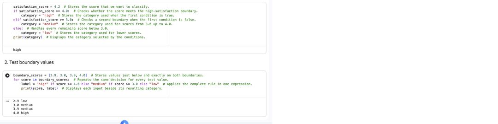
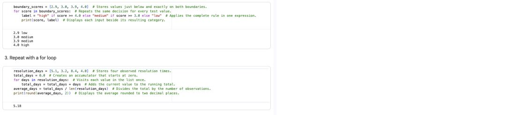
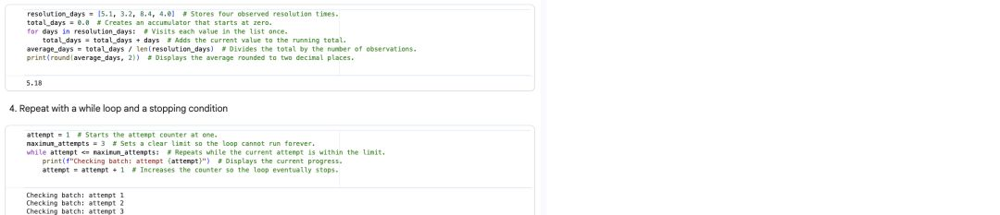
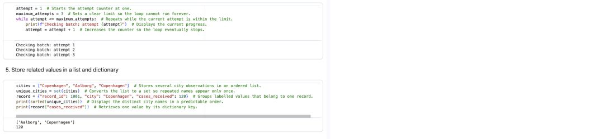
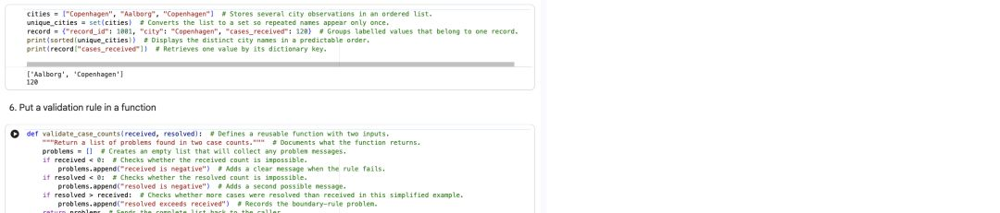
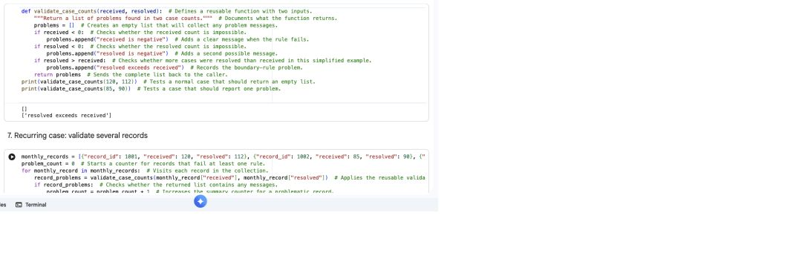
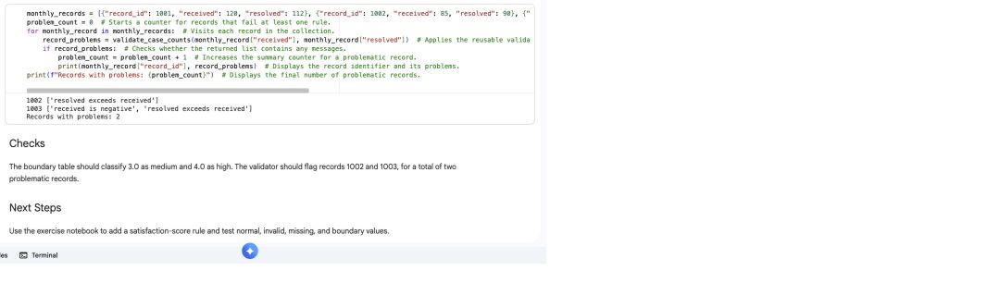

# Part II Tutorial: Python Foundations II

**Course:** Introduction to Scripting, Data Mining and Machine Learning  
**Audience:** Programming beginners in Techno-Anthropology and related social-science programmes  
**Tutorial status:** Core  
**Estimated study time:** 4 to 6 hours, including exercises  
**Suggested lecture use:** Four 45-minute teaching slots, supported by pre-lecture and post-lecture practice  
**Primary environment:** Google Colab  
**Prerequisite:** Python Foundations I, including variables, values, data types, expressions, `print()`, type conversion, user input and comments  

> **Central idea:** In Python Foundations I, you learned how Python stores values and evaluates expressions. In this tutorial, you will learn how a program makes decisions, repeats work, organises reusable code and responds to errors.

---

## Tutorial links

- **Run every Python Foundations II tutorial example:** [Open the complete companion in Colab](https://colab.research.google.com/github/asmrabbi/E26_TAN7_Scripting_CPH/blob/main/notebooks/examples/L04_complete_python_foundations_II_tutorial.ipynb)
- **View all tutorial code on GitHub:** [Complete companion notebook](https://github.com/asmrabbi/E26_TAN7_Scripting_CPH/blob/main/notebooks/examples/L04_complete_python_foundations_II_tutorial.ipynb)
- **Open the shorter lecture examples:** [Lecture 4 examples in Colab](https://colab.research.google.com/github/asmrabbi/E26_TAN7_Scripting_CPH/blob/main/notebooks/examples/L04_examples_control_flow_collections_functions.ipynb)
- **Practise independently:** [Lecture 4 exercises in Colab](https://colab.research.google.com/github/asmrabbi/E26_TAN7_Scripting_CPH/blob/main/notebooks/exercises/L04_exercises_control_flow_collections_functions.ipynb)
- **Review worked answers separately:** [Lecture 4 solutions in Colab](https://colab.research.google.com/github/asmrabbi/E26_TAN7_Scripting_CPH/blob/main/notebooks/solutions/L04_solutions_control_flow_collections_functions.ipynb)
- **Report a problem:** [Open a GitHub issue](https://github.com/asmrabbi/E26_TAN7_Scripting_CPH/issues)

---

# 1. What you will learn

By the end of this tutorial, you should be able to:

1. explain what a Boolean value is;
2. use comparison operators to create conditions;
3. write one-way, two-way and multi-way decisions using `if`, `else` and `elif`;
4. combine conditions using `and`, `or` and `not`;
5. explain why indentation is part of Python syntax;
6. use `try` and `except` to respond to common input errors;
7. use a `for` loop to repeat an action for a known collection or range;
8. use a `while` loop when repetition depends on a condition;
9. recognise and repair an infinite loop;
10. create and call a simple function;
11. use parameters and return values;
12. import and use a Python module;
13. read common error messages and identify where a program failed;
14. combine conditions, loops and functions in a short, meaningful script;
15. explain the limits of a program and the assumptions built into its rules.

You are **not** expected to memorise every line. You should be able to:

- read the code;
- explain its important parts;
- run it;
- change it;
- test it;
- repair basic errors;
- apply the same structure to a new but bounded problem.

---

# 2. Before you begin

## 2.1 Required knowledge from Python Foundations I

You should already recognise the following ideas:

```python
records = 250
missing_records = 18
complete_records = records - missing_records

print(complete_records)
```

You should be able to explain that:

- `records`, `missing_records` and `complete_records` are variables;
- `250` and `18` are integer values;
- `=` assigns a value to a variable;
- `-` performs subtraction;
- `print()` displays a result;
- the code is executed from top to bottom.

## 2.2 Quick readiness check

Predict the output before running the code:

```python
total_rows = 120
duplicate_rows = 8
usable_rows = total_rows - duplicate_rows

print("Usable rows:", usable_rows)
```

**Expected output:**

```text
Usable rows: 112
```

### Check your understanding

1. Which variable stores the value `8`?
2. Which line performs a calculation?
3. What will happen if `duplicate_rows` changes to `20`?
4. Is `"Usable rows:"` a number or a string?

<details>
<summary>Suggested answers</summary>

1. `duplicate_rows`
2. `usable_rows = total_rows - duplicate_rows`
3. The output will become `Usable rows: 100`
4. It is a string because it is written inside quotation marks.

</details>

---

# 3. The recurring case used in this tutorial

Throughout this tutorial, we will use small examples connected to a fictional case called the **Green Mobility Consultation**.

A municipality has collected public consultation records about:

- cycling infrastructure;
- public transport;
- car restrictions;
- accessibility;
- business concerns;
- environmental effects.

Later in the course, you may work with a CSV dataset. In this tutorial, we will not load a CSV file yet. Instead, we will use individual values and small lists so that you can focus on Python logic.

Examples will involve questions such as:

- Does a record have missing information?
- Is engagement high, medium or low?
- Should a record be reviewed?
- How many records meet a condition?
- Can repeated checks be organised into a function?

These are simplified teaching examples. Real data-quality decisions require context, documentation and human judgement.

---

# 4. Boolean values and comparison operators

## 4.1 What is a Boolean value?

A Boolean value represents one of two logical states:

```python
True
False
```

The capital letters matter. Python recognises `True` and `False` as reserved Boolean values.

```python
record_complete = True
needs_review = False

print(record_complete)
print(needs_review)
```

**Expected output:**

```text
True
False
```

### Line-by-line explanation

```python
record_complete = True
```

- `record_complete` is a variable.
- `=` assigns a value.
- `True` is a Boolean value.
- The line records the decision that the record is complete.

```python
needs_review = False
```

- `needs_review` is another variable.
- Its value is `False`.

```python
print(record_complete)
```

- `print()` displays the current value stored in `record_complete`.

---

## 4.2 Comparison operators

Comparison operators compare two values. The result is normally `True` or `False`.

| Operator | Meaning | Example |
|---|---|---|
| `==` | equal to | `score == 5` |
| `!=` | not equal to | `score != 5` |
| `>` | greater than | `score > 5` |
| `<` | less than | `score < 5` |
| `>=` | greater than or equal to | `score >= 5` |
| `<=` | less than or equal to | `score <= 5` |

### Example 1: Comparing a number

```python
engagement = 125

print(engagement > 100)
print(engagement == 125)
print(engagement < 50)
```

**Expected output:**

```text
True
True
False
```

### Explanation

- `engagement > 100` asks whether `125` is greater than `100`.
- `engagement == 125` asks whether the two values are equal.
- `engagement < 50` asks whether `125` is less than `50`.

The expressions do not merely describe a comparison. Python evaluates them and produces Boolean results.

---

## 4.3 Assignment and equality are different

This distinction is essential:

```python
engagement = 125
```

means:

> Assign the value `125` to the variable `engagement`.

By contrast:

```python
engagement == 125
```

means:

> Ask whether the current value of `engagement` is equal to `125`.

### Deliberate error

Run this code:

```python
engagement = 125

if engagement = 125:
    print("The value is 125")
```

You should receive a syntax error because `=` cannot be used as the equality comparison inside the condition.

### Repair

```python
engagement = 125

if engagement == 125:
    print("The value is 125")
```

**Expected output:**

```text
The value is 125
```

---

## 4.4 Comparing strings

Python can also compare strings.

```python
actor_type = "Municipality"

print(actor_type == "Municipality")
print(actor_type == "Business")
print(actor_type != "Citizen")
```

**Expected output:**

```text
True
False
True
```

String comparisons are case-sensitive:

```python
topic = "Cycling"

print(topic == "Cycling")
print(topic == "cycling")
```

**Expected output:**

```text
True
False
```

The words look similar to a human reader, but Python treats uppercase and lowercase letters as different.

### Modification task

Change the value of `topic` to `"Public Transport"` and create three comparisons:

1. Is the topic `"Public Transport"`?
2. Is the topic `"Cycling"`?
3. Is the topic not equal to `"Accessibility"`?

---

## 4.5 Storing the result of a comparison

A comparison can be stored in a variable.

```python
missing_values = 14
too_many_missing = missing_values > 10

print(too_many_missing)
```

**Expected output:**

```text
True
```

### Explanation

Python first evaluates:

```python
missing_values > 10
```

The result is `True`. That result is then assigned to:

```python
too_many_missing
```

This can make later code easier to read.

Compare:

```python
if missing_values > 10:
    print("Review the data")
```

with:

```python
too_many_missing = missing_values > 10

if too_many_missing:
    print("Review the data")
```

Both work. The second version gives a meaningful name to the condition.

---

## Practice checkpoint 1

Predict the output:

```python
records = 75
minimum_required = 100
enough_records = records >= minimum_required

print(enough_records)
```

Then answer:

1. What type of value is stored in `enough_records`?
2. What change would make the result `True`?
3. What is the difference between `>` and `>=`?

<details>
<summary>Suggested answer</summary>

The output is:

```text
False
```

1. A Boolean value.
2. Set `records` to `100` or more.
3. `>` means strictly greater than. `>=` includes equality.

</details>

---

# 5. Conditional execution with `if`

Programs often need to make decisions. A condition allows Python to execute code only when a logical test is true.

## 5.1 A one-way decision

```python
missing_values = 14

if missing_values > 10:
    print("Review the missing data")
```

**Expected output:**

```text
Review the missing data
```

### Structure

```python
if condition:
    code_to_run
```

Important parts:

- `if` is a reserved word.
- The condition comes after `if`.
- A colon `:` ends the condition line.
- The action is indented.
- The indented code runs only when the condition is `True`.

---

## 5.2 When the condition is false

```python
missing_values = 4

if missing_values > 10:
    print("Review the missing data")

print("Check complete")
```

**Expected output:**

```text
Check complete
```

The review message is not printed because the condition is false. The final line is outside the `if` block, so it runs regardless.

---

## 5.3 Indentation is part of Python syntax

Python uses indentation to show which lines belong together.

Correct:

```python
engagement = 150

if engagement > 100:
    print("High engagement")
    print("Include this record in the high-engagement review")

print("Finished")
```

**Expected output:**

```text
High engagement
Include this record in the high-engagement review
Finished
```

Incorrect:

```python
engagement = 150

if engagement > 100:
print("High engagement")
```

This produces an `IndentationError`.

### Repair

Add four spaces before the action:

```python
engagement = 150

if engagement > 100:
    print("High engagement")
```

---

## 5.4 Multiple lines inside one `if` block

```python
engagement = 220
actor_type = "Citizen Group"

if engagement > 200:
    print("Priority record")
    print("Actor type:", actor_type)
    print("Engagement:", engagement)

print("Assessment complete")
```

**Expected output:**

```text
Priority record
Actor type: Citizen Group
Engagement: 220
Assessment complete
```

All three indented lines belong to the same decision.

---

## 5.5 A condition using a string

```python
position = "Support"

if position == "Support":
    print("This record supports the proposal")
```

**Expected output:**

```text
This record supports the proposal
```

### Common mistake

```python
position = "Support"

if position == "support":
    print("This record supports the proposal")
```

This prints nothing because string comparison is case-sensitive.

One possible repair is:

```python
position = "Support"

if position.lower() == "support":
    print("This record supports the proposal")
```

Here, `.lower()` creates a lowercase version for the comparison.

You do not need to memorise every string method yet. The important idea is that data may need to be standardised before reliable comparisons can be made.

---

## Practice checkpoint 2

Complete the missing condition:

```python
duplicate_rows = 7

if __________________:
    print("Duplicates must be reviewed")
```

The message should be printed when there is at least one duplicate row.

<details>
<summary>Suggested answer</summary>

```python
duplicate_rows = 7

if duplicate_rows > 0:
    print("Duplicates must be reviewed")
```

</details>

---

# 6. Two-way decisions with `if` and `else`

An `else` block provides an alternative action when the condition is false.

## 6.1 Basic example

```python
missing_values = 14

if missing_values > 10:
    print("Review the dataset")
else:
    print("Continue to initial analysis")
```

**Expected output:**

```text
Review the dataset
```

If you change `missing_values` to `4`, the output becomes:

```text
Continue to initial analysis
```

Exactly one branch runs.

---

## 6.2 Understanding the flow

```python
if condition:
    action_when_true
else:
    action_when_false
```

Python:

1. evaluates the condition;
2. runs the `if` block when the result is `True`;
3. otherwise runs the `else` block;
4. continues with the code after the decision.

---

## 6.3 Example with user input

```python
answer = input("Is the source verified? Type yes or no: ")

if answer == "yes":
    print("The record may continue to analysis")
else:
    print("The source must be reviewed")
```

### Possible interaction

```text
Is the source verified? Type yes or no: yes
The record may continue to analysis
```

### Problem with this version

A user might enter:

```text
Yes
YES
 yes
yes 
```

These values are not exactly equal to `"yes"`.

A more robust version is:

```python
answer = input("Is the source verified? Type yes or no: ")
answer = answer.strip().lower()

if answer == "yes":
    print("The record may continue to analysis")
else:
    print("The source must be reviewed")
```

### Explanation

- `.strip()` removes spaces at the beginning and end.
- `.lower()` converts letters to lowercase.
- The cleaned value is assigned back to `answer`.

This is an early example of data cleaning.

---

## 6.4 Deliberate break-and-repair activity

Broken code:

```python
engagement = 80

if engagement >= 100
    print("High engagement")
else
    print("Normal engagement")
```

There are two missing colons.

Repaired code:

```python
engagement = 80

if engagement >= 100:
    print("High engagement")
else:
    print("Normal engagement")
```

**Expected output:**

```text
Normal engagement
```

---

# 7. Multi-way decisions with `elif`

Sometimes there are more than two meaningful outcomes.

## 7.1 Classifying engagement

```python
engagement = 125

if engagement >= 200:
    print("High engagement")
elif engagement >= 100:
    print("Medium engagement")
else:
    print("Low engagement")
```

**Expected output:**

```text
Medium engagement
```

### How Python evaluates the code

Python checks conditions from top to bottom:

1. Is `125 >= 200`? No.
2. Is `125 >= 100`? Yes.
3. Print `"Medium engagement"`.
4. Skip the remaining branch.

Only the first matching branch is executed.

---

## 7.2 Order matters

Consider this incorrect order:

```python
engagement = 250

if engagement >= 100:
    print("Medium or high engagement")
elif engagement >= 200:
    print("High engagement")
else:
    print("Low engagement")
```

**Output:**

```text
Medium or high engagement
```

The second condition is never reached because `250 >= 100` is already true.

A better order is:

```python
engagement = 250

if engagement >= 200:
    print("High engagement")
elif engagement >= 100:
    print("Medium engagement")
else:
    print("Low engagement")
```

Check the most restrictive or highest threshold first.

---

## 7.3 A more detailed classification

```python
missing_percentage = 18

if missing_percentage == 0:
    status = "No missing values"
elif missing_percentage <= 5:
    status = "Minor missingness"
elif missing_percentage <= 15:
    status = "Moderate missingness"
else:
    status = "Substantial missingness"

print(status)
```

**Expected output:**

```text
Substantial missingness
```

### Why assign the result to a variable?

Instead of printing inside every branch, we store the classification in `status`. This makes it easier to use the result later.

```python
print("Data-quality status:", status)
```

or:

```python
if status == "Substantial missingness":
    print("Human review required")
```

---

## 7.4 Boundary testing

When writing thresholds, test values directly around the boundaries.

For the earlier classification, try:

```python
missing_percentage = 0
missing_percentage = 1
missing_percentage = 5
missing_percentage = 6
missing_percentage = 15
missing_percentage = 16
```

Boundary testing helps reveal mistakes such as gaps or overlaps.

For example, this code contains a gap:

```python
score = 70

if score > 70:
    print("High")
elif score < 70:
    print("Low")
```

Nothing happens when `score` is exactly `70`.

A repair could be:

```python
score = 70

if score >= 70:
    print("High")
else:
    print("Low")
```

---

## Practice checkpoint 3

Write a multi-way decision that classifies the number of records:

- `200` or more: `"Large dataset"`
- `100` to `199`: `"Medium dataset"`
- fewer than `100`: `"Small dataset"`

Starter code:

```python
number_of_records = 145

# Write your decision below
```

<details>
<summary>Suggested solution</summary>

```python
number_of_records = 145

if number_of_records >= 200:
    print("Large dataset")
elif number_of_records >= 100:
    print("Medium dataset")
else:
    print("Small dataset")
```

</details>

---

# 8. Combining conditions with logical operators

Logical operators allow a program to combine or reverse conditions.

## 8.1 `and`

Both conditions must be true.

```python
missing_values = 4
duplicate_rows = 0

if missing_values <= 5 and duplicate_rows == 0:
    print("The dataset passes the initial check")
```

**Expected output:**

```text
The dataset passes the initial check
```

Truth pattern for `and`:

| First condition | Second condition | Result |
|---|---|---|
| `True` | `True` | `True` |
| `True` | `False` | `False` |
| `False` | `True` | `False` |
| `False` | `False` | `False` |

---

## 8.2 `or`

At least one condition must be true.

```python
missing_values = 3
duplicate_rows = 7

if missing_values > 10 or duplicate_rows > 0:
    print("Review is required")
```

**Expected output:**

```text
Review is required
```

The first condition is false, but the second condition is true.

---

## 8.3 `not`

`not` reverses a Boolean value.

```python
source_verified = False

if not source_verified:
    print("Do not use the record without review")
```

**Expected output:**

```text
Do not use the record without review
```

The condition reads:

> If `source_verified` is not true, print the warning.

---

## 8.4 A combined example

```python
actor_type = "Citizen Group"
engagement = 240
source_verified = True

if actor_type == "Citizen Group" and engagement >= 200 and source_verified:
    print("Include in the high-engagement citizen-group review")
else:
    print("Use the standard review process")
```

**Expected output:**

```text
Include in the high-engagement citizen-group review
```

---

## 8.5 Parentheses for clarity

Python has rules for evaluating logical expressions, but parentheses make your intention clearer.

Less clear:

```python
if topic == "Cycling" or topic == "Public Transport" and engagement > 100:
    print("Selected")
```

Clearer:

```python
if (topic == "Cycling" or topic == "Public Transport") and engagement > 100:
    print("Selected")
```

The clearer version requires:

- one of the selected topics;
- and engagement above `100`.

Use parentheses when combining several conditions.

---

## 8.6 Common mistake: repeating the variable incorrectly

Incorrect:

```python
topic = "Cycling"

if topic == "Cycling" or "Public Transport":
    print("Selected topic")
```

This condition does not mean what it appears to mean. The non-empty string `"Public Transport"` is treated as truthy, so the decision will almost always pass.

Correct:

```python
topic = "Cycling"

if topic == "Cycling" or topic == "Public Transport":
    print("Selected topic")
```

A later alternative is:

```python
if topic in ["Cycling", "Public Transport"]:
    print("Selected topic")
```

The second version uses a list and the `in` operator.

---

## Practice checkpoint 4

Create a condition that prints `"Priority review"` when:

- engagement is at least `150`;
- and either the actor type is `"Citizen Group"` or `"NGO"`.

<details>
<summary>Suggested solution</summary>

```python
engagement = 180
actor_type = "NGO"

if engagement >= 150 and (actor_type == "Citizen Group" or actor_type == "NGO"):
    print("Priority review")
```

</details>

---

# 9. Nested decisions

A nested decision is an `if` statement inside another decision.

## 9.1 Basic nested example

```python
source_verified = True
engagement = 230

if source_verified:
    print("Source check passed")

    if engagement >= 200:
        print("High-engagement verified record")
```

**Expected output:**

```text
Source check passed
High-engagement verified record
```

The second decision is checked only when the first decision passes.

---

## 9.2 Nested decision with alternatives

```python
source_verified = True
engagement = 80

if source_verified:
    if engagement >= 200:
        print("High-engagement verified record")
    else:
        print("Verified record with normal engagement")
else:
    print("Source review required")
```

**Expected output:**

```text
Verified record with normal engagement
```

---

## 9.3 Avoid unnecessary nesting

This nested code:

```python
if source_verified:
    if engagement >= 200:
        print("Selected")
```

can also be written as:

```python
if source_verified and engagement >= 200:
    print("Selected")
```

Use the form that is easiest to understand.

Nested decisions are useful when the second question only makes sense after the first. Combined logical conditions are useful when the criteria form one clear test.

---

# 10. User input, type conversion and validation

The `input()` function always returns a string.

## 10.1 Why conversion is necessary

```python
engagement = input("Enter the engagement value: ")

print(type(engagement))
```

Possible output:

```text
Enter the engagement value: 125
<class 'str'>
```

Even though the user typed digits, the result is a string.

This fails:

```python
engagement = input("Enter the engagement value: ")

if engagement > 100:
    print("High engagement")
```

Python cannot directly compare a string with an integer.

Repair:

```python
engagement = input("Enter the engagement value: ")
engagement = int(engagement)

if engagement > 100:
    print("High engagement")
```

---

## 10.2 Conversion in one line

```python
engagement = int(input("Enter the engagement value: "))

if engagement > 100:
    print("High engagement")
else:
    print("Normal engagement")
```

This is concise, but a conversion error will stop the program when the user enters non-numeric text.

---

## 10.3 Input assumptions

Consider:

```python
age = int(input("Enter age: "))
```

The code assumes that the user will enter a whole number such as `25`.

Possible problematic inputs include:

```text
twenty-five
25.5
unknown
(blank input)
```

Good programming requires thinking about the assumptions behind input.

---

# 11. Handling errors with `try` and `except`

## 11.1 Why error handling matters

Without error handling:

```python
engagement = int(input("Enter engagement: "))
print("Recorded:", engagement)
```

Entering `high` produces a `ValueError` and stops the program.

With error handling:

```python
try:
    engagement = int(input("Enter engagement: "))
    print("Recorded:", engagement)
except:
    print("Error: enter a whole number")
```

Possible interaction:

```text
Enter engagement: high
Error: enter a whole number
```

---

## 11.2 Understanding the structure

```python
try:
    code_that_might_fail
except:
    code_to_run_if_an_error_occurs
```

Python first attempts the `try` block. When an error occurs, it moves to the `except` block.

---

## 11.3 Catching a specific error

It is usually better to name the expected error.

```python
try:
    engagement = int(input("Enter engagement: "))
    print("Recorded:", engagement)
except ValueError:
    print("Error: enter a whole number")
```

This handles `ValueError` without hiding every possible problem.

---

## 11.4 Adding a decision after valid input

```python
try:
    engagement = int(input("Enter engagement: "))

    if engagement >= 200:
        print("High engagement")
    elif engagement >= 100:
        print("Medium engagement")
    else:
        print("Low engagement")

except ValueError:
    print("The engagement value must be a whole number")
```

---

## 11.5 Valid type but invalid range

A value can be correctly converted but still be unreasonable.

```python
try:
    percentage = float(input("Enter missing-data percentage: "))

    if percentage < 0 or percentage > 100:
        print("Error: percentage must be between 0 and 100")
    elif percentage > 15:
        print("Substantial missingness")
    else:
        print("Missingness is within the initial review threshold")

except ValueError:
    print("Error: enter a numeric value")
```

This distinguishes:

- a conversion error;
- an implausible value;
- a valid value.

---

## 11.6 Avoid a completely empty `except`

A broad `except:` can hide unexpected problems. In beginner exercises, it may be used to introduce the concept, but prefer specific errors where possible.

Less informative:

```python
except:
    print("Something went wrong")
```

More informative:

```python
except ValueError:
    print("Enter a numeric value")
```

---

## Practice checkpoint 5

Repair this program so that non-numeric input produces a helpful message:

```python
number_of_records = int(input("Enter number of records: "))

if number_of_records >= 100:
    print("Suitable for the planned exercise")
else:
    print("Small dataset")
```

<details>
<summary>Suggested solution</summary>

```python
try:
    number_of_records = int(input("Enter number of records: "))

    if number_of_records >= 100:
        print("Suitable for the planned exercise")
    else:
        print("Small dataset")

except ValueError:
    print("Enter a whole number")
```

</details>

---

# 12. Repetition and loops

A loop repeats a block of code.

There are two major beginner-level loop types:

- `for` loops;
- `while` loops.

A `for` loop is normally used when you have a known sequence, range or collection. A `while` loop repeats while a condition remains true.

---

# 13. `for` loops

## 13.1 A simple definite loop

```python
for number in [1, 2, 3]:
    print(number)
```

**Expected output:**

```text
1
2
3
```

### Explanation

```python
for number in [1, 2, 3]:
```

- `for` begins the loop.
- `number` is the iteration variable.
- `in` means that Python will take values from the sequence.
- `[1, 2, 3]` is a list.
- The colon begins the loop body.

Each time through the loop, `number` receives the next value.

---

## 13.2 Looping through strings

```python
topics = ["Cycling", "Public Transport", "Accessibility"]

for topic in topics:
    print("Current topic:", topic)
```

**Expected output:**

```text
Current topic: Cycling
Current topic: Public Transport
Current topic: Accessibility
```

### What changes?

The variable `topic` changes during each iteration:

1. `"Cycling"`
2. `"Public Transport"`
3. `"Accessibility"`

The indented line runs once for each value.

---

## 13.3 The code after the loop

```python
topics = ["Cycling", "Public Transport", "Accessibility"]

for topic in topics:
    print(topic)

print("All topics processed")
```

**Expected output:**

```text
Cycling
Public Transport
Accessibility
All topics processed
```

The final line is not indented, so it runs after the loop finishes.

---

## 13.4 Using `range()`

`range()` generates a sequence of integers.

```python
for number in range(5):
    print(number)
```

**Expected output:**

```text
0
1
2
3
4
```

`range(5)` starts at `0` and stops before `5`.

---

## 13.5 Starting and stopping a range

```python
for number in range(1, 6):
    print(number)
```

**Expected output:**

```text
1
2
3
4
5
```

The first argument is the starting value. The second is the stopping point, which is not included.

---

## 13.6 Adding a step

```python
for number in range(0, 11, 2):
    print(number)
```

**Expected output:**

```text
0
2
4
6
8
10
```

The arguments mean:

```text
start at 0
stop before 11
increase by 2
```

---

## 13.7 Repeating a message

```python
for repetition in range(3):
    print("Check the dataset")
```

**Expected output:**

```text
Check the dataset
Check the dataset
Check the dataset
```

The iteration variable exists even when it is not printed.

A conventional name for an unused variable is `_`:

```python
for _ in range(3):
    print("Check the dataset")
```

---

## 13.8 Conditions inside a loop

```python
engagement_values = [35, 120, 240, 80]

for engagement in engagement_values:
    if engagement >= 200:
        print(engagement, "is high")
    elif engagement >= 100:
        print(engagement, "is medium")
    else:
        print(engagement, "is low")
```

**Expected output:**

```text
35 is low
120 is medium
240 is high
80 is low
```

This combines repetition with decision-making.

---

## 13.9 Counting values that meet a condition

```python
engagement_values = [35, 120, 240, 80, 310]
high_count = 0

for engagement in engagement_values:
    if engagement >= 200:
        high_count = high_count + 1

print("High-engagement records:", high_count)
```

**Expected output:**

```text
High-engagement records: 2
```

### Step-by-step explanation

```python
high_count = 0
```

The counter begins at zero.

```python
for engagement in engagement_values:
```

Python processes each engagement value.

```python
if engagement >= 200:
```

The program checks whether the current value meets the threshold.

```python
high_count = high_count + 1
```

When the condition is true, the counter increases by one.

An equivalent shorter form is:

```python
high_count += 1
```

---

## 13.10 Accumulating a total

```python
engagement_values = [35, 120, 240, 80]
total_engagement = 0

for engagement in engagement_values:
    total_engagement = total_engagement + engagement

print("Total engagement:", total_engagement)
```

**Expected output:**

```text
Total engagement: 475
```

Then calculate the mean:

```python
average_engagement = total_engagement / len(engagement_values)
print("Average engagement:", average_engagement)
```

**Expected output:**

```text
Average engagement: 118.75
```

`len()` returns the number of items in the list.

Later, pandas will calculate summaries more directly. This example helps you understand the repeated process behind a total and mean.

---

## 13.11 Deliberate indentation error

Broken:

```python
topics = ["Cycling", "Accessibility"]

for topic in topics:
print(topic)
```

Repair:

```python
topics = ["Cycling", "Accessibility"]

for topic in topics:
    print(topic)
```

---

## Practice checkpoint 6

Write a loop that prints each item with the phrase `"Topic under review:"`.

Starter code:

```python
topics = ["Cycling", "Parking", "Accessibility"]
```

Expected output:

```text
Topic under review: Cycling
Topic under review: Parking
Topic under review: Accessibility
```

<details>
<summary>Suggested solution</summary>

```python
topics = ["Cycling", "Parking", "Accessibility"]

for topic in topics:
    print("Topic under review:", topic)
```

</details>

---

# 14. `while` loops

A `while` loop repeats while a condition remains true.

## 14.1 Countdown example

```python
number = 5

while number > 0:
    print(number)
    number = number - 1

print("Finished")
```

**Expected output:**

```text
5
4
3
2
1
Finished
```

### Three essential parts

Most `while` loops need:

1. an initial value;
2. a condition;
3. an update.

In the example:

```python
number = 5
```

is the initial value.

```python
while number > 0:
```

is the condition.

```python
number = number - 1
```

is the update.

---

## 14.2 An infinite loop

This code never changes `number`:

```python
number = 5

while number > 0:
    print(number)
```

The condition remains true forever.

### How to stop an infinite loop in Colab

Use the stop button beside the running cell.

### Repair

```python
number = 5

while number > 0:
    print(number)
    number = number - 1
```

---

## 14.3 A loop that never starts

```python
number = 0

while number > 0:
    print(number)

print("Finished")
```

**Expected output:**

```text
Finished
```

The condition is false before the first iteration.

---

## 14.4 Repeating until valid input

```python
valid_input = False

while not valid_input:
    answer = input("Type yes or no: ").strip().lower()

    if answer == "yes" or answer == "no":
        valid_input = True
    else:
        print("Please type exactly yes or no")

print("Accepted:", answer)
```

### Explanation

- `valid_input` begins as `False`.
- `while not valid_input` means repeat while valid input has not been received.
- When the answer is acceptable, `valid_input` becomes `True`.
- The condition becomes false and the loop ends.

This is a meaningful use of a `while` loop because the number of attempts is unknown.

---

## 14.5 `for` or `while`?

Use a `for` loop when you know the sequence or number of repetitions:

```python
for topic in topics:
    print(topic)
```

Use a `while` loop when repetition depends on a changing condition:

```python
while not valid_input:
    ...
```

For beginners, `for` loops are usually safer and more common in data processing.

---

# 15. Loop-control statements

This section is useful, but it can be treated as **recommended rather than essential**.

## 15.1 `break`

`break` ends the loop immediately.

```python
topics = ["Cycling", "Accessibility", "STOP", "Parking"]

for topic in topics:
    if topic == "STOP":
        break

    print(topic)

print("Loop ended")
```

**Expected output:**

```text
Cycling
Accessibility
Loop ended
```

When `"STOP"` is reached, the loop ends.

---

## 15.2 `continue`

`continue` skips the rest of the current iteration and moves to the next one.

```python
values = [120, None, 75, 240]

for value in values:
    if value is None:
        continue

    print("Valid value:", value)
```

**Expected output:**

```text
Valid value: 120
Valid value: 75
Valid value: 240
```

The missing value is skipped.

---

## 15.3 Use with care

`break` and `continue` can be helpful, but too many control statements can make a loop difficult to follow. Prefer clear conditions and meaningful variable names.

---

# 16. Functions

A function is a named block of reusable code.

Functions help you:

- avoid repeating code;
- organise a program;
- give a meaningful name to a process;
- test one part of a program separately;
- reuse the same logic with different values.

---

## 16.1 Defining and calling a function

```python
def show_welcome():
    print("Welcome to the data-quality checker")

show_welcome()
```

**Expected output:**

```text
Welcome to the data-quality checker
```

### Explanation

```python
def show_welcome():
```

- `def` is a reserved word that defines a function.
- `show_welcome` is the function name.
- Parentheses are required.
- The colon starts the function body.

```python
    print("Welcome to the data-quality checker")
```

The indented line belongs to the function.

```python
show_welcome()
```

This calls the function.

Defining a function does not automatically run it.

---

## 16.2 Meaningful function names

Good names:

```python
calculate_percentage()
classify_engagement()
check_missing_values()
show_summary()
```

Less useful names:

```python
do_it()
thing()
f1()
xyz()
```

A function name should describe the action.

---

## 16.3 Parameters and arguments

```python
def greet_actor(actor_name):
    print("Record submitted by:", actor_name)

greet_actor("Green Streets Association")
greet_actor("Local Business Council")
```

**Expected output:**

```text
Record submitted by: Green Streets Association
Record submitted by: Local Business Council
```

### Terminology

In the definition:

```python
def greet_actor(actor_name):
```

`actor_name` is a **parameter**.

In the call:

```python
greet_actor("Green Streets Association")
```

`"Green Streets Association"` is an **argument**.

---

## 16.4 Multiple parameters

```python
def show_record(actor_name, topic, engagement):
    print("Actor:", actor_name)
    print("Topic:", topic)
    print("Engagement:", engagement)

show_record("Cycling Alliance", "Cycling", 245)
```

**Expected output:**

```text
Actor: Cycling Alliance
Topic: Cycling
Engagement: 245
```

The order of arguments should match the order of parameters.

---

## 16.5 Returning a value

A function can calculate and return a result.

```python
def calculate_missing_percentage(missing_values, total_values):
    percentage = missing_values / total_values * 100
    return percentage

result = calculate_missing_percentage(18, 200)
print(result)
```

**Expected output:**

```text
9.0
```

### Explanation

```python
return percentage
```

sends the result back to the place where the function was called.

```python
result = calculate_missing_percentage(18, 200)
```

stores the returned value in `result`.

---

## 16.6 `print()` and `return` are not the same

Printing:

```python
def calculate_total(a, b):
    print(a + b)
```

Returning:

```python
def calculate_total(a, b):
    return a + b
```

A returned value can be stored and used later:

```python
total = calculate_total(5, 7)
average = total / 2

print(average)
```

When a function only prints, the printed result is visible but is not automatically available for later calculation.

---

## 16.7 A function with conditional logic

```python
def classify_engagement(engagement):
    if engagement >= 200:
        return "High"
    elif engagement >= 100:
        return "Medium"
    else:
        return "Low"

print(classify_engagement(240))
print(classify_engagement(130))
print(classify_engagement(45))
```

**Expected output:**

```text
High
Medium
Low
```

The function can be reused with different values.

---

## 16.8 A function with validation

```python
def classify_percentage(percentage):
    if percentage < 0 or percentage > 100:
        return "Invalid percentage"
    elif percentage > 15:
        return "Substantial missingness"
    elif percentage > 5:
        return "Moderate missingness"
    else:
        return "Minor missingness"

print(classify_percentage(18))
print(classify_percentage(4))
print(classify_percentage(120))
```

**Expected output:**

```text
Substantial missingness
Minor missingness
Invalid percentage
```

---

## 16.9 Local and global variables

This is an important idea, but it does not need advanced treatment yet.

```python
status = "Global status"

def show_status():
    status = "Local status"
    print(status)

show_status()
print(status)
```

**Expected output:**

```text
Local status
Global status
```

The variable created inside the function is local to that function.

A good beginner rule is:

> Pass information into a function through parameters and send results back using `return`.

Avoid relying heavily on global variables.

---

## 16.10 Deliberate function errors

### Error 1: Function not called

```python
def show_message():
    print("Hello")
```

No output appears because the function is defined but not called.

Repair:

```python
def show_message():
    print("Hello")

show_message()
```

### Error 2: Missing argument

```python
def greet(name):
    print("Hello", name)

greet()
```

This produces a `TypeError` because the required argument is missing.

Repair:

```python
greet("Amina")
```

### Error 3: Incorrect indentation

```python
def greet(name):
print("Hello", name)
```

Repair:

```python
def greet(name):
    print("Hello", name)
```

---

## Practice checkpoint 7

Create a function called `calculate_completion_rate()` that:

- receives `complete_records`;
- receives `total_records`;
- returns the completion percentage.

Test it with `180` complete records out of `200`.

<details>
<summary>Suggested solution</summary>

```python
def calculate_completion_rate(complete_records, total_records):
    rate = complete_records / total_records * 100
    return rate

result = calculate_completion_rate(180, 200)
print(result)
```

Expected output:

```text
90.0
```

</details>

---

# 17. Combining loops and functions

## 17.1 Apply one function to several values

```python
def classify_engagement(engagement):
    if engagement >= 200:
        return "High"
    elif engagement >= 100:
        return "Medium"
    else:
        return "Low"

engagement_values = [35, 120, 240, 80]

for engagement in engagement_values:
    category = classify_engagement(engagement)
    print(engagement, "->", category)
```

**Expected output:**

```text
35 -> Low
120 -> Medium
240 -> High
80 -> Low
```

### Why this structure is useful

The function contains the classification rule. The loop applies the rule repeatedly.

Later, data-processing libraries will perform similar repeated operations across rows or columns.

---

## 17.2 Count function results

```python
def classify_engagement(engagement):
    if engagement >= 200:
        return "High"
    elif engagement >= 100:
        return "Medium"
    else:
        return "Low"

engagement_values = [35, 120, 240, 80, 310]
high_count = 0

for engagement in engagement_values:
    category = classify_engagement(engagement)

    if category == "High":
        high_count = high_count + 1

print("High-engagement count:", high_count)
```

**Expected output:**

```text
High-engagement count: 2
```

---

## 17.3 More advanced example: produce a simple report

```python
def classify_engagement(engagement):
    if engagement >= 200:
        return "High"
    elif engagement >= 100:
        return "Medium"
    else:
        return "Low"


engagement_values = [35, 120, 240, 80, 310]

high_count = 0
medium_count = 0
low_count = 0

for engagement in engagement_values:
    category = classify_engagement(engagement)

    if category == "High":
        high_count = high_count + 1
    elif category == "Medium":
        medium_count = medium_count + 1
    else:
        low_count = low_count + 1

print("Engagement report")
print("-----------------")
print("High:", high_count)
print("Medium:", medium_count)
print("Low:", low_count)
```

**Expected output:**

```text
Engagement report
-----------------
High: 2
Medium: 1
Low: 2
```

This example combines:

- function definition;
- parameters;
- return values;
- a list;
- a loop;
- conditional execution;
- counters;
- formatted output.

---

# 18. Modules and libraries

A module contains reusable Python code. A library is a broader collection of tools. In beginner practice, the terms are sometimes used informally, but the core idea is the same:

> You can import existing functionality instead of writing everything yourself.

---

## 18.1 Importing a standard module

```python
import math

result = math.sqrt(16)
print(result)
```

**Expected output:**

```text
4.0
```

### Explanation

```python
import math
```

makes the `math` module available.

```python
math.sqrt(16)
```

uses the `sqrt()` function from that module.

The dot connects the module name and the function.

---

## 18.2 Importing one item

```python
from math import sqrt

result = sqrt(25)
print(result)
```

**Expected output:**

```text
5.0
```

Now `sqrt()` can be used without writing `math.`.

For beginners, importing the full module can make the origin of a function clearer:

```python
math.sqrt()
```

shows that `sqrt()` comes from `math`.

---

## 18.3 Using an alias

Later you will see:

```python
import pandas as pd
```

`pd` is an alias, or shorter name, for pandas.

A standard example:

```python
import math as m

print(m.sqrt(36))
```

**Expected output:**

```text
6.0
```

Aliases should follow common conventions. Do not create confusing aliases such as:

```python
import math as banana
```

Python allows it, but it makes the code harder to understand.

---

## 18.4 Example with the `random` module

```python
import random

number = random.randint(1, 5)
print(number)
```

The output can be any whole number from `1` to `5`.

This demonstrates that not every program produces exactly the same result each time.

For reproducible data analysis, randomness must be controlled and documented. This becomes important later in machine learning.

---

## 18.5 Import errors

This code contains a spelling error:

```python
import maths
```

Python produces:

```text
ModuleNotFoundError: No module named 'maths'
```

Repair:

```python
import math
```

Another common error:

```python
import math

print(math.squareroot(16))
```

This produces an `AttributeError` because the function is called `sqrt()`, not `squareroot()`.

Repair:

```python
print(math.sqrt(16))
```

---

# 19. Reading and responding to errors

Errors are normal evidence that Python reached something it could not interpret or execute.

A useful debugging routine is:

1. Read the final line of the error message.
2. Identify the error type.
3. Find the referenced line.
4. Inspect spelling, punctuation, indentation, values and types.
5. Make one change.
6. Run the code again.
7. Check whether the output now makes sense.

---

## 19.1 `SyntaxError`

Example:

```python
if engagement > 100
    print("High")
```

The colon is missing.

Repair:

```python
if engagement > 100:
    print("High")
```

---

## 19.2 `IndentationError`

Example:

```python
for topic in topics:
print(topic)
```

Repair:

```python
for topic in topics:
    print(topic)
```

---

## 19.3 `NameError`

Example:

```python
engagment = 120
print(engagement)
```

The variable was assigned using one spelling and printed using another.

Repair:

```python
engagement = 120
print(engagement)
```

---

## 19.4 `TypeError`

Example:

```python
engagement = "120"
result = engagement + 10
```

A string and integer cannot be added in this way.

Repair:

```python
engagement = "120"
result = int(engagement) + 10

print(result)
```

---

## 19.5 `ValueError`

Example:

```python
engagement = int("high")
```

The string cannot be converted to an integer.

Possible repair:

```python
try:
    engagement = int(input("Enter engagement: "))
except ValueError:
    print("Enter a whole number")
```

---

## 19.6 `ModuleNotFoundError`

Example:

```python
import pandass
```

Possible repair:

```python
import pandas
```

Check both spelling and whether the package exists in the environment.

---

## 19.7 `TypeError` from a missing function argument

Example:

```python
def classify(value):
    return value > 100

result = classify()
```

Repair:

```python
result = classify(120)
```

---

## 19.8 Logic errors

A logic error does not necessarily produce an error message. The program runs, but the result is wrong.

Example:

```python
missing_values = 10
total_values = 200

missing_percentage = total_values / missing_values * 100
print(missing_percentage)
```

The code runs, but the formula is reversed.

Correct:

```python
missing_percentage = missing_values / total_values * 100
print(missing_percentage)
```

**Expected output:**

```text
5.0
```

Logic errors require testing and domain understanding.

---

# 20. Tracing code manually

Tracing means following how variables change line by line.

Example:

```python
count = 0

for value in [40, 120, 220]:
    if value >= 100:
        count = count + 1

print(count)
```

Trace table:

| Step | Current `value` | Is `value >= 100`? | `count` after step |
|---|---:|---|---:|
| Before loop | Not set | Not checked | 0 |
| First iteration | 40 | False | 0 |
| Second iteration | 120 | True | 1 |
| Third iteration | 220 | True | 2 |

Final output:

```text
2
```

Tracing is particularly helpful for:

- loops;
- counters;
- nested decisions;
- function calls;
- logic errors.

---

# 21. Integrated case: Green Mobility data-quality checker

This case combines the core ideas from the tutorial.

## 21.1 Case description

A municipality is preparing consultation records for analysis. Before continuing, staff want a simple Python script that:

1. asks for the total number of records;
2. asks for the number of missing records;
3. checks that both inputs are numeric;
4. rejects impossible values;
5. calculates the missing-data percentage;
6. classifies the result;
7. prints a short report.

This is not a complete professional data-quality system. It is a bounded learning exercise.

---

## 21.2 Step 1: Write the process in plain language

```text
START
Ask for total records
Ask for missing records
Convert both values to integers
Check whether the inputs are valid
Calculate the missing percentage
Classify the percentage
Display the report
END
```

---

## 21.3 Step 2: Create the classification function

```python
def classify_missingness(percentage):
    if percentage > 15:
        return "Substantial missingness"
    elif percentage > 5:
        return "Moderate missingness"
    else:
        return "Minor missingness"
```

Test it independently:

```python
print(classify_missingness(18))
print(classify_missingness(10))
print(classify_missingness(3))
```

**Expected output:**

```text
Substantial missingness
Moderate missingness
Minor missingness
```

---

## 21.4 Step 3: Add input and error handling

```python
try:
    total_records = int(input("Enter total records: "))
    missing_records = int(input("Enter missing records: "))

except ValueError:
    print("Error: both values must be whole numbers")
```

This catches conversion errors, but it does not yet calculate anything.

---

## 21.5 Step 4: Add validation

```python
try:
    total_records = int(input("Enter total records: "))
    missing_records = int(input("Enter missing records: "))

    if total_records <= 0:
        print("Error: total records must be greater than zero")
    elif missing_records < 0:
        print("Error: missing records cannot be negative")
    elif missing_records > total_records:
        print("Error: missing records cannot exceed total records")
    else:
        print("Inputs accepted")

except ValueError:
    print("Error: both values must be whole numbers")
```

---

## 21.6 Step 5: Complete the script

```python
def classify_missingness(percentage):
    if percentage > 15:
        return "Substantial missingness"
    elif percentage > 5:
        return "Moderate missingness"
    else:
        return "Minor missingness"


try:
    total_records = int(input("Enter total records: "))
    missing_records = int(input("Enter missing records: "))

    if total_records <= 0:
        print("Error: total records must be greater than zero")

    elif missing_records < 0:
        print("Error: missing records cannot be negative")

    elif missing_records > total_records:
        print("Error: missing records cannot exceed total records")

    else:
        missing_percentage = missing_records / total_records * 100
        status = classify_missingness(missing_percentage)

        print()
        print("Data-quality report")
        print("-------------------")
        print("Total records:", total_records)
        print("Missing records:", missing_records)
        print("Missing percentage:", round(missing_percentage, 2))
        print("Classification:", status)

except ValueError:
    print("Error: both values must be whole numbers")
```

### Example interaction

```text
Enter total records: 200
Enter missing records: 18

Data-quality report
-------------------
Total records: 200
Missing records: 18
Missing percentage: 9.0
Classification: Moderate missingness
```

---

## 21.7 Line-by-line review

### Function definition

```python
def classify_missingness(percentage):
```

Defines a reusable function with one parameter.

```python
    if percentage > 15:
```

Checks the highest threshold first.

```python
        return "Substantial missingness"
```

Sends a category back to the caller.

### Input block

```python
try:
```

Begins code that might produce a conversion error.

```python
    total_records = int(input("Enter total records: "))
```

Receives text input, converts it to an integer and stores it.

### Validation block

```python
    if total_records <= 0:
```

Rejects zero and negative totals.

```python
    elif missing_records > total_records:
```

Rejects an impossible count.

### Calculation block

```python
missing_percentage = missing_records / total_records * 100
```

Calculates the percentage.

```python
status = classify_missingness(missing_percentage)
```

Calls the function and stores the returned classification.

```python
round(missing_percentage, 2)
```

Rounds the displayed value to two decimal places.

### Error block

```python
except ValueError:
```

Runs when conversion to an integer fails.

---

## 21.8 Test plan

Do not test only one successful example.

| Test | Input | Expected behaviour |
|---|---|---|
| Normal case | total `200`, missing `18` | Moderate missingness |
| No missing data | total `200`, missing `0` | Minor missingness |
| High missingness | total `100`, missing `30` | Substantial missingness |
| Zero total | total `0`, missing `0` | Error message |
| Negative missing | total `100`, missing `-2` | Error message |
| Missing exceeds total | total `100`, missing `120` | Error message |
| Text instead of number | total `many` | Conversion error message |
| Boundary | total `100`, missing `5` | Minor missingness |
| Boundary | total `100`, missing `6` | Moderate missingness |
| Boundary | total `100`, missing `15` | Moderate missingness |
| Boundary | total `100`, missing `16` | Substantial missingness |

---

## 21.9 Critical reflection

The thresholds in this example are invented for teaching. They should not be treated as universal standards.

Ask:

1. Who decided that more than 15% is “substantial”?
2. Does the importance of missing data depend on which column is missing?
3. Could 2% missingness be serious when the missing cases represent a marginalised group?
4. Does a low percentage automatically mean the data are reliable?
5. What documentation would be needed before using such a classification professionally?

A script can apply rules consistently, but it cannot decide whether the rules are socially, methodologically or ethically appropriate.

---

# 22. Advanced example: reviewing several records

This example is more challenging. It combines a list, a function, a loop, conditions and counters.

```python
def review_record(actor_type, engagement, source_verified):
    if not source_verified:
        return "Source review"

    if engagement >= 200 and actor_type in ["Citizen Group", "NGO"]:
        return "Priority review"

    if engagement >= 100:
        return "Standard review"

    return "Low-priority review"


records = [
    ["Citizen Group", 240, True],
    ["Business", 130, True],
    ["NGO", 260, False],
    ["Municipality", 75, True]
]

priority_count = 0
source_review_count = 0

for record in records:
    actor_type = record[0]
    engagement = record[1]
    source_verified = record[2]

    decision = review_record(actor_type, engagement, source_verified)

    print(actor_type, "->", decision)

    if decision == "Priority review":
        priority_count = priority_count + 1
    elif decision == "Source review":
        source_review_count = source_review_count + 1

print()
print("Priority reviews:", priority_count)
print("Source reviews:", source_review_count)
```

**Expected output:**

```text
Citizen Group -> Priority review
Business -> Standard review
NGO -> Source review
Municipality -> Low-priority review

Priority reviews: 1
Source reviews: 1
```

## Why this is advanced

This example introduces a list containing smaller lists. You do not need to master this structure yet. Focus on the larger logic:

1. the function contains the decision rules;
2. the loop processes each record;
3. each record supplies values to the function;
4. the returned decision is printed;
5. counters produce a summary.

Later, pandas will represent this kind of tabular information more clearly.

---

# 23. Student activities

## Activity 1: Predict and run

Predict the output before running:

```python
value = 12

if value > 10:
    print("A")
elif value > 5:
    print("B")
else:
    print("C")
```

Explain why only one letter is printed.

---

## Activity 2: Modify

Start with:

```python
engagement = 125

if engagement >= 200:
    print("High")
elif engagement >= 100:
    print("Medium")
else:
    print("Low")
```

Modify it so that:

- `300` or more is `"Very high"`;
- `200` to `299` is `"High"`;
- `100` to `199` is `"Medium"`;
- below `100` is `"Low"`.

Test at least four values.

---

## Activity 3: Break and repair

The program below contains at least five problems:

```python
def classify(value)
if value > 100:
return "High"
else
return "Low"

print(classify())
```

Repair the program and explain every change.

---

## Activity 4: Loop and count

Given:

```python
missing_counts = [0, 3, 12, 4, 18, 2]
```

Write a loop that counts how many values are greater than `10`.

Expected output:

```text
Values above 10: 2
```

---

## Activity 5: Create a function

Create:

```python
calculate_percentage(part, whole)
```

The function should:

- return `part / whole * 100`;
- return `"Invalid total"` when `whole` is zero or negative.

Test:

```python
calculate_percentage(15, 100)
calculate_percentage(5, 0)
```

---

## Activity 6: Input validation

Write a program that asks the user for an engagement value.

Requirements:

- convert the input to an integer;
- catch non-numeric input;
- reject negative values;
- classify valid values as high, medium or low.

---

## Activity 7: Meaningful mini-case

A research team has assigned confidence scores from `0` to `100` to several coded records:

```python
confidence_scores = [85, 42, 91, 67, 50, 78]
```

Write a program that:

1. prints each score;
2. classifies `80` or above as `"High confidence"`;
3. classifies `50` to `79` as `"Review recommended"`;
4. classifies below `50` as `"Low confidence"`;
5. counts each category;
6. prints a final summary.

Then reflect:

- Who assigned the confidence scores?
- Are the thresholds justified?
- Can a single number represent coding uncertainty?
- What information is lost through this classification?

---

# 24. Self-test

Answer without running code first.

## Question 1

What is the difference between:

```python
x = 5
```

and:

```python
x == 5
```

## Question 2

What values can a Boolean have?

## Question 3

Why is indentation important?

## Question 4

What is printed?

```python
score = 75

if score >= 80:
    print("A")
elif score >= 60:
    print("B")
else:
    print("C")
```

## Question 5

Why does this fail?

```python
number = input("Enter a number: ")
print(number + 1)
```

## Question 6

When is a `for` loop normally preferable to a `while` loop?

## Question 7

What is wrong?

```python
count = 5

while count > 0:
    print(count)
```

## Question 8

What is a function parameter?

## Question 9

What does `return` do?

## Question 10

What error type is likely here?

```python
int("hello")
```

## Question 11

What is the role of `import`?

## Question 12

Why can a program run without an error message and still be wrong?

<details>
<summary>Suggested self-test answers</summary>

1. `=` assigns a value. `==` compares values.
2. `True` and `False`.
3. It defines code blocks and is part of Python syntax.
4. `B`.
5. `input()` returns a string, and the code tries to add an integer.
6. When iterating through a known range or collection.
7. The loop variable is never updated, so it becomes an infinite loop.
8. A named input in a function definition.
9. It sends a result back to the caller.
10. `ValueError`.
11. It makes code from a module or library available.
12. It may contain a logic error or incorrect assumption.

</details>

---

# 25. Common mistakes checklist

Before asking for help, check:

- Did I use `==` for comparison rather than `=`?
- Did I include a colon after `if`, `elif`, `else`, `for`, `while`, `try`, `except` and `def`?
- Is the code block indented?
- Did I spell the variable name consistently?
- Did I convert input from string to number?
- Did I test boundary values?
- Does my `while` loop update the condition?
- Did I call the function after defining it?
- Did I provide all required function arguments?
- Did I use `return` when I need the result later?
- Did I import the module before using it?
- Did I read the final line of the error message?
- Did I test whether the output makes sense, rather than only whether the code runs?

---

# 26. Responsible use of AI for this tutorial

AI tools may help you:

- explain an error message;
- describe what a code block does;
- suggest a smaller example;
- propose test cases;
- compare two versions of code;
- identify a missing colon or indentation problem;
- suggest a modification.

You remain responsible for:

- reading the code;
- running it;
- testing it;
- checking that the result is correct;
- understanding the important logic;
- documenting significant AI assistance;
- not submitting unexplained generated code.

## Better AI prompt

```text
I am a beginner learning Python conditions. Explain why this code produces an
IndentationError. Do not replace the entire program. Point to the line that is
wrong, explain the indentation rule, and give me one small correction to test.

[Paste code here]
```

## Less useful prompt

```text
Fix everything.
```

The first prompt supports learning. The second encourages blind replacement.

---

# 27. Original Colab screenshots used by the website

These are original captures from the published Lecture 4 course notebook. Code remains selectable in the tutorial and is also available through the linked GitHub and Colab companions.















The screenshots exclude personal information, private browser details, API keys and secrets.

---

# 28. Suggested lecture delivery plan

The tutorial is intentionally more detailed than can be covered line by line during one class. Students can use it before, during and after the lecture.

## Slot 1: Conditions

- Recap variables and types
- Boolean values
- Comparison operators
- `if`, `else`, `elif`
- Indentation
- Predict-and-run tasks

## Slot 2: Logical operators and input validation

- `and`, `or`, `not`
- Nested decisions
- User input
- Type conversion
- `try` and `except`
- Data-quality decision exercise

## Slot 3: Loops

- `for`
- lists as short sequences
- `range()`
- counters and totals
- conditions inside loops
- `while`
- infinite-loop awareness

## Slot 4: Functions, imports and integration

- define and call functions
- parameters
- return values
- functions with conditions
- functions inside loops
- importing modules
- integrated mini-case
- debugging and reflection

---

# 29. What comes next

In the next part of the course, you will begin working with CSV files and pandas.

You will encounter code such as:

```python
import pandas as pd

data = pd.read_csv("green_mobility_records.csv")
selected_data = data[data["engagement"] >= 100]
```

After this tutorial, you should already recognise:

- `import` introduces a library;
- `data` and `selected_data` are variables;
- `"green_mobility_records.csv"` is a string;
- `read_csv()` is a function;
- `>=` is a comparison;
- the comparison creates a condition used to select data.

Pandas introduces new structures and syntax, but it builds on the Python ideas you have already learned.

---

# 30. Glossary

| Term | Beginner-friendly meaning |
|---|---|
| Argument | A value supplied when calling a function |
| Boolean | A value that is either `True` or `False` |
| Branch | One possible path through a decision |
| Condition | An expression evaluated as true or false |
| Counter | A variable used to count occurrences |
| Definite loop | A loop that processes a known sequence or collection |
| Exception | An error event that can sometimes be handled |
| Function | A named, reusable block of code |
| Import | A statement that makes a module or library available |
| Indefinite loop | A loop that continues until a condition becomes false |
| Indentation | Spaces used to define Python code blocks |
| Infinite loop | A loop that does not terminate |
| Iteration | One repetition of a loop |
| Iteration variable | The variable receiving each value during a loop |
| Library | A collection of reusable code |
| Logic error | A mistake that produces an incorrect result without necessarily stopping the program |
| Logical operator | `and`, `or` or `not` |
| Module | A reusable unit of Python code |
| Parameter | A named input in a function definition |
| Return value | A result sent back by a function |
| Traceback | Python’s report showing where an error occurred |
| Validation | Checking whether input or data meets required rules |

---

# 31. Source and scope note

The topic selection for this tutorial follows the earlier course materials on:

- conditional execution with `if`, `else` and `elif`;
- logical operators;
- error handling with `try` and `except`;
- functions, parameters and return values;
- `for` and `while` loops;
- definite and indefinite iteration;
- loop control;
- modules and standard libraries.

The material has been reorganised and expanded for the 2026 beginner-oriented course pathway. Traditional file handling, NumPy file loading and plotting are not taught here because they will be handled later through CSV, pandas and visualisation tutorials.

---

# 32. Completion checklist

Before moving to CSV and pandas, you should be able to say:

- [ ] I can create a Boolean comparison.
- [ ] I understand the difference between `=` and `==`.
- [ ] I can write an `if`, `elif`, `else` decision.
- [ ] I can combine conditions using `and`, `or` and `not`.
- [ ] I understand why indentation matters.
- [ ] I can convert user input to a number.
- [ ] I can use `try` and `except` for a basic conversion error.
- [ ] I can write a `for` loop over a short list.
- [ ] I can use `range()`.
- [ ] I can explain the three parts of a `while` loop.
- [ ] I can recognise an infinite loop.
- [ ] I can define and call a function.
- [ ] I can use parameters and return values.
- [ ] I can import and use a simple module.
- [ ] I can read the final line of a traceback.
- [ ] I can test boundary values and unreasonable inputs.
- [ ] I can explain the main logic of the integrated case.
- [ ] I can identify assumptions and limitations in a rule-based script.
